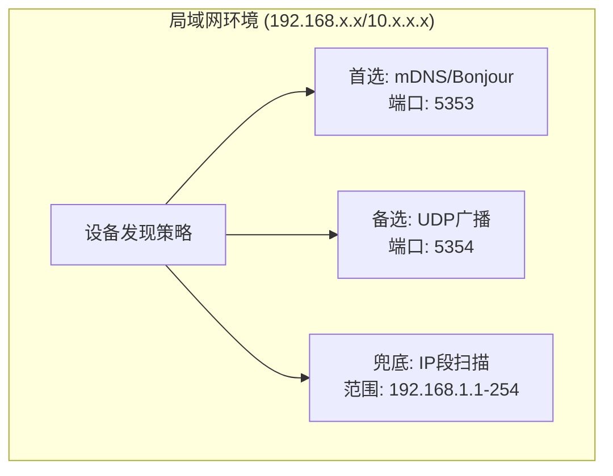
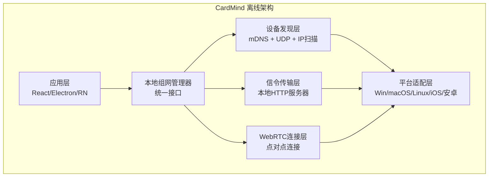
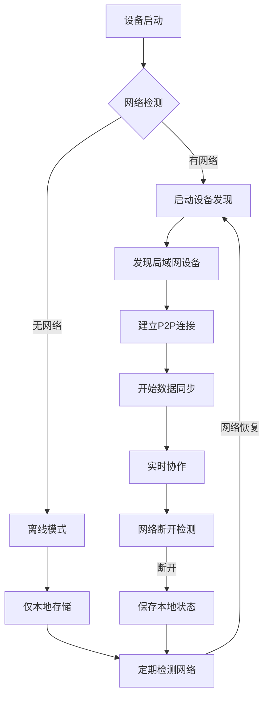
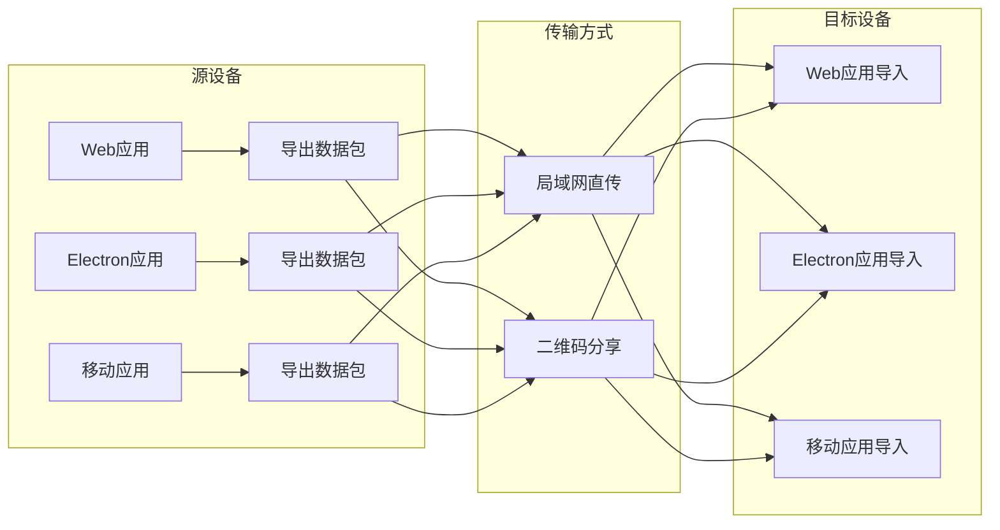

# CardMind 纯局域网离线组网技术方案

## 1. 概述

本文档整合了CardMind项目在纯局域网离线环境下的组网技术方案，包括架构设计、技术选型和实现细节。主要面向开发人员和技术决策者，旨在提供完整的技术参考。

**核心目标**：实现完全离线运行、自动设备发现、跨平台支持的多设备协作系统。

## 2. 设计目标与挑战

### 2.1 核心需求
- ✅ **完全离线运行**：不依赖任何外网连接或云服务
- ✅ **自动设备发现**：在局域网内自动发现其他设备
- ✅ **跨平台支持**：Windows、macOS、Linux、Android、iOS
- ✅ **实时协作**：支持多设备实时数据同步
- ✅ **即插即用**：无需手动配置，开机即用

### 2.2 技术挑战
| 挑战 | 传统方案 | 离线限制 | 解决思路 |
|------|----------|----------|----------|
| 设备发现 | DNS/云服务 | ❌ 不可用 | mDNS/Bonjour + UDP广播 |
| 信令传输 | WebSocket服务器 | ❌ 不可用 | 本地HTTP服务器 + P2P |
| NAT穿透 | STUN/TURN服务器 | ❌ 不可用 | 局域网直连优化 |
| 跨平台兼容 | 平台专用API | ❌ 需统一 | 抽象适配层 |

## 3. 总体架构设计

### 3.1 混合发现策略



混合发现策略确保了在不同网络环境下的设备发现可靠性：
- **mDNS/Bonjour**：现代操作系统原生支持，高效可靠
- **UDP广播**：兼容性好，适用于老旧设备
- **IP段扫描**：作为最后手段，确保最大兼容性

### 3.2 分层架构



分层架构设计提供了良好的模块化和可扩展性：
- **应用层**：跨平台应用框架
- **本地组网管理器**：提供统一的设备发现和连接接口
- **核心功能层**：设备发现、信令传输和WebRTC连接
- **平台适配层**：处理不同平台的原生API差异

## 4. 设备发现技术方案

### 4.1 mDNS/Bonjour 方案

**适用场景**：现代操作系统、支持多播网络

**技术栈选择**：
- Web: `mdns-js` (纯JS实现，无需原生模块)
- Electron: `bonjour` (基于Node.js，功能完整)
- React Native: `react-native-zeroconf` (原生模块)

**服务定义**：
```
服务类型: _cardmind._tcp.local
服务名称: CardMind-{设备名}_{随机码}
端口: 动态分配 (8080-9000)
TXT记录: {
  deviceId: "唯一设备标识",
  platform: "windows/macos/linux/ios/android",
  version: "1.0.0",
  capabilities: "webrtc,sync,collab",
  httpPort: "本地HTTP服务器端口"
}
```

**发现流程**：
1. 设备启动时注册mDNS服务广播
2. 持续监听同类型服务上线/下线事件
3. 解析服务信息，提取设备详情和HTTP端口
4. 建立HTTP信令连接

### 4.2 UDP广播备选方案

**适用场景**：老旧设备、防火墙限制多播、嵌入式系统

**实现原理**：
- 使用UDP广播地址 (255.255.255.255:5354)
- 定期发送设备信息JSON包
- 监听相同端口接收其他设备广播
- 超时机制检测设备离线

**广播协议**：
```json
{
  "type": "cardmind_discovery",
  "deviceId": "unique_device_id",
  "deviceName": "设备显示名称",
  "httpPort": 8080,
  "platform": "windows",
  "version": "1.0.0",
  "timestamp": 1640995200000,
  "signature": "消息签名防篡改"
}
```

### 4.3 IP段扫描兜底方案

**适用场景**：极端网络环境、发现机制失效时

**扫描策略**：
- 智能网段检测：获取本机IP和子网掩码
- 并行扫描：同时扫描多个IP，避免阻塞
- 端口探测：检测目标IP的HTTP端口可用性
- 指数退避：失败后延长扫描间隔

**优化措施**：
- 跳过已知设备IP
- 基于ARP表优先扫描活跃设备
- 限制扫描频率，避免网络风暴

## 5. 本地信令传输方案

### 5.1 轻量级HTTP服务器设计

**核心要求**：
- ✅ 支持WebSocket升级
- ✅ 跨平台兼容
- ✅ 自动端口分配
- ✅ 零配置启动

**平台实现策略**：

| 平台 | 实现方案 | 端口分配 | 特殊处理 |
|------|----------|----------|----------|
| Web | Service Worker拦截 | 虚拟端口 | 需要真实WebSocket代理 |
| Electron | Node.js HTTP服务器 | 自动端口 | 原生支持，功能完整 |
| React Native | 原生HTTP服务器 | 自动端口 | Android用NanoHTTPD，iOS用GCDWebServer |

**API设计**：
```
GET  /health          - 健康检查
GET  /info            - 获取设备信息
GET  /peers           - 获取已连接设备列表
POST /signal/offer    - 发送WebRTC offer
POST /signal/answer   - 发送WebRTC answer
POST /signal/ice      - 发送ICE候选
WS   /ws              - WebSocket信令连接
```

### 5.2 WebRTC连接优化

**局域网直连优化**：
- 禁用STUN/TURN服务器（节省资源）
- 优先使用host类型ICE候选
- 快速连接建立（减少握手延迟）
- 局域网QoS优化（降低延迟）

**连接建立流程**：
1. 通过HTTP信令交换SDP offer/answer
2. 收集局域网内ICE候选（通常直接连通）
3. 建立WebRTC数据通道
4. 开始P2P数据同步

## 6. 跨平台兼容性方案

### 6.1 平台能力矩阵

| 功能 \ 平台 | Web | Electron | Win桌面 | macOS | Linux | Android | iOS |
|-------------|-----|----------|---------|-------|-------|---------|-----|
| mDNS发现 | ✅ | ✅ | ✅ | ✅ | ✅ | ✅ | ✅ |
| UDP广播 | ❌ | ✅ | ✅ | ✅ | ✅ | ✅ | ✅ |
| HTTP服务器 | ⚠️ | ✅ | ✅ | ✅ | ✅ | ✅ | ✅ |
| WebRTC数据通道 | ✅ | ✅ | ✅ | ✅ | ✅ | ✅ | ✅ |
| 后台运行 | ❌ | ✅ | ✅ | ✅ | ✅ | ✅ | ✅ |

说明：✅ 完全支持，⚠️ 有限支持，❌ 不支持

### 6.2 渐进式降级策略

**Web平台**：
- 首选：Service Worker + WebSocket代理
- 备选：纯WebSocket信令（需要额外中继）
- 兜底：提示用户使用桌面应用

**移动端限制**：
- iOS后台限制：使用推送通知唤醒
- Android电源优化：请求忽略电池优化
- 网络切换：监听网络变化，重新发现

**桌面端优化**：
- 系统服务：可选注册为系统服务
- 开机启动：提供开机自启动选项
- 系统通知：集成原生通知系统

## 7. 技术选型详情

### 7.1 设备发现技术选型

#### 7.1.1 mDNS/Bonjour 技术栈

**技术方案对比**：

| 技术方案 | 适用平台 | 包大小 | 成熟度 | 维护状态 | 选型建议 |
|----------|----------|--------|--------|----------|----------|
| **mdns-js** | Web/Electron | 45KB | ⭐⭐⭐ | ✅ 活跃 | **推荐** |
| bonjour | Node.js | 28KB | ⭐⭐⭐⭐⭐ | ✅ 活跃 | 备选 |
| ciao | Node.js | 35KB | ⭐⭐⭐ | ⚠️ 一般 | 不推荐 |
| dns-sd | 原生绑定 | 2.1MB | ⭐⭐⭐⭐⭐ | ✅ 活跃 | 太重 |

**最终选型：mdns-js**

**选型理由**：
1. **纯JavaScript实现**：无需原生依赖，Web平台可用
2. **轻量级**：45KB包大小，加载快速
3. **零配置**：符合Bonjour/mDNS标准，与系统服务兼容
4. **活跃维护**：社区活跃，issue响应及时

#### 7.1.2 UDP广播备选方案

**技术选型**：

| 方案 | 平台支持 | 可靠性 | 实现复杂度 | 选型建议 |
|------|----------|--------|------------|----------|
| **dgram** | Node.js/Electron | ⭐⭐⭐⭐ | 简单 | **推荐** |
| chrome.sockets | Chrome App | ⭐⭐⭐ | 中等 | 已废弃 |
| WebRTC数据通道 | Web | ⭐⭐ | 复杂 | 不实用 |
| 原生socket | React Native | ⭐⭐⭐⭐⭐ | 复杂 | 备选 |

**最终选型：dgram + 原生socket混合方案**

#### 7.1.3 IP段扫描兜底方案

**扫描策略选型**：

| 策略 | 扫描速度 | 网络影响 | 准确率 | 选型建议 |
|------|----------|----------|--------|----------|
| **并行扫描** | 快 | 中等 | ⭐⭐⭐⭐ | **推荐** |
| 顺序扫描 | 慢 | 低 | ⭐⭐⭐ | 太慢 |
| ICMP Ping | 中等 | 低 | ⭐⭐⭐⭐ | 需权限 |
| ARP表优先 | 快 | 最低 | ⭐⭐⭐⭐⭐ | 最佳但复杂 |

**最终选型：并行扫描 + ARP表优化**

### 7.2 信令传输技术选型

#### 7.2.1 本地HTTP服务器框架

**Electron/Node.js平台选型**：

| 框架 | 启动时间 | 内存占用 | 功能完整性 | 选型建议 |
|------|----------|----------|------------|----------|
| **Express** | 50ms | 35MB | ⭐⭐⭐⭐⭐ | **推荐** |
| Fastify | 40ms | 30MB | ⭐⭐⭐⭐ | 备选 |
| Koa | 60ms | 40MB | ⭐⭐⭐ | 不推荐 |
| 原生http | 20ms | 20MB | ⭐⭐ | 过于底层 |

**最终选型：Express**

**选型理由**：
1. **生态成熟**：丰富的中间件和文档
2. **性能平衡**：启动时间和内存占用合理
3. **WebSocket支持**：通过express-ws扩展支持
4. **开发效率**：API简洁，调试工具完善

**React Native平台选型**：

| 框架 | Android支持 | iOS支持 | 包大小 | 选型建议 |
|------|-------------|---------|--------|----------|
| **NanoHTTPD** | ✅ | ✅ | 85KB | **推荐** |
| AndroidAsync | ✅ | ❌ | 120KB | 平台受限 |
| GCDWebServer | ❌ | ✅ | 95KB | iOS专用 |
| CocoaHTTPServer | ❌ | ✅ | 110KB | 已停止维护 |

**最终选型：NanoHTTPD (Android) + GCDWebServer (iOS)**

#### 7.2.2 WebSocket库选型

**ws vs socket.io对比**：

| 特性 | ws | socket.io | 选型建议 |
|------|----|-----------|----------|
| 包大小 | 23KB | 45KB | ws更小 |
| 兼容性 | 标准WebSocket | 自有协议 | 标准更好 |
| 重连机制 | 手动实现 | 内置支持 | 手动更灵活 |
| 二进制支持 | ✅ | ✅ | 都支持 |
| 社区活跃度 | ⭐⭐⭐⭐ | ⭐⭐⭐⭐⭐ | 都很活跃 |

**最终选型：ws**

**选型理由**：
1. **轻量级**：包大小仅为socket.io的一半
2. **标准兼容**：使用标准WebSocket协议
3. **性能更好**：无额外协议开销
4. **控制灵活**：手动管理重连和状态

#### 7.2.3 信令协议设计

**协议格式选型**：

| 格式 | 可读性 | 包大小 | 解析速度 | 选型建议 |
|------|--------|--------|----------|----------|
| **JSON** | ⭐⭐⭐⭐⭐ | 中等 | ⭐⭐⭐⭐ | **推荐** |
| MessagePack | ⭐⭐ | 小 | ⭐⭐⭐⭐⭐ | 备选 |
| Protocol Buffers | ⭐⭐ | 最小 | ⭐⭐⭐⭐⭐ | 过度设计 |
| 纯文本 | ⭐⭐⭐⭐⭐ | 最大 | ⭐⭐ | 不高效 |

**最终选型：JSON**

**选型理由**：
1. **开发友好**：调试时可直接阅读
2. **跨平台**：所有平台原生支持
3. **足够高效**：局域网内包大小不是瓶颈
4. **前后兼容**：易于版本演进

### 7.3 WebRTC技术选型

#### 7.3.1 WebRTC实现库

**浏览器环境**：
- **选型**：浏览器原生WebRTC API
- **理由**：无需额外库，标准支持，性能最佳

**Electron环境**：
- **选型**：浏览器原生WebRTC API
- **理由**：基于Chromium，与Web完全一致

**React Native环境**：

| 库 | 维护状态 | 功能完整性 | 包大小 | 选型建议 |
|----|----------|------------|--------|----------|
| **react-native-webrtc** | ✅ 活跃 | ⭐⭐⭐⭐⭐ | 2.1MB | **推荐** |
| react-native-callkeep | ✅ 活跃 | ⭐⭐ | 1.5MB | 功能不符 |

**最终选型：react-native-webrtc**

#### 7.3.2 NAT穿透策略

**局域网优化策略**：

| 策略 | 适用场景 | 成功率 | 延迟 | 选型建议 |
|------|----------|--------|------|----------|
| **直连优先** | 同一交换机 | ⭐⭐⭐⭐⭐ | <5ms | **推荐** |
| STUN服务器 | 简单NAT | ⭐⭐⭐⭐ | 20-50ms | 不适用 |
| TURN中继 | 复杂NAT | ⭐⭐⭐⭐⭐ | 100-300ms | 不适用 |

**最终选型：局域网直连优化**

### 7.4 数据存储技术选型

#### 7.4.1 本地存储方案

**Web平台**：

| 方案 | 容量 | 性能 | 持久性 | 选型建议 |
|------|------|------|--------|----------|
| **IndexedDB** | 250MB+ | ⭐⭐⭐⭐ | 持久 | **推荐** |
| localStorage | 5MB | ⭐⭐⭐ | 持久 | 太小 |
| File System Access | 系统限制 | ⭐⭐⭐⭐⭐ | 持久 | 兼容性差 |


**Electron平台**：

| 方案 | 容量 | 性能 | 持久性 | 选型建议 |
|------|------|------|--------|----------|
| **better-sqlite3** | 无限制 | ⭐⭐⭐⭐⭐ | 持久 | **推荐** |
| LevelDB | 无限制 | ⭐⭐⭐⭐ | 持久 | 备选 |
| 文件系统 | 无限制 | ⭐⭐⭐ | 持久 | 需自行管理 |

**最终选型：better-sqlite3**

**React Native平台**：

| 方案 | 容量 | 性能 | 持久性 | 选型建议 |
|------|------|------|--------|----------|
| **react-native-sqlite-storage** | 无限制 | ⭐⭐⭐⭐ | 持久 | **推荐** |
| AsyncStorage | 6MB | ⭐⭐ | 持久 | 太小 |
| MMKV | 无限制 | ⭐⭐⭐⭐⭐ | 持久 | 需原生适配 |

**最终选型：react-native-sqlite-storage**

## 8. 实现示例

### 8.1 设备发现实现示例

#### 8.1.1 mDNS设备发现代码示例

```javascript
// 设备发现服务类
class DeviceDiscoveryService {
  constructor(platformAdapter) {
    this.platformAdapter = platformAdapter;
    this.discoveredDevices = new Map();
    this.mdnsService = null;
    this.udpBroadcast = null;
  }

  // 启动设备发现
  async startDiscovery() {
    // 1. 首选mDNS发现
    try {
      await this.startMdnsDiscovery();
      console.log('mDNS discovery started');
    } catch (error) {
      console.warn('mDNS discovery failed, falling back to UDP:', error);
      // 2. 备选UDP广播
      await this.startUdpBroadcast();
    }
    
    // 3. 兜底IP段扫描（延迟启动，避免网络拥塞）
    setTimeout(() => this.startIpScanning(), 5000);
  }

  // mDNS发现实现
  async startMdnsDiscovery() {
    const mdns = await import('mdns-js');
    
    this.mdnsService = mdns.createBrowser(mdns.tcp('cardmind'));
    
    this.mdnsService.on('serviceUp', (service) => {
      this.handleDeviceDiscovered({
        id: service.txt.deviceId,
        name: service.name.replace('CardMind-', ''),
        host: service.addresses[0],
        port: parseInt(service.txt.httpPort),
        platform: service.txt.platform,
        capabilities: service.txt.capabilities.split(','),
        discoveryMethod: 'mdns'
      });
    });
    
    this.mdnsService.on('serviceDown', (service) => {
      const deviceId = service.txt.deviceId;
      this.handleDeviceLost(deviceId);
    });
    
    this.mdnsService.start();
  }

  // UDP广播实现
  async startUdpBroadcast() {
    const dgram = await import('dgram');
    this.udpSocket = dgram.createSocket('udp4');
    
    // 绑定到广播端口
    this.udpSocket.bind(5354, () => {
      this.udpSocket.setBroadcast(true);
      
      // 定期广播本机信息
      this.broadcastInterval = setInterval(() => {
        this.broadcastDeviceInfo();
      }, 3000);
    });
    
    // 监听广播消息
    this.udpSocket.on('message', (msg, rinfo) => {
      try {
        const data = JSON.parse(msg.toString());
        if (data.type === 'cardmind_discovery' && data.deviceId !== this.platformAdapter.getDeviceId()) {
          this.handleDeviceDiscovered({
            id: data.deviceId,
            name: data.deviceName,
            host: rinfo.address,
            port: data.httpPort,
            platform: data.platform,
            discoveryMethod: 'udp'
          });
        }
      } catch (error) {
        // 忽略解析错误
      }
    });
  }

  // 广播本机信息
  broadcastDeviceInfo() {
    const deviceInfo = {
      type: 'cardmind_discovery',
      deviceId: this.platformAdapter.getDeviceId(),
      deviceName: this.platformAdapter.getDeviceName(),
      httpPort: this.platformAdapter.getHttpServerPort(),
      platform: this.platformAdapter.getPlatform(),
      version: '1.0.0',
      timestamp: Date.now()
    };
    
    const message = Buffer.from(JSON.stringify(deviceInfo));
    this.udpSocket.send(message, 0, message.length, 5354, '255.255.255.255');
  }

  // IP段扫描实现
  async startIpScanning() {
    const networkInterfaces = this.platformAdapter.getNetworkInterfaces();
    const subnets = this.extractSubnets(networkInterfaces);
    
    // 并行扫描各子网
    const scanPromises = subnets.map(subnet => this.scanSubnet(subnet));
    await Promise.allSettled(scanPromises);
  }

  // 处理设备发现
  handleDeviceDiscovered(device) {
    const existingDevice = this.discoveredDevices.get(device.id);
    
    if (!existingDevice || existingDevice.lastSeen < Date.now() - 10000) {
      // 新设备或设备更新
      this.discoveredDevices.set(device.id, {
        ...device,
        lastSeen: Date.now()
      });
      
      // 触发设备发现事件
      this.emit('deviceDiscovered', device);
      console.log(`Device discovered: ${device.name} (${device.host}:${device.port})`);
    }
  }

  // 处理设备丢失
  handleDeviceLost(deviceId) {
    if (this.discoveredDevices.has(deviceId)) {
      this.discoveredDevices.delete(deviceId);
      this.emit('deviceLost', { deviceId });
      console.log(`Device lost: ${deviceId}`);
    }
  }
}
```

### 8.2 WebRTC连接建立示例

```javascript
// WebRTC连接管理器
class WebRTCConnectionManager {
  constructor(deviceId, signalingClient) {
    this.deviceId = deviceId;
    this.signalingClient = signalingClient;
    this.connections = new Map();
    this.pendingOffers = new Map();
  }

  // 创建与指定设备的连接
  async connectToDevice(targetDeviceId) {
    if (this.connections.has(targetDeviceId)) {
      return this.connections.get(targetDeviceId);
    }

    const peerConnection = this.createPeerConnection();
    
    // 设置连接事件处理
    peerConnection.onicecandidate = (event) => {
      if (event.candidate) {
        this.signalingClient.sendIceCandidate(targetDeviceId, event.candidate);
      }
    };

    peerConnection.onconnectionstatechange = () => {
      console.log(`Connection state with ${targetDeviceId}:`, peerConnection.connectionState);
    };

    // 创建数据通道
    const dataChannel = peerConnection.createDataChannel('cardmind-sync', {
      ordered: true,
      maxRetransmits: 3
    });

    this.setupDataChannel(dataChannel, targetDeviceId);
    
    // 创建并发送offer
    const offer = await peerConnection.createOffer();
    await peerConnection.setLocalDescription(offer);
    this.signalingClient.sendOffer(targetDeviceId, offer);

    // 保存连接
    this.connections.set(targetDeviceId, {
      peerConnection,
      dataChannel,
      state: 'connecting'
    });

    return this.connections.get(targetDeviceId);
  }

  // 处理接收到的offer
  async handleOffer(fromDeviceId, offer) {
    let connection = this.connections.get(fromDeviceId);
    
    if (!connection) {
      // 创建新连接
      const peerConnection = this.createPeerConnection();
      
      peerConnection.onicecandidate = (event) => {
        if (event.candidate) {
          this.signalingClient.sendIceCandidate(fromDeviceId, event.candidate);
        }
      };

      peerConnection.ondatachannel = (event) => {
        const dataChannel = event.channel;
        this.setupDataChannel(dataChannel, fromDeviceId);
        
        // 保存连接
        this.connections.set(fromDeviceId, {
          peerConnection,
          dataChannel,
          state: 'connecting'
        });
      };

      connection = { peerConnection, state: 'connecting' };
      this.connections.set(fromDeviceId, connection);
    }

    // 设置远程描述并创建answer
    await connection.peerConnection.setRemoteDescription(offer);
    const answer = await connection.peerConnection.createAnswer();
    await connection.peerConnection.setLocalDescription(answer);
    
    // 发送answer
    this.signalingClient.sendAnswer(fromDeviceId, answer);
  }

  // 处理接收到的answer
  async handleAnswer(fromDeviceId, answer) {
    const connection = this.connections.get(fromDeviceId);
    if (connection) {
      await connection.peerConnection.setRemoteDescription(answer);
    }
  }

  // 处理ICE候选
  async handleIceCandidate(fromDeviceId, candidate) {
    const connection = this.connections.get(fromDeviceId);
    if (connection) {
      await connection.peerConnection.addIceCandidate(candidate);
    }
  }

  // 创建优化的PeerConnection
  createPeerConnection() {
    const configuration = {
      // 局域网优化：不使用STUN/TURN服务器
      iceServers: [],
      
      // 连接策略优化
      iceCandidatePoolSize: 10,
      iceTransportPolicy: 'all', // 在局域网环境中允许所有候选
      
      // 局域网优化配置
      bundlePolicy: 'max-bundle',
      rtcpMuxPolicy: 'require'
    };

    const pc = new RTCPeerConnection(configuration);
    
    // 局域网优化：优先主机候选
    pc.addEventListener('icegatheringstatechange', () => {
      if (pc.iceGatheringState === 'complete') {
        // 可以在这里筛选候选，优先主机候选
        console.log('ICE gathering completed');
      }
    });

    return pc;
  }

  // 设置数据通道
  setupDataChannel(dataChannel, deviceId) {
    dataChannel.onopen = () => {
      console.log(`Data channel opened with ${deviceId}`);
      const connection = this.connections.get(deviceId);
      if (connection) {
        connection.state = 'connected';
      }
      this.emit('connected', deviceId);
    };

    dataChannel.onclose = () => {
      console.log(`Data channel closed with ${deviceId}`);
      this.connections.delete(deviceId);
      this.emit('disconnected', deviceId);
    };

    dataChannel.onerror = (error) => {
      console.error(`Data channel error with ${deviceId}:`, error);
      this.emit('error', { deviceId, error });
    };

    dataChannel.onmessage = (event) => {
      try {
        const message = JSON.parse(event.data);
        this.emit('message', { deviceId, message });
      } catch (error) {
        console.error('Failed to parse message:', error);
      }
    };
  }

  // 发送消息到指定设备
  sendMessage(deviceId, message) {
    const connection = this.connections.get(deviceId);
    if (connection && connection.dataChannel && connection.dataChannel.readyState === 'open') {
      connection.dataChannel.send(JSON.stringify(message));
      return true;
    }
    return false;
  }

  // 广播消息到所有连接的设备
  broadcastMessage(message) {
    const results = new Map();
    
    for (const [deviceId, connection] of this.connections) {
      if (connection.dataChannel && connection.dataChannel.readyState === 'open') {
        try {
          connection.dataChannel.send(JSON.stringify(message));
          results.set(deviceId, true);
        } catch (error) {
          console.error(`Failed to send message to ${deviceId}:`, error);
          results.set(deviceId, false);
        }
      } else {
        results.set(deviceId, false);
      }
    }
    
    return results;
  }
}
```

### 8.3 实际应用场景示例

#### 8.3.1 多设备协作场景

```mermaid
sequenceDiagram
    participant A as 设备A (创建者)
    participant B as 设备B (协作者)
    participant C as 设备C (观察者)
    
    Note over A,B,C: 场景: 三人协作编辑卡片
    
    A->>A: 创建新卡片
    A->>B: 通过WebRTC发送卡片创建事件
    A->>C: 通过WebRTC发送卡片创建事件
    
    B->>B: 接收并显示新卡片
    C->>C: 接收并显示新卡片
    
    B->>B: 编辑卡片内容
    B->>A: 通过WebRTC发送更新事件
    B->>C: 通过WebRTC发送更新事件
    
    A->>A: 接收并显示更新
    C->>C: 接收并显示更新
    
    Note over A,B,C: 所有设备实时同步，无需中央服务器
```

#### 8.3.2 离线工作场景



#### 8.3.3 跨平台数据迁移场景



## 9. 性能优化策略

### 9.1 设备发现优化

- **智能频率控制**: 根据网络状态动态调整发现频率
- **缓存机制**: 缓存已发现设备，减少重复发现
- **优先级策略**: 优先使用高效发现方式，失败后降级
- **资源限制**: 限制并发扫描数，避免网络拥塞

### 9.2 WebRTC连接优化

- **连接池**: 复用已建立的连接，减少握手开销
- **数据压缩**: 对大型数据使用压缩算法
- **分片传输**: 大文件分片传输，提高可靠性
- **心跳机制**: 定期心跳维持连接，及时检测断开

### 9.3 数据同步优化

- **增量同步**: 仅同步变更数据，减少传输量
- **冲突解决**: 智能合并算法，处理并发修改
- **优先级队列**: 重要数据优先同步
- **本地缓存**: 本地缓存远程数据，提高响应速度

## 10. 测试策略

### 10.1 单元测试

- 设备发现各模块功能测试
- WebRTC连接建立流程测试
- 数据同步算法测试
- 平台适配层接口测试

### 10.2 集成测试

- 多设备协作场景测试
- 网络异常处理测试
- 跨平台兼容性测试
- 性能压力测试

### 10.3 用户场景测试

- 真实局域网环境测试
- 不同网络拓扑测试
- 长时间稳定性测试
- 用户体验流程测试

## 11. 部署与维护

### 11.1 部署策略

- **渐进式发布**: 先Web平台，后扩展到其他平台
- **版本兼容**: 保证新旧版本互操作性
- **回滚机制**: 快速回滚到稳定版本
- **监控告警**: 实时监控系统状态

### 11.2 维护计划

- **定期更新**: 修复安全漏洞，提升性能
- **文档维护**: 保持技术文档与实现同步
- **社区反馈**: 收集用户反馈，持续改进
- **技术演进**: 跟进新技术，适时升级架构

## 12. 总结

本文档详细介绍了CardMind项目在纯局域网离线环境下的组网技术方案，包括：

1. **混合设备发现策略**: mDNS/Bonjour为主，UDP广播备选，IP段扫描兜底
2. **本地信令传输方案**: 轻量级HTTP服务器 + WebRTC直连
3. **跨平台兼容性**: 统一抽象层，平台特定实现
4. **性能优化**: 针对局域网环境的各种优化策略

该方案实现了完全离线运行、自动设备发现、跨平台支持的目标，为CardMind项目提供了可靠的技术基础。通过实际代码示例和应用场景展示，开发团队可以快速理解并实现相关功能。

后续工作将重点关注实际实现、性能测试和用户体验优化，确保技术方案能够满足实际使用需求。


**最终选型：IndexedDB**

**Electron/React Native平台**：

| 方案 | 跨平台 | 性能 | 包大小 | 选型建议 |
|------|--------|------|--------|----------|
| **SQLite** | ✅ | ⭐⭐⭐⭐⭐ | 1.2MB | **推荐** |
| Realm | ✅ | ⭐⭐⭐⭐⭐ | 3.5MB | 备选 |
| WatermelonDB | ✅ | ⭐⭐⭐⭐ | 800KB | 功能有限 |

**最终选型：SQLite**

#### 7.4.2 数据同步算法

**CRDT算法选型**：

| 算法 | 冲突解决 | 性能 | 实现复杂度 | 选型建议 |
|------|----------|------|------------|----------|
| **Yjs** | 自动 | ⭐⭐⭐⭐⭐ | 中等 | **推荐** |
| Automerge | 自动 | ⭐⭐⭐⭐ | 简单 | 备选 |
| OT算法 | 手动 | ⭐⭐⭐ | 复杂 | 不推荐 |

**最终选型：Yjs**

**选型理由**：
1. **成熟稳定**：大量生产环境验证
2. **性能优秀**：高效的CRDT实现
3. **生态丰富**：支持多种编辑器
4. **离线友好**：支持离线编辑和同步

## 8. 数据同步策略

### 8.1 冲突解决机制

**CRDT算法**：使用Yjs的CRDT实现
- 自动冲突合并，无需人工干预
- 支持离线编辑，上线后自动同步
- 保持数据一致性

**版本向量化**：
- 每个设备维护向量时钟
- 检测并发更新
- 支持回滚和重做

### 8.2 同步优先级

1. **局域网同步**（延迟 < 100ms）
2. **本地存储**（立即生效）
3. **云端同步**（可选，有网络时）

### 8.3 离线数据管理

**存储策略**：
- IndexedDB（Web）
- SQLite（Electron/React Native）
- 异步存储，不阻塞UI

**数据完整性**：
- 事务支持
- 自动备份
- 损坏检测和修复

## 9. 安全考虑

### 9.1 局域网安全

**设备认证**：
- 首次连接需要手动确认
- 可选PIN码验证
- 设备白名单机制

**数据传输**：
- WebRTC内置DTLS加密
- 敏感数据额外加密
- 防止中间人攻击

### 9.2 隐私保护

**本地发现隐私**：
- 设备名可自定义
- 可选择隐藏设备
- 发现范围限制（同一子网）

## 10. 性能优化

### 10.1 网络性能

**发现优化**：
- 服务缓存，减少重复查询
- 智能扫描间隔（活跃时更频繁）
- 网络变化快速响应

**传输优化**：
- 数据压缩（大数据量时）
- 批量传输，减少网络包
- 差分同步，只传变化部分

### 10.2 资源使用

**内存优化**：
- 连接池复用
- 定时清理过期数据
- 懒加载，按需初始化

**电量优化**（移动端）：
- 减少后台活动
- 合并网络请求
- 智能休眠机制

## 11. 实施路线图

### 阶段1：核心发现机制（2周）
- [ ] 实现mDNS服务发现和广播
- [ ] 实现UDP广播备选方案
- [ ] 基础设备信息管理

### 阶段2：信令传输（2周）
- [ ] 跨平台HTTP服务器设计
- [ ] WebSocket信令协议
- [ ] 平台适配层实现

### 阶段3：WebRTC集成（2周）
- [ ] WebRTC连接建立优化
- [ ] 数据通道管理
- [ ] 与现有SyncService集成

### 阶段4：测试优化（1周）
- [ ] 跨平台兼容性测试
- [ ] 性能基准测试
- [ ] 用户体验优化

### 阶段5：生产部署（1周）
- [ ] 打包和发布
- [ ] 文档完善
- [ ] 用户反馈收集

## 12. 风险评估与应对

### 12.1 技术风险

| 风险 | 概率 | 影响 | 应对措施 |
|------|------|------|----------|
| mDNS被防火墙拦截 | 中等 | 高 | 降级到UDP广播 |
| Web平台功能限制 | 高 | 中等 | 提供桌面应用替代 |
| React Native原生模块bug | 低 | 高 | 准备多个实现方案 |
| WebRTC局域网连接失败 | 低 | 高 | 提供HTTP轮询备选 |

### 12.2 兼容性风险

**浏览器兼容性**：
- Chrome 70+：完全支持
- Firefox 65+：完全支持  
- Safari 12+：需要polyfill
- Edge 79+：完全支持

**系统版本要求**：
- Windows 10+：支持mDNS
- macOS 10.10+：原生Bonjour
- Android 5.0+：支持WebRTC
- iOS 11+：支持WebRTC

## 13. 注意事项

1. **防火墙限制**：某些企业网络可能阻止mDNS或UDP广播，需要提供手动IP连接选项
2. **移动端后台限制**：iOS和Android对后台运行有限制，需要合理设计后台任务
3. **网络切换处理**：设备在不同网络间切换时，需要重新发现和连接
4. **版本兼容性**：不同版本的CardMind客户端需要保持协议兼容

## 14. 关联文档

- [0301-tech-stack.md](./0301-tech-stack.md) - 整体技术栈
- [0302-api-doc.md](./0302-api-doc.md) - API接口文档
- [0303-chat-feature-implementation.md](./0303-chat-feature-implementation.md) - 聊天功能实现
- [0304-file-transfer-implementation.md](./0304-file-transfer-implementation.md) - 文件传输实现