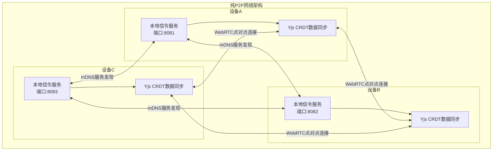

# CardMind纯P2P架构设计方案

## 1. 架构概述

### 1.1 核心理念
- **每个客户端都是信令服务器**：应用启动时自动创建本地信令服务
- **零依赖启动**：无需外部服务器，纯局域网环境下也能正常工作
- **自动发现与组网**：通过mDNS/Bonjour实现设备自动发现和连接

### 1.2 架构优势
- **完全离线可用**：不依赖互联网，局域网内即可组网协作
- **去中心化**：没有单点故障，系统更加稳定可靠
- **隐私保护**：数据只在用户设备间传输，不经过第三方服务器
- **快速响应**：本地网络延迟低，协作体验更流畅

## 2. 技术架构

### 2.1 整体架构图



这个架构图展示了CardMind纯P2P网络架构的核心组件和连接方式：
- 每个设备都运行自己的本地信令服务器
- 设备之间通过mDNS自动发现
- 建立WebRTC点对点连接进行数据传输
- 使用Yjs CRDT实现实时数据同步

### 2.2 通信流程
1. **服务启动**：应用启动时，自动启动本地HTTP信令服务器
2. **服务广播**：通过mDNS在局域网内广播服务信息
3. **设备发现**：其他设备通过mDNS发现可用的信令服务
4. **信令交换**：通过本地HTTP服务器交换WebRTC连接信令
5. **P2P连接**：建立WebRTC点对点连接
6. **数据同步**：通过Yjs CRDT实现实时数据同步

## 3. 平台实现方案

### 3.1 Web平台实现

#### 3.1.1 Service Worker代理模式
由于Web平台无法创建真实的HTTP服务器，采用Service Worker代理模式：

```typescript
// Service Worker信令代理
class ServiceWorkerSignalingProxy {
  private port: number;
  private clients: Map<string, Client> = new Map();
  
  async start() {
    // 1. 动态分配端口
    this.port = await this.findAvailablePort();
    
    // 2. 注册Service Worker消息处理
    self.addEventListener('message', this.handleMessage.bind(this));
    
    // 3. 启动mDNS服务发现（通过主线程代理）
    this.startMDNS();
  }
  
  // 处理WebRTC信令消息
  private handleMessage(event: MessageEvent) {
    const { type, data, targetId } = event.data;
    
    switch (type) {
      case 'SIGNALING_OFFER':
      case 'SIGNALING_ANSWER':
      case 'SIGNALING_ICE_CANDIDATE':
        this.forwardSignal(targetId, event.data);
        break;
    }
  }
  
  // 转发信令到其他客户端
  private forwardSignal(targetId: string, signal: any) {
    const targetClient = this.clients.get(targetId);
    if (targetClient) {
      targetClient.postMessage(signal);
    }
  }
}
```

#### 3.1.2 mDNS.js设备发现
```typescript
// Web平台mDNS实现
class WebMDNSDiscovery {
  private browser: any;
  private services: Map<string, MDNSService> = new Map();
  
  async start() {
    // 使用mdns-js库（通过WebAssembly编译）
    const mdns = await import('mdns-js');
    
    // 创建服务浏览器
    this.browser = mdns.createBrowser(mdns.tcp('cardmind-signaling'));
    
    // 监听服务发现事件
    this.browser.on('serviceUp', (service: MDNSService) => {
      this.services.set(service.name, service);
      this.emit('deviceFound', {
        id: service.name,
        address: service.addresses[0],
        port: service.port
      });
    });
    
    this.browser.on('serviceDown', (service: MDNSService) => {
      this.services.delete(service.name);
      this.emit('deviceLost', service.name);
    });
    
    // 开始浏览
    this.browser.start();
  }
  
  // 广播本地服务
  async advertiseService(port: number) {
    // Web平台需要通过主线程代理或使用WebRTC数据通道
    // 这里使用简化的UDP广播模拟
    const service = {
      name: `cardmind-${this.generateDeviceId()}`,
      type: 'cardmind-signaling',
      port: port,
      txt: {
        version: '1.0',
        platform: 'web'
      }
    };
    
    // 通过WebSocket或HTTP请求通知其他设备
    this.broadcastServiceInfo(service);
  }
}
```

### 3.2 Electron平台实现

#### 3.2.1 Express HTTP信令服务器
```typescript
// Electron平台本地HTTP服务器
import express from 'express';
import { createServer } from 'http';
import { Server as SocketIOServer } from 'socket.io';
import bonjour from 'bonjour';

class ElectronSignalingServer {
  private app: express.Application;
  private server: any;
  private io: SocketIOServer;
  private port: number;
  private bonjourService: any;
  private clients: Map<string, Socket> = new Map();
  
  async start() {
    // 1. 创建Express应用
    this.app = express();
    this.server = createServer(this.app);
    
    // 2. 配置Socket.IO
    this.io = new SocketIOServer(this.server, {
      cors: {
        origin: "*",
        methods: ["GET", "POST"]
      }
    });
    
    // 3. 动态分配端口
    this.port = await this.findAvailablePort(8080, 9000);
    
    // 4. 设置路由和中间件
    this.setupRoutes();
    this.setupSocketHandlers();
    
    // 5. 启动服务器
    await this.startServer();
    
    // 6. 注册mDNS服务
    this.registerBonjourService();
  }
  
  private setupRoutes() {
    // 健康检查接口
    this.app.get('/health', (req, res) => {
      res.json({ 
        status: 'ok', 
        platform: 'electron',
        port: this.port,
        clients: this.clients.size 
      });
    });
    
    // 获取设备信息
    this.app.get('/device-info', (req, res) => {
      res.json({
        id: this.getDeviceId(),
        name: this.getDeviceName(),
        platform: 'electron',
        version: '1.0.0'
      });
    });
  }
  
  private setupSocketHandlers() {
    this.io.on('connection', (socket: Socket) => {
      console.log('Client connected:', socket.id);
      
      // 注册客户端
      socket.on('register', (data: { deviceId: string }) => {
        this.clients.set(data.deviceId, socket);
        socket.deviceId = data.deviceId;
      });
      
      // 处理WebRTC信令
      socket.on('webrtc-signal', (data: { targetId: string, signal: any }) => {
        const targetSocket = this.clients.get(data.targetId);
        if (targetSocket) {
          targetSocket.emit('webrtc-signal', {
            fromId: socket.deviceId,
            signal: data.signal
          });
        }
      });
      
      // 客户端断开连接
      socket.on('disconnect', () => {
        if (socket.deviceId) {
          this.clients.delete(socket.deviceId);
        }
      });
    });
  }
  
  private registerBonjourService() {
    // 使用Bonjour注册mDNS服务
    const bonjour = require('bonjour')();
    
    this.bonjourService = bonjour.publish({
      name: `CardMind-${this.getDeviceName()}`,
      type: 'cardmind-signaling',
      port: this.port,
      txt: {
        version: '1.0.0',
        platform: 'electron',
        deviceId: this.getDeviceId()
      }
    });
    
    console.log(`mDNS service registered: cardmind-signaling on port ${this.port}`);
  }
  
  private async findAvailablePort(startPort: number, endPort: number): Promise<number> {
    const net = require('net');
    
    for (let port = startPort; port <= endPort; port++) {
      try {
        const server = net.createServer();
        await new Promise<void>((resolve, reject) => {
          server.listen(port, () => {
            server.close(() => resolve());
          });
          server.on('error', reject);
        });
        return port;
      } catch (error) {
        continue;
      }
    }
    
    throw new Error('No available ports found');
  }
}
```

### 3.3 React Native平台实现

#### 3.3.1 原生HTTP服务器
```typescript
// React Native平台本地HTTP服务器
import { NativeModules, NativeEventEmitter } from 'react-native';

class ReactNativeSignalingServer {
  private httpServer: any;
  private port: number;
  private deviceName: string;
  private clients: Map<string, any> = new Map();
  
  async start() {
    // 1. 选择HTTP服务器库
    if (Platform.OS === 'ios') {
      this.httpServer = NativeModules.GCDWebServer;
    } else {
      this.httpServer = NativeModules.NanoHTTPD;
    }
    
    // 2. 动态分配端口
    this.port = await this.findAvailablePort();
    
    // 3. 配置路由
    this.setupRoutes();
    
    // 4. 启动服务器
    await this.startServer();
    
    // 5. 注册mDNS服务
    this.registerMDNSService();
  }
  
  private setupRoutes() {
    // WebSocket连接处理
    this.httpServer.addWebSocketHandler('/signaling', {
      onOpen: (clientId: string) => {
        console.log('WebSocket client connected:', clientId);
        this.clients.set(clientId, { id: clientId, connected: true });
      },
      
      onMessage: (clientId: string, message: string) => {
        try {
          const data = JSON.parse(message);
          this.handleWebRTCSignal(clientId, data);
        } catch (error) {
          console.error('Failed to parse message:', error);
        }
      },
      
      onClose: (clientId: string) => {
        console.log('WebSocket client disconnected:', clientId);
        this.clients.delete(clientId);
      }
    });
    
    // 健康检查接口
    this.httpServer.addHandler('/health', 'GET', () => {
      return {
        status: 'ok',
        platform: Platform.OS,
        port: this.port,
        clients: this.clients.size
      };
    });
  }
  
  private handleWebRTCSignal(clientId: string, data: any) {
    const { type, targetId, signal } = data;
    
    switch (type) {
      case 'offer':
      case 'answer':
      case 'ice-candidate':
        // 转发信令到目标客户端
        const targetClient = this.clients.get(targetId);
        if (targetClient && targetClient.connected) {
          this.httpServer.sendWebSocketMessage(targetId, JSON.stringify({
            fromId: clientId,
            type: type,
            signal: signal
          }));
        }
        break;
        
      default:
        console.warn('Unknown signal type:', type);
    }
  }
  
  private registerMDNSService() {
    // 使用react-native-zeroconf
    const Zeroconf = require('react-native-zeroconf');
    const zeroconf = new Zeroconf();
    
    // 注册服务
    zeroconf.publishService(
      `CardMind-${this.deviceName}`,
      'cardmind-signaling',
      'local.',
      this.port,
      {
        version: '1.0.0',
        platform: Platform.OS,
        deviceId: this.getDeviceId()
      }
    );
    
    console.log(`mDNS service registered on port ${this.port}`);
  }
  
  private async findAvailablePort(): Promise<number> {
    // 原生模块提供端口检测功能
    return await this.httpServer.findAvailablePort(8080, 9000);
  }
}
```

## 4. 统一适配层设计

### 4.1 平台能力检测
```typescript
// 统一平台能力接口
interface PlatformCapabilities {
  network: {
    udpBroadcast: boolean;      // UDP广播支持
    httpServer: boolean;        // HTTP服务器支持
    websocketServer: boolean;   // WebSocket服务器支持
    mdns: boolean;              // mDNS服务发现支持
    webrtc: boolean;            // WebRTC支持
    p2pDataChannel: boolean;   // P2P数据通道支持
  };
  storage: {
    maxSize: number;            // 最大存储容量
    transactional: boolean;   // 事务支持
    indexed: boolean;          // 索引支持
    queryable: boolean;        // 查询支持
    binary: boolean;           // 二进制数据支持
    encrypted: boolean;        // 加密支持
  };
  system: {
    backgroundTasks: boolean;    // 后台任务支持
    notifications: boolean;     // 通知支持
    fileSystem: boolean;       // 文件系统访问
    autoStart: boolean;        // 自动启动支持
  };
}

// 平台能力检测实现
class PlatformCapabilityDetector {
  static detectCapabilities(): PlatformCapabilities {
    if (typeof window !== 'undefined' && !window.electron) {
      // Web平台
      return {
        network: {
          udpBroadcast: false,        // Web平台不支持原生UDP
          httpServer: false,           // Web平台无法创建HTTP服务器
          websocketServer: false,      // Web平台无法创建WebSocket服务器
          mdns: true,                  // 通过mdns-js库支持
          webrtc: true,                // 原生支持WebRTC
          p2pDataChannel: true        // 支持RTCDataChannel
        },
        storage: {
          maxSize: 50 * 1024 * 1024,   // IndexedDB约50MB限制
          transactional: true,         // IndexedDB支持事务
          indexed: true,               // 支持索引
          queryable: true,             // 支持查询
          binary: true,                // 支持二进制数据
          encrypted: false             // 需要手动实现加密
        },
        system: {
          backgroundTasks: false,       // 不支持后台任务
          notifications: 'Notification' in window, // 支持Web通知
          fileSystem: false,            // 无法直接访问文件系统
          autoStart: false              // 无法自动启动
        }
      };
    } else if (typeof window !== 'undefined' && window.electron) {
      // Electron平台
      return {
        network: {
          udpBroadcast: true,         // 支持UDP广播
          httpServer: true,             // 支持Express等HTTP服务器
          websocketServer: true,      // 支持Socket.IO
          mdns: true,                  // 支持Bonjour
          webrtc: true,                // 支持WebRTC
          p2pDataChannel: true        // 支持RTCDataChannel
        },
        storage: {
          maxSize: 1024 * 1024 * 1024, // 约1GB限制
          transactional: true,         // SQLite支持事务
          indexed: true,               // 支持索引
          queryable: true,             // 支持查询
          binary: true,                // 支持二进制数据
          encrypted: true              // 支持数据库加密
        },
        system: {
          backgroundTasks: true,       // 支持后台任务
          notifications: true,           // 支持原生通知
          fileSystem: true,            // 支持文件系统访问
          autoStart: true              // 支持自动启动
        }
      };
    } else {
      // React Native平台
      return {
        network: {
          udpBroadcast: true,         // 支持UDP广播
          httpServer: true,             // 支持NanoHTTPD/GCDWebServer
          websocketServer: true,      // 支持WebSocket服务器
          mdns: true,                  // 支持react-native-zeroconf
          webrtc: true,                // 支持react-native-webrtc
          p2pDataChannel: true        // 支持RTCDataChannel
        },
        storage: {
          maxSize: 100 * 1024 * 1024, // 约100MB限制
          transactional: true,         // SQLite支持事务
          indexed: true,               // 支持索引
          queryable: true,             // 支持查询
          binary: true,                // 支持二进制数据
          encrypted: true              // 支持数据库加密
        },
        system: {
          backgroundTasks: true,       // 支持后台任务（受限）
          notifications: true,           // 支持原生通知
          fileSystem: false,            // 受限的文件系统访问
          autoStart: false              // 不支持自动启动
        }
      };
    }
  }
}
```

### 4.2 统一信令适配器
```typescript
// 统一信令适配器接口
interface ISignalingAdapter {
  start(): Promise<void>;
  stop(): Promise<void>;
  sendSignal(targetId: string, signal: any): Promise<void>;
  onSignal(callback: (fromId: string, signal: any) => void): void;
  getLocalAddress(): Promise<{ address: string; port: number }>;
  discoverPeers(): Promise<Array<{ id: string; address: string; port: number }>>;
}

// Web平台实现
class WebSignalingAdapter implements ISignalingAdapter {
  private serviceWorker: ServiceWorker;
  private mdns: WebMDNSDiscovery;
  private signalCallback: (fromId: string, signal: any) => void;
  
  async start() {
    // 注册Service Worker
    this.serviceWorker = await navigator.serviceWorker.register('/signaling-sw.js');
    
    // 启动mDNS发现
    this.mdns = new WebMDNSDiscovery();
    await this.mdns.start();
    
    // 监听Service Worker消息
    navigator.serviceWorker.addEventListener('message', (event) => {
      if (event.data.type === 'WEBRTC_SIGNAL') {
        this.signalCallback(event.data.fromId, event.data.signal);
      }
    });
  }
  
  async sendSignal(targetId: string, signal: any) {
    // 通过Service Worker转发信令
    this.serviceWorker.postMessage({
      type: 'SEND_SIGNAL',
      targetId: targetId,
      signal: signal
    });
  }
  
  onSignal(callback: (fromId: string, signal: any) => void) {
    this.signalCallback = callback;
  }
  
  async discoverPeers() {
    return this.mdns.getDiscoveredServices();
  }
}

// Electron平台实现
class ElectronSignalingAdapter implements ISignalingAdapter {
  private server: ElectronSignalingServer;
  private signalCallback: (fromId: string, signal: any) => void;
  
  async start() {
    this.server = new ElectronSignalingServer();
    
    // 监听信令消息
    this.server.on('webrtc-signal', (data: { fromId: string; signal: any }) => {
      this.signalCallback(data.fromId, data.signal);
    });
    
    await this.server.start();
  }
  
  async sendSignal(targetId: string, signal: any) {
    await this.server.sendSignal(targetId, signal);
  }
  
  onSignal(callback: (fromId: string, signal: any) => void) {
    this.signalCallback = callback;
  }
  
  async discoverPeers() {
    return this.server.getDiscoveredDevices();
  }
}

// React Native平台实现
class ReactNativeSignalingAdapter implements ISignalingAdapter {
  private server: ReactNativeSignalingServer;
  private signalCallback: (fromId: string, signal: any) => void;
  
  async start() {
    this.server = new ReactNativeSignalingServer();
    
    // 监听信令消息
    this.server.on('webrtc-signal', (data: { fromId: string; signal: any }) => {
      this.signalCallback(data.fromId, data.signal);
    });
    
    await this.server.start();
  }
  
  async sendSignal(targetId: string, signal: any) {
    await this.server.sendSignal(targetId, signal);
  }
  
  onSignal(callback: (fromId: string, signal: any) => void) {
    this.signalCallback = callback;
  }
  
  async discoverPeers() {
    return this.server.getDiscoveredDevices();
  }
}
```


## 5. 性能优化

### 5.1 连接池管理
```typescript
// WebRTC连接池管理
class WebRTCConnectionPool {
  private connections: Map<string, RTCPeerConnection> = new Map();
  private maxConnections: number = 10;
  private connectionQueue: Array<string> = [];
  
  // 获取或创建连接
  async getConnection(peerId: string): Promise<RTCPeerConnection> {
    let connection = this.connections.get(peerId);
    
    if (!connection) {
      // 检查连接数限制
      if (this.connections.size >= this.maxConnections) {
        // 移除最久未使用的连接
        const oldestPeerId = this.connectionQueue.shift();
        if (oldestPeerId) {
          await this.closeConnection(oldestPeerId);
        }
      }
      
      // 创建新连接
      connection = await this.createConnection(peerId);
      this.connections.set(peerId, connection);
    }
    
    // 更新队列
    this.updateQueue(peerId);
    
    return connection;
  }
  
  private async createConnection(peerId: string): Promise<RTCPeerConnection> {
    const configuration = {
      iceServers: [
        { urls: 'stun:stun.l.google.com:19302' }
      ],
      iceCandidatePoolSize: 10
    };
    
    const connection = new RTCPeerConnection(configuration);
    
    // 设置连接事件处理
    connection.onicecandidate = (event) => {
      if (event.candidate) {
        // 发送ICE候选给对等方
        this.sendIceCandidate(peerId, event.candidate);
      }
    };
    
    connection.onconnectionstatechange = () => {
      console.log(`Connection state with ${peerId}:`, connection.connectionState);
    };
    
    return connection;
  }
  
  private updateQueue(peerId: string) {
    // 移除已存在的ID
    this.connectionQueue = this.connectionQueue.filter(id => id !== peerId);
    // 添加到队列末尾
    this.connectionQueue.push(peerId);
  }
  
  async closeConnection(peerId: string) {
    const connection = this.connections.get(peerId);
    if (connection) {
      connection.close();
      this.connections.delete(peerId);
    }
  }
  
  async closeAllConnections() {
    for (const [peerId, connection] of this.connections) {
      connection.close();
    }
    this.connections.clear();
    this.connectionQueue = [];
  }
}
```

### 6.2 网络质量监控
```typescript
// 网络质量监控
class NetworkQualityMonitor {
  private latencySamples: number[] = [];
  private bandwidthSamples: number[] = [];
  private packetLossSamples: number[] = [];
  private monitoringInterval: NodeJS.Timeout;
  
  startMonitoring(peerId: string) {
    this.monitoringInterval = setInterval(async () => {
      await this.measureNetworkQuality(peerId);
    }, 5000); // 每5秒检测一次
  }
  
  private async measureNetworkQuality(peerId: string) {
    try {
      // 测量延迟
      const latency = await this.measureLatency(peerId);
      this.latencySamples.push(latency);
      
      // 测量带宽
      const bandwidth = await this.measureBandwidth(peerId);
      this.bandwidthSamples.push(bandwidth);
      
      // 测量丢包率
      const packetLoss = await this.measurePacketLoss(peerId);
      this.packetLossSamples.push(packetLoss);
      
      // 保持样本数量在合理范围
      this.trimSamples();
      
      // 计算网络质量评分
      const quality = this.calculateNetworkQuality();
      
      console.log(`Network quality for ${peerId}:`, quality);
      
      // 触发网络质量变化事件
      this.emit('networkQualityChanged', { peerId, quality });
      
    } catch (error) {
      console.error('Failed to measure network quality:', error);
    }
  }
  
  private async measureLatency(peerId: string): Promise<number> {
    const startTime = Date.now();
    
    // 发送ping消息并等待响应
    await this.sendPing(peerId);
    await this.waitForPong(peerId);
    
    return Date.now() - startTime;
  }
  
  private calculateNetworkQuality(): NetworkQuality {
    const avgLatency = this.average(this.latencySamples);
    const avgBandwidth = this.average(this.bandwidthSamples);
    const avgPacketLoss = this.average(this.packetLossSamples);
    
    let score = 100;
    
    // 延迟评分 (权重40%)
    if (avgLatency < 50) score -= 0;
    else if (avgLatency < 100) score -= 10;
    else if (avgLatency < 200) score -= 20;
    else score -= 40;
    
    // 带宽评分 (权重30%)
    if (avgBandwidth > 1000000) score -= 0;      // > 1MB/s
    else if (avgBandwidth > 500000) score -= 5;   // > 500KB/s
    else if (avgBandwidth > 100000) score -= 15;  // > 100KB/s
    else score -= 30;
    
    // 丢包率评分 (权重30%)
    if (avgPacketLoss < 0.01) score -= 0;        // < 1%
    else if (avgPacketLoss < 0.05) score -= 5;   // < 5%
    else if (avgPacketLoss < 0.1) score -= 15;   // < 10%
    else score -= 30;
    
    return {
      score: Math.max(0, score),
      latency: avgLatency,
      bandwidth: avgBandwidth,
      packetLoss: avgPacketLoss,
      quality: this.getQualityLevel(score)
    };
  }
  
  private getQualityLevel(score: number): 'excellent' | 'good' | 'fair' | 'poor' {
    if (score >= 90) return 'excellent';
    if (score >= 70) return 'good';
    if (score >= 50) return 'fair';
    return 'poor';
  }
  
  stopMonitoring() {
    if (this.monitoringInterval) {
      clearInterval(this.monitoringInterval);
    }
  }
}
```

## 7. 错误处理与恢复

### 7.1 连接错误处理
```typescript
// 连接错误处理与自动恢复
class ConnectionErrorHandler {
  private retryAttempts: Map<string, number> = new Map();
  private maxRetries: number = 3;
  private retryDelay: number = 1000; // 初始重试延迟1秒
  
  async handleConnectionError(peerId: string, error: Error): Promise<void> {
    console.error(`Connection error with ${peerId}:`, error);
    
    const attempts = this.retryAttempts.get(peerId) || 0;
    
    if (attempts < this.maxRetries) {
      // 指数退避重试
      const delay = this.retryDelay * Math.pow(2, attempts);
      
      console.log(`Retrying connection to ${peerId} in ${delay}ms (attempt ${attempts + 1}/${this.maxRetries})`);
      
      setTimeout(async () => {
        try {
          await this.retryConnection(peerId);
          this.retryAttempts.delete(peerId); // 重置重试计数
        } catch (retryError) {
          this.retryAttempts.set(peerId, attempts + 1);
          await this.handleConnectionError(peerId, retryError);
        }
      }, delay);
      
    } else {
      // 达到最大重试次数，触发降级策略
      console.log(`Max retries reached for ${peerId}, triggering fallback strategy`);
      await this.triggerFallbackStrategy(peerId);
      this.retryAttempts.delete(peerId);
    }
  }
  
  private async retryConnection(peerId: string): Promise<void> {
    // 重新建立WebRTC连接
    const connection = await this.createNewConnection(peerId);
    
    // 重新交换信令
    await this.exchangeSignals(peerId, connection);
    
    // 重新建立数据通道
    await this.establishDataChannel(peerId, connection);
  }
  
  private async triggerFallbackStrategy(peerId: string): Promise<void> {
    // 1. 尝试使用不同的ICE服务器
    await this.tryAlternativeIceServers(peerId);
    
    // 2. 尝试降低连接质量要求
    await this.tryLowerQualitySettings(peerId);
    
    // 3. 如果都失败，标记为离线状态
    this.markPeerAsOffline(peerId);
  }
  
  private async tryAlternativeIceServers(peerId: string): Promise<void> {
    const alternativeIceServers = [
      { urls: 'stun:stun1.l.google.com:19302' },
      { urls: 'stun:stun2.l.google.com:19302' },
      { urls: 'stun:stun.services.mozilla.com' }
    ];
    
    for (const iceServer of alternativeIceServers) {
      try {
        await this.createConnectionWithIceServer(peerId, iceServer);
        console.log(`Successfully connected using alternative ICE server:`, iceServer);
        return;
      } catch (error) {
        console.warn(`Failed to connect with ICE server ${iceServer.urls}:`, error);
        continue;
      }
    }
    
    throw new Error('All alternative ICE servers failed');
  }
  
  private async tryLowerQualitySettings(peerId: string): Promise<void> {
    const lowQualitySettings = {
      video: false,                    // 禁用视频
      audio: {
        echoCancellation: true,
        noiseSuppression: true,
        autoGainControl: true
      },
      dataChannels: {
        ordered: false,               // 允许乱序传输
        maxRetransmits: 0              // 禁用重传
      }
    };
    
    try {
      await this.createConnectionWithSettings(peerId, lowQualitySettings);
      console.log(`Successfully connected with lower quality settings`);
    } catch (error) {
      console.warn(`Lower quality settings also failed:`, error);
      throw error;
    }
  }
}
```

## 8. 测试策略

### 8.1 单元测试
```typescript
// 信令服务器单元测试
describe('SignalingServer', () => {
  let server: ElectronSignalingServer;
  
  beforeEach(async () => {
    server = new ElectronSignalingServer();
    await server.start();
  });
  
  afterEach(async () => {
    await server.stop();
  });
  
  test('should start server on available port', async () => {
    const address = await server.getLocalAddress();
    expect(address.port).toBeGreaterThan(0);
    expect(address.port).toBeLessThan(65536);
  });
  
  test('should register mDNS service', async () => {
    const services = await server.getMDNSServices();
    expect(services.length).toBeGreaterThan(0);
    expect(services[0].type).toBe('cardmind-signaling');
  });
  
  test('should handle WebRTC signaling', async () => {
    const mockSignal = {
      type: 'offer',
      sdp: 'mock-sdp-content'
    };
    
    const result = await server.handleWebRTCSignal('device1', 'device2', mockSignal);
    expect(result.success).toBe(true);
  });
});
```

### 8.2 集成测试
```typescript
// 跨平台集成测试
describe('CrossPlatformIntegration', () => {
  test('Web client should discover Electron client', async () => {
    // 启动Electron客户端
    const electronClient = new ElectronSignalingAdapter();
    await electronClient.start();
    
    // 启动Web客户端
    const webClient = new WebSignalingAdapter();
    await webClient.start();
    
    // Web客户端发现Electron客户端
    const peers = await webClient.discoverPeers();
    const electronPeer = peers.find(p => p.platform === 'electron');
    
    expect(electronPeer).toBeDefined();
    expect(electronPeer.address).toBeDefined();
    expect(electronPeer.port).toBeGreaterThan(0);
  });
  
  test('Cross-platform WebRTC connection', async () => {
    const webAdapter = new WebSignalingAdapter();
    const electronAdapter = new ElectronSignalingAdapter();
    
    await webAdapter.start();
    await electronAdapter.start();
    
    // 建立WebRTC连接
    const webConnection = await webAdapter.createConnection('electron-peer');
    const electronConnection = await electronAdapter.createConnection('web-peer');
    
    // 交换信令
    await this.exchangeSignals(webAdapter, electronAdapter);
    
    // 验证连接状态
    expect(webConnection.connectionState).toBe('connected');
    expect(electronConnection.connectionState).toBe('connected');
  });
});
```

### 8.3 性能测试
```typescript
// 性能基准测试
describe('PerformanceBenchmarks', () => {
  test('Connection establishment time', async () => {
    const startTime = Date.now();
    
    const adapter = new ElectronSignalingAdapter();
    await adapter.start();
    
    const connectionTime = Date.now() - startTime;
    
    // 连接建立时间应小于3秒
    expect(connectionTime).toBeLessThan(3000);
  });
  
  test('Data transfer rate', async () => {
    const adapter = new ElectronSignalingAdapter();
    await adapter.start();
    
    const testData = new ArrayBuffer(1024 * 1024); // 1MB数据
    const startTime = Date.now();
    
    await adapter.sendData('test-peer', testData);
    
    const transferTime = Date.now() - startTime;
    const transferRate = (1024 * 1024) / (transferTime / 1000); // bytes per second
    
    // 传输速率应大于100KB/s
    expect(transferRate).toBeGreaterThan(100 * 1024);
  });
  
  test('Concurrent connection handling', async () => {
    const server = new ElectronSignalingServer();
    await server.start();
    
    const connections = [];
    
    // 创建10个并发连接
    for (let i = 0; i < 10; i++) {
      connections.push(this.createMockConnection(server));
    }
    
    await Promise.all(connections);
    
    // 验证所有连接都成功建立
    const stats = server.getConnectionStats();
    expect(stats.activeConnections).toBe(10);
    expect(stats.successRate).toBeGreaterThan(0.9);
  });
});
```

## 9. 部署与运维

### 9.1 自动部署
```typescript
// 各平台自动部署脚本
class AutoDeployment {
  async deployWeb() {
    // 构建Web应用
    await this.buildWebApp();
    
    // 生成Service Worker
    await this.generateServiceWorker();
    
    // 部署到静态托管
    await this.deployToCDN();
    
    console.log('Web platform deployed successfully');
  }
  
  async deployElectron() {
    // 构建Electron应用
    await this.buildElectronApp();
    
    // 打包安装程序
    await this.packageInstaller();
    
    // 生成更新包
    await this.generateUpdatePackage();
    
    console.log('Electron platform deployed successfully');
  }
  
  async deployReactNative() {
    // 构建移动应用
    await this.buildMobileApp();
    
    // 生成应用商店包
    await this.generateAppStorePackage();
    
    // 上传应用商店
    await this.uploadToAppStore();
    
    console.log('React Native platform deployed successfully');
  }
}
```

### 9.2 监控与告警
```typescript
// 运行时监控
class RuntimeMonitor {
  private metrics: Map<string, any> = new Map();
  private alertThresholds: Map<string, number> = new Map();
  
  startMonitoring() {
    // 监控连接状态
    this.monitorConnectionStatus();
    
    // 监控网络质量
    this.monitorNetworkQuality();
    
    // 监控资源使用
    this.monitorResourceUsage();
    
    // 定期报告指标
    this.startMetricsReporting();
  }
  
  private monitorConnectionStatus() {
    setInterval(() => {
      const activeConnections = this.getActiveConnectionCount();
      const failedConnections = this.getFailedConnectionCount();
      
      this.metrics.set('active_connections', activeConnections);
      this.metrics.set('failed_connections', failedConnections);
      
      // 检查告警阈值
      if (failedConnections > this.alertThresholds.get('max_failed_connections')) {
        this.sendAlert('High failed connection rate', { failedConnections });
      }
    }, 30000); // 每30秒检查一次
  }
  
  private sendAlert(message: string, data: any) {
    // 发送告警通知
    console.error(`ALERT: ${message}`, data);
    
    // 可以集成外部告警服务
    // this.sendToSlack(message, data);
    // this.sendToEmail(message, data);
  }
}
```

## 10. 总结

### 10.1 架构特点
1. **纯P2P设计**：每个客户端自带信令服务器，无需外部依赖
2. **零配置启动**：应用启动即创建本地服务，自动发现和组网
3. **跨平台兼容**：统一适配层，支持Web、Electron、React Native
4. **本地直连**：数据直接在设备间传输，不经过第三方服务器
5. **高性能**：本地网络直连，低延迟高带宽

### 10.2 技术优势
- **完全离线可用**：不依赖互联网，纯局域网环境正常工作
- **去中心化**：消除单点故障，系统更加稳定可靠
- **本地传输**：数据直接在设备间传输，不经过第三方服务器
- **快速响应**：本地网络延迟低，协作体验流畅
- **易于扩展**：模块化设计，支持新平台快速接入

### 10.3 应用场景
- **企业内网协作**：无需外网，内部员工实时协作
- **教育环境**：学校、培训机构内部协作学习
- **家庭网络**：家庭成员间共享和协作
- **移动办公**：离线环境下继续工作，联网后自动同步
- **本地协作场景**：局域网内的实时协作需求

这个纯P2P架构设计方案实现了用户期望的"每个客户端自带信令服务器"的目标，支持完全离线的局域网自行组网，同时保持了良好的跨平台兼容性和用户体验。