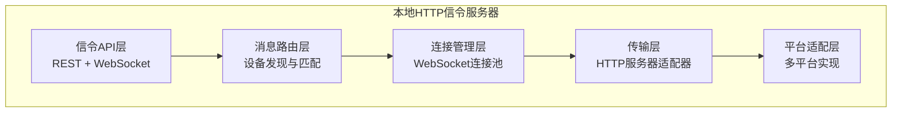

# CardMind 本地HTTP信令服务器架构设计

## 1. 架构设计目标

### 1.1 核心要求
- ✅ **零配置启动**：无需用户手动配置端口和IP
- ✅ **跨平台兼容**：支持Web、Electron、React Native
- ✅ **轻量级**：最小化资源占用，快速启动
- ✅ **高可靠**：自动端口冲突解决，故障自恢复
- ✅ **标准化**：兼容WebRTC信令协议

### 1.2 性能指标
| 指标 | 目标值 | 说明 |
|------|--------|------|
| 启动时间 | < 500ms | 从初始化到可接收连接 |
| 内存占用 | < 50MB | 稳定运行时的内存使用 |
| 并发连接 | > 100 | 同时处理设备连接数 |
| 消息延迟 | < 50ms | 局域网内消息传输延迟 |
| 端口分配成功率 | > 99% | 自动端口分配成功概率 |

## 2. 总体架构

### 2.1 分层架构设计



分层架构设计提供了良好的模块化和可扩展性：
- **信令API层**：提供标准化的REST和WebSocket接口
- **消息路由层**：处理设备发现和消息路由
- **连接管理层**：维护WebSocket连接池
- **传输层**：适配不同的HTTP服务器实现
- **平台适配层**：处理不同平台的特定实现

### 2.2 核心组件关系

```mermaid
flowchart TD
    subgraph "设备A (Web平台)"
        A_App[应用页面] ←→ A_ServiceWorker[Service Worker]
        A_ServiceWorker ←→ A_WebSocket[WebSocket代理]
    end

    subgraph "本地信令服务器"
        Signaling[信令服务器核心] ←→ Adapter[HTTP服务器适配器]
    end

    subgraph "设备B (Electron平台)"
        B_App[Electron应用] ←→ B_WebSocket[WebSocket客户端]
        B_WebSocket ←→ B_NodeHTTP[Node.js HTTP服务器]
    end

    A_WebSocket <-- WebSocket连接 --> Signaling
    Signaling <-- WebSocket连接 --> B_WebSocket
    Adapter --> A_WebSocket
    B_NodeHTTP --> Signaling
```

核心组件关系图展示了不同平台设备间的信令传输流程：
- Web平台使用Service Worker作为HTTP服务器代理
- Electron平台使用原生Node.js HTTP服务器
- 设备间通过WebSocket连接进行信令传输

## 3. 平台实现策略

### 3.1 Web平台方案

**挑战**：浏览器无法直接创建HTTP服务器

**解决方案**：Service Worker代理模式

```mermaid
flowchart TD
    subgraph "Web浏览器架构"
        AppPage[应用页面] ←→ ServiceWorker[Service Worker]
        ServiceWorker ←→ WebSocketProxy[WebSocket代理]
        ServiceWorker ←→ HttpInterceptor[HTTP请求拦截器]
    end

    subgraph "其他设备"
        RemoteServer[远程设备HTTP服务器]
    end

    HttpInterceptor <-- 转发请求 --> WebSocketProxy
    WebSocketProxy <-- WebSocket连接 --> RemoteServer
```

Service Worker代理模式解决了Web平台无法创建HTTP服务器的限制：
- Service Worker拦截特定URL模式的请求
- 将请求转发到其他设备的WebSocket连接
- 接收响应并返回给原始请求
- 维护设备连接映射表

**实现机制**：
1. Service Worker拦截特定URL模式的请求
2. 将请求转发到其他设备的WebSocket连接
3. 接收响应并返回给原始请求
4. 维护设备连接映射表

**限制与优化**：
- 需要至少一个非Web设备作为中继
- 优先选择Electron设备作为hub节点
- 提供"桌面模式"提示用户安装桌面应用

### 3.2 Electron平台方案

**优势**：完整的Node.js环境，功能最全面

**技术栈选择**：
```javascript
// 服务器框架对比
┌─────────────┬──────────┬──────────┬──────────┬─────────────┐
│   框架      │ 启动时间 │ 内存占用 │ 功能完整性 │  选择建议   │
├─────────────┼──────────┼──────────┼──────────┼─────────────┤
│ Express     │ 50ms     │ 35MB     │ ⭐⭐⭐⭐⭐   │ ✅ 推荐     │
│ Fastify     │ 40ms     │ 30MB     │ ⭐⭐⭐⭐    │ 备选方案    │
│ Koa         │ 60ms     │ 40MB     │ ⭐⭐⭐     │ 不适用      │
│ 原生http    │ 20ms     │ 20MB     │ ⭐⭐      │ 过于底层    │
└─────────────┴──────────┴──────────┴──────────┴─────────────┘
```

**核心功能实现**：
```javascript
// 端口自动分配
class PortManager {
  static async findAvailablePort(startPort = 8080, maxPort = 9000) {
    for (let port = startPort; port <= maxPort; port++) {
      if (await this.isPortAvailable(port)) {
        return port;
      }
    }
    throw new Error('No available ports found');
  }
  
  static async isPortAvailable(port) {
    return new Promise((resolve) => {
      const server = net.createServer();
      server.once('error', () => resolve(false));
      server.once('listening', () => {
        server.close();
        resolve(true);
      });
      server.listen(port);
    });
  }
}
```

### 3.3 React Native平台方案

**Android实现**：
```java
// 使用NanoHTTPD轻量级服务器
public class LocalSignalingServer extends NanoHTTPD {
    private static final int DEFAULT_PORT = 8080;
    private final Map<String, WebSocket> connections = new ConcurrentHashMap<>();
    
    public LocalSignalingServer() throws IOException {
        super(DEFAULT_PORT);
        start(NanoHTTPD.SOCKET_READ_TIMEOUT, false);
    }
    
    @Override
    public Response serve(IHTTPSession session) {
        // 处理HTTP请求和WebSocket升级
        return handleRequest(session);
    }
}
```

**iOS实现**：
```swift
// 使用GCDWebServer
class LocalSignalingServer: NSObject {
    private var webServer: GCDWebServer?
    private var connections: [String: WebSocket] = [:]
    
    func startServer() throws {
        webServer = GCDWebServer()
        
        // 添加WebSocket处理
        webServer?.addHandler(forMethod: "GET", 
                             path: "/ws",
                             request: GCDWebServerRequest.self) { [weak self] request in
            return self?.handleWebSocket(request) ?? GCDWebServerResponse(statusCode: 500)
        }
        
        try webServer?.start(options: [
            GCDWebServerOption_Port: 8080,
            GCDWebServerOption_BonjourName: "CardMind-Server"
        ])
    }
}
```

**统一接口封装**：
```typescript
interface LocalServerAdapter {
  start(port?: number): Promise<number>; // 返回实际使用的端口
  stop(): Promise<void>;
  onConnection(callback: (deviceId: string, ws: WebSocket) => void): void;
  sendToDevice(deviceId: string, message: SignalMessage): void;
  broadcast(message: SignalMessage): void;
  getConnectedDevices(): DeviceInfo[];
}
```

## 4. 信令协议设计

### 4.1 REST API设计

**设备信息管理**：
```http
GET /health
→ { "status": "ok", "timestamp": 1234567890 }

GET /info
→ {
  "deviceId": "dev_abc123",
  "deviceName": "我的电脑",
  "platform": "windows",
  "version": "1.0.0",
  "capabilities": ["webrtc", "sync", "collab"],
  "httpPort": 8080,
  "wsPort": 8080
}

GET /peers
→ {
  "peers": [
    {
      "deviceId": "dev_def456",
      "deviceName": "iPhone",
      "platform": "ios",
      "connectionState": "connected",
      "lastSeen": 1234567890
    }
  ]
}
```

**信令消息传输**：
```http
POST /signal/offer
Content-Type: application/json
{
  "from": "dev_abc123",
  "to": "dev_def456",
  "type": "offer",
  "sdp": "v=0\r\no=...",
  "timestamp": 1234567890
}

POST /signal/answer
POST /signal/ice
POST /signal/leave
```

### 4.2 WebSocket协议

**连接建立**：
```javascript
// 客户端连接
const ws = new WebSocket('ws://192.168.1.100:8080/ws');

// 连接握手
ws.onopen = () => {
  ws.send(JSON.stringify({
    type: 'register',
    deviceId: 'dev_abc123',
    deviceName: '我的电脑',
    platform: 'windows',
    capabilities: ['webrtc', 'sync']
  }));
};
```

**消息格式**：
```typescript
interface SignalMessage {
  id: string;           // 消息唯一ID
  type: 'offer' | 'answer' | 'ice' | 'leave' | 'ping' | 'pong';
  from: string;         // 发送方设备ID
  to: string;           // 接收方设备ID
  payload: any;         // 消息内容
  timestamp: number;    // 时间戳
  priority?: 'high' | 'normal' | 'low';
}
```

**心跳机制**：
```javascript
// 客户端心跳
setInterval(() => {
  if (ws.readyState === WebSocket.OPEN) {
    ws.send(JSON.stringify({
      type: 'ping',
      timestamp: Date.now()
    }));
  }
}, 30000); // 30秒一次

// 服务器响应
ws.on('message', (data) => {
  const message = JSON.parse(data);
  if (message.type === 'ping') {
    ws.send(JSON.stringify({
      type: 'pong',
      timestamp: message.timestamp
    }));
  }
});
```

## 5. 连接管理策略

### 5.1 连接池管理

**连接生命周期**：
```
发现设备 → 建立连接 → 身份验证 → 心跳维持 → 连接断开 → 清理资源
```

**连接状态机**：
```typescript
enum ConnectionState {
  DISCOVERED = 'discovered',      // 已发现，未连接
  CONNECTING = 'connecting',      // 连接中
  CONNECTED = 'connected',        // 已连接
  AUTHENTICATED = 'authenticated', // 已认证
  DISCONNECTED = 'disconnected',  // 已断开
  ERROR = 'error'                 // 连接错误
}
```

**连接池实现**：
```typescript
class ConnectionPool {
  private connections: Map<string, DeviceConnection> = new Map();
  private maxConnections: number = 100;
  private idleTimeout: number = 300000; // 5分钟
  
  async addConnection(deviceId: string, connection: WebSocket): Promise<void> {
    if (this.connections.size >= this.maxConnections) {
      await this.cleanupOldestConnection();
    }
    
    const deviceConnection = new DeviceConnection(deviceId, connection);
    this.connections.set(deviceId, deviceConnection);
    
    // 设置连接监听器
    connection.on('close', () => this.removeConnection(deviceId));
    connection.on('error', (error) => this.handleConnectionError(deviceId, error));
  }
  
  private async cleanupOldestConnection(): Promise<void> {
    let oldestConnection: DeviceConnection | null = null;
    let oldestTime = Date.now();
    
    for (const [deviceId, connection] of this.connections) {
      if (connection.lastActivity < oldestTime) {
        oldestTime = connection.lastActivity;
        oldestConnection = connection;
      }
    }
    
    if (oldestConnection) {
      await oldestConnection.close();
      this.connections.delete(oldestConnection.deviceId);
    }
  }
}
```

### 5.2 消息路由策略

**设备匹配算法**：
```typescript
class MessageRouter {
  routeMessage(message: SignalMessage): boolean {
    const targetConnection = this.connectionPool.getConnection(message.to);
    
    if (!targetConnection) {
      // 目标设备未连接，尝试缓存消息
      return this.cacheMessage(message);
    }
    
    if (targetConnection.state !== ConnectionState.AUTHENTICATED) {
      // 连接未认证，等待认证完成
      return this.queueMessage(message);
    }
    
    // 发送消息
    try {
      targetConnection.send(message);
      return true;
    } catch (error) {
      this.handleDeliveryFailure(message, error);
      return false;
    }
  }
  
  private cacheMessage(message: SignalMessage): boolean {
    // 缓存离线消息，等待设备上线
    const cacheKey = `${message.to}:${message.id}`;
    this.messageCache.set(cacheKey, {
      message,
      timestamp: Date.now(),
      retryCount: 0
    });
    
    // 设置缓存过期时间（5分钟）
    setTimeout(() => {
      this.messageCache.delete(cacheKey);
    }, 300000);
    
    return true;
  }
}
```

## 6. 错误处理与容错

### 6.1 端口冲突处理

**冲突检测与解决**：
```typescript
class PortConflictResolver {
  async resolveConflict(preferredPort: number): Promise<number> {
    let currentPort = preferredPort;
    let attemptCount = 0;
    const maxAttempts = 20; // 最多尝试20个端口
    
    while (attemptCount < maxAttempts) {
      try {
        // 尝试启动服务器
        await this.startServer(currentPort);
        return currentPort;
      } catch (error) {
        if (this.isPortConflict(error)) {
          // 端口冲突，尝试下一个端口
          currentPort = this.getNextPort(currentPort);
          attemptCount++;
          
          // 记录冲突日志
          logger.warn(`Port ${currentPort - 1} conflict, trying ${currentPort}`);
        } else {
          // 其他错误，直接抛出
          throw error;
        }
      }
    }
    
    throw new Error(`Failed to find available port after ${maxAttempts} attempts`);
  }
  
  private getNextPort(currentPort: number): number {
    // 在8080-9000范围内循环
    return currentPort >= 9000 ? 8080 : currentPort + 1;
  }
}
```

### 6.2 网络变化适应

**网络变化检测**：
```typescript
class NetworkChangeHandler {
  private currentNetwork: NetworkInfo | null = null;
  
  async handleNetworkChange(): Promise<void> {
    const newNetwork = await this.detectNetwork();
    
    if (this.isNetworkChanged(newNetwork)) {
      logger.info(`Network changed: ${this.currentNetwork?.ip} → ${newNetwork.ip}`);
      
      // 停止当前服务器
      await this.server.stop();
      
      // 更新网络信息
      this.currentNetwork = newNetwork;
      
      // 重新启动服务器
      const newPort = await this.server.start();
      
      // 重新注册mDNS服务
      await this.mdnsService.updateService({
        port: newPort,
        addresses: [newNetwork.ip]
      });
      
      // 通知所有连接设备
      await this.notifyNetworkChange();
    }
  }
  
  private async notifyNetworkChange(): Promise<void> {
    const message: SignalMessage = {
      id: generateId(),
      type: 'network_change',
      from: this.deviceId,
      to: 'broadcast',
      payload: {
        newAddress: this.currentNetwork?.ip,
        newPort: this.server.getPort()
      },
      timestamp: Date.now()
    };
    
    // 广播网络变化通知
    this.connectionPool.broadcast(message);
  }
}
```

### 6.3 自动恢复机制

**故障检测**：
```typescript
class HealthChecker {
  private isHealthy: boolean = true;
  private failureCount: number = 0;
  private readonly maxFailures: number = 3;
  private readonly checkInterval: number = 30000; // 30秒
  
  start(): void {
    setInterval(async () => {
      try {
        await this.performHealthCheck();
        this.isHealthy = true;
        this.failureCount = 0;
      } catch (error) {
        this.failureCount++;
        logger.error(`Health check failed (${this.failureCount}/${this.maxFailures}):`, error);
        
        if (this.failureCount >= this.maxFailures) {
          this.isHealthy = false;
          await this.triggerRecovery();
        }
      }
    }, this.checkInterval);
  }
  
  private async performHealthCheck(): Promise<void> {
    // 检查HTTP服务器状态
    const response = await fetch(`http://localhost:${this.server.getPort()}/health`);
    if (!response.ok) {
      throw new Error(`HTTP server health check failed: ${response.status}`);
    }
    
    // 检查WebSocket连接状态
    const wsConnections = this.connectionPool.getAllConnections();
    for (const connection of wsConnections) {
      if (!connection.isAlive()) {
        throw new Error(`WebSocket connection ${connection.deviceId} is not alive`);
      }
    }
    
    // 检查mDNS服务状态
    if (!this.mdnsService.isRunning()) {
      throw new Error('mDNS service is not running');
    }
  }
  
  private async triggerRecovery(): Promise<void> {
    logger.warn('Triggering automatic recovery...');
    
    try {
      // 1. 停止所有服务
      await this.server.stop();
      await this.mdnsService.stop();
      
      // 2. 清理资源
      this.connectionPool.clear();
      
      // 3. 重新初始化
      await this.initialize();
      
      // 4. 重启服务
      const port = await this.server.start();
      await this.mdnsService.start(port);
      
      logger.info('Automatic recovery completed successfully');
      this.isHealthy = true;
      this.failureCount = 0;
    } catch (error) {
      logger.error('Automatic recovery failed:', error);
      // 通知用户需要手动干预
      this.notifyRecoveryFailure(error);
    }
  }
}
```

## 7. 性能优化

### 7.1 连接池优化

**动态扩缩容**：
```typescript
class AdaptiveConnectionPool {
  private minConnections: number = 5;
  private maxConnections: number = 100;
  private currentMax: number = 20;
  
  adaptToLoad(metrics: ConnectionMetrics): void {
    const utilization = metrics.activeConnections / this.currentMax;
    
    if (utilization > 0.8 && this.currentMax < this.maxConnections) {
      // 高利用率，扩容
      this.currentMax = Math.min(this.currentMax * 1.5, this.maxConnections);
      logger.info(`Increased connection pool size to ${this.currentMax}`);
    } else if (utilization < 0.3 && this.currentMax > this.minConnections) {
      // 低利用率，缩容
      this.currentMax = Math.max(this.currentMax * 0.8, this.minConnections);
      logger.info(`Decreased connection pool size to ${this.currentMax}`);
    }
  }
}
```

### 7.2 消息批处理

**批量消息发送**：
```typescript
class MessageBatcher {
  private batchQueue: SignalMessage[] = [];
  private batchTimeout: number = 50; // 50ms
  private maxBatchSize: number = 10;
  private batchTimer: NodeJS.Timeout | null = null;
  
  addMessage(message: SignalMessage): void {
    this.batchQueue.push(message);
    
    if (this.batchQueue.length >= this.maxBatchSize) {
      this.flushBatch();
    } else if (!this.batchTimer) {
      this.batchTimer = setTimeout(() => {
        this.flushBatch();
      }, this.batchTimeout);
    }
  }
  
  private flushBatch(): void {
    if (this.batchQueue.length === 0) return;
    
    const batchMessage: BatchSignalMessage = {
      id: generateId(),
      type: 'batch',
      messages: this.batchQueue.splice(0),
      timestamp: Date.now()
    };
    
    // 发送批量消息
    this.sendBatch(batchMessage);
    
    // 清理定时器
    if (this.batchTimer) {
      clearTimeout(this.batchTimer);
      this.batchTimer = null;
    }
  }
}
```

## 8. 监控与诊断

### 8.1 性能指标收集

**关键指标**：
```typescript
interface ServerMetrics {
  // 连接指标
  activeConnections: number;
  totalConnections: number;
  connectionRate: number; // 连接/秒
  disconnectionRate: number;
  
  // 消息指标
  messagesReceived: number;
  messagesSent: number;
  messageRate: number; // 消息/秒
  averageMessageSize: number;
  
  // 性能指标
  averageLatency: number; // 毫秒
  memoryUsage: number; // MB
  cpuUsage: number; // 百分比
  
  // 错误指标
  errorRate: number;
  portConflicts: number;
  connectionFailures: number;
}
```

### 8.2 实时监控

**监控仪表板**：
```typescript
class MetricsCollector {
  private metrics: ServerMetrics;
  private readonly windowSize: number = 60; // 60秒滑动窗口
  
  collectMetrics(): ServerMetrics {
    return {
      activeConnections: this.connectionPool.getActiveCount(),
      totalConnections: this.connectionPool.getTotalCount(),
      connectionRate: this.calculateRate('connections'),
      disconnectionRate: this.calculateRate('disconnections'),
      messagesReceived: this.messageCounter.getReceived(),
      messagesSent: this.messageCounter.getSent(),
      messageRate: this.calculateMessageRate(),
      averageMessageSize: this.calculateAverageMessageSize(),
      averageLatency: this.calculateAverageLatency(),
      memoryUsage: process.memoryUsage().heapUsed / 1024 / 1024,
      cpuUsage: this.getCpuUsage(),
      errorRate: this.calculateErrorRate(),
      portConflicts: this.errorCounter.getPortConflicts(),
      connectionFailures: this.errorCounter.getConnectionFailures()
    };
  }
  
  // 性能告警
  checkAlerts(): Alert[] {
    const alerts: Alert[] = [];
    
    if (this.metrics.errorRate > 0.1) { // 错误率超过10%
      alerts.push({
        level: 'warning',
        message: `High error rate: ${(this.metrics.errorRate * 100).toFixed(1)}%`,
        timestamp: Date.now()
      });
    }
    
    if (this.metrics.memoryUsage > 100) { // 内存使用超过100MB
      alerts.push({
        level: 'critical',
        message: `High memory usage: ${this.metrics.memoryUsage.toFixed(1)}MB`,
        timestamp: Date.now()
      });
    }
    
    if (this.metrics.averageLatency > 200) { // 平均延迟超过200ms
      alerts.push({
        level: 'warning',
        message: `High latency: ${this.metrics.averageLatency.toFixed(1)}ms`,
        timestamp: Date.now()
      });
    }
    
    return alerts;
  }
}
```

## 9. 部署策略

### 9.1 渐进式部署

**部署阶段**：
1. **测试阶段**：功能验证，性能基准测试
2. **灰度阶段**：小范围用户试用，收集反馈
3. **全量阶段**：所有用户推送，监控稳定性

**回滚策略**：
- 版本控制：保留旧版本信令逻辑
- 功能开关：通过配置控制新功能启用
- 快速回滚：发现问题时立即切换回旧版本

### 9.2 配置管理

**环境配置**：
```typescript
interface ServerConfig {
  // 基础配置
  port: {
    start: number;      // 起始端口 (默认8080)
    end: number;        // 结束端口 (默认9000)
    retryAttempts: number; // 重试次数 (默认20)
  };
  
  // 连接配置
  connections: {
    max: number;        // 最大连接数 (默认100)
    idleTimeout: number; // 空闲超时 (默认5分钟)
    heartbeatInterval: number; // 心跳间隔 (默认30秒)
  };
  
  // 性能配置
  performance: {
    messageBatchSize: number;  // 消息批处理大小 (默认10)
    messageBatchTimeout: number; // 批处理超时 (默认50ms)
    enableCompression: boolean; // 启用压缩 (默认true)
  };
  
  // 安全配置
  security: {
    enableAuth: boolean;      // 启用认证 (默认false)
    authTimeout: number;      // 认证超时 (默认30秒)
    maxMessageSize: number;   // 最大消息大小 (默认1MB)
  };
  
  // 监控配置
  monitoring: {
    enableMetrics: boolean;   // 启用指标收集 (默认true)
    metricsInterval: number;  // 指标收集间隔 (默认60秒)
    enableLogging: boolean;   // 启用详细日志 (默认false)
  };
}
```

## 10. 测试策略

### 10.1 单元测试

**核心模块测试**：
```typescript
describe('PortManager', () => {
  it('should find available port', async () => {
    const port = await PortManager.findAvailablePort(8080);
    expect(port).toBeGreaterThanOrEqual(8080);
    expect(port).toBeLessThanOrEqual(9000);
  });
  
  it('should handle port conflicts', async () => {
    // 模拟端口冲突
    const occupiedPort = 8080;
    const server = net.createServer();
    await new Promise(resolve => server.listen(occupiedPort, resolve));
    
    const port = await PortManager.findAvailablePort(occupiedPort);
    expect(port).not.toBe(occupiedPort);
    
    server.close();
  });
});

describe('ConnectionPool', () => {
  it('should limit maximum connections', async () => {
    const pool = new ConnectionPool({ maxConnections: 5 });
    
    // 尝试建立6个连接
    const connections = [];
    for (let i = 0; i < 6; i++) {
      const ws = createMockWebSocket();
      connections.push(pool.addConnection(`device${i}`, ws));
    }
    
    // 第6个连接应该被拒绝
    await expect(connections[5]).rejects.toThrow('Max connections reached');
  });
});
```

### 10.2 集成测试

**跨平台兼容性测试**：
```typescript
describe('Cross-platform signaling', () => {
  it('should connect Web and Electron clients', async () => {
    // 启动Electron服务器
    const electronServer = new ElectronSignalingServer();
    const electronPort = await electronServer.start();
    
    // Web客户端连接
    const webClient = new WebSignalingClient();
    await webClient.connect(`ws://localhost:${electronPort}`);
    
    // 验证连接建立
    expect(webClient.getState()).toBe('connected');
    
    // 测试消息传输
    const testMessage = createTestMessage();
    await webClient.send(testMessage);
    
    // 验证消息接收
    const receivedMessage = await electronServer.waitForMessage();
    expect(receivedMessage).toEqual(testMessage);
    
    // 清理
    await webClient.disconnect();
    await electronServer.stop();
  });
});
```

### 10.3 性能测试

**压力测试**：
```typescript
describe('Performance benchmarks', () => {
  it('should handle 100 concurrent connections', async () => {
    const server = new ElectronSignalingServer();
    const port = await server.start();
    
    const clients = [];
    const startTime = Date.now();
    
    // 建立100个并发连接
    for (let i = 0; i < 100; i++) {
      const client = new MockWebSocketClient();
      clients.push(client.connect(`ws://localhost:${port}`));
    }
    
    await Promise.all(clients);
    const connectTime = Date.now() - startTime;
    
    expect(connectTime).toBeLessThan(5000); // 5秒内完成连接
    
    // 测试消息广播性能
    const messageStart = Date.now();
    const broadcastMessage = createBroadcastMessage();
    
    server.broadcast(broadcastMessage);
    
    // 等待所有客户端接收消息
    await Promise.all(clients.map(client => client.waitForMessage()));
    const broadcastTime = Date.now() - messageStart;
    
    expect(broadcastTime).toBeLessThan(100); // 100ms内完成广播
    
    // 清理
    await Promise.all(clients.map(client => client.disconnect()));
    await server.stop();
  });
});
```

## 总结

本地HTTP信令服务器架构设计的关键要点：

1. **跨平台适配**：针对不同平台提供最优实现方案
2. **零配置启动**：自动端口分配和冲突解决
3. **高可靠性**：完善的错误处理和自动恢复机制
4. **高性能**：连接池管理、消息批处理等优化
5. **可监控**：全面的性能指标和实时监控
6. **易测试**：完善的测试策略和自动化测试

这个架构确保了在纯局域网环境下，各设备之间能够建立稳定、高效的信令传输通道，为WebRTC连接建立和数据同步提供可靠基础。