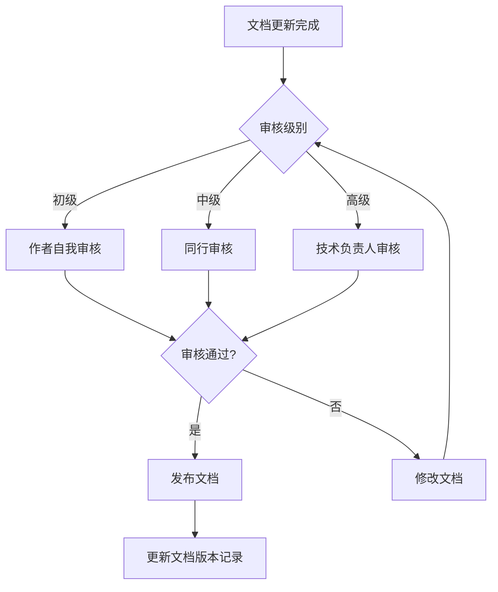
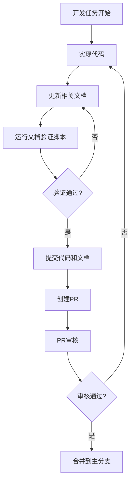

# 文档更新和维护机制

## 1. 概述

本文档详细描述了CardMind项目中文档更新和维护的自动化机制，旨在确保文档内容与代码实现保持同步，提高文档维护的效率和准确性。

## 2. 自动化验证机制

### 2.1 验证脚本设计

设计自动化验证脚本，用于检查文档与代码的一致性：

#### 2.1.1 脚本功能

```markdown
# 文档验证脚本功能

1. **代码引用文档验证**：
   - 检查代码中`@文档`注释引用的文档是否存在
   - 验证文档路径的有效性
   - 统计代码引用文档的数量和分布

2. **文档引用代码验证**：
   - 检查文档中`<!-- CODE_REF: -->`标记引用的代码是否存在
   - 验证代码行范围的有效性
   - 检查代码内容是否与文档引用的一致

3. **文档格式规范验证**：
   - 检查文档是否符合Markdown格式规范
   - 验证标题层级是否正确
   - 检查代码块是否包含语言类型
   - 验证Mermaid图表语法是否正确

4. **文档完整性验证**：
   - 检查文档是否包含所有必要的章节（概述、核心功能、实现细节等）
   - 验证文档是否包含版本记录
   - 检查文档是否包含相关文档链接

5. **链接有效性验证**：
   - 检查文档中的内部链接是否有效
   - 验证文档中的外部链接是否可访问
   - 检查图片链接是否有效
```

#### 2.1.2 脚本实现思路

```javascript
// 文档验证脚本实现思路

// 1. 遍历项目中的所有文档文件
const docFiles = findAllMarkdownFiles('docs/');

// 2. 遍历项目中的所有代码文件
const codeFiles = findAllCodeFiles('src/');

// 3. 验证代码引用文档
codeFiles.forEach(file => {
  const content = readFile(file);
  const docRefs = extractDocReferences(content);
  docRefs.forEach(ref => {
    if (!fileExists(ref.path)) {
      addError(`代码 ${file} 引用的文档 ${ref.path} 不存在`);
    }
  });
});

// 4. 验证文档引用代码

docFiles.forEach(file => {
  const content = readFile(file);
  const codeRefs = extractCodeReferences(content);
  codeRefs.forEach(ref => {
    if (!fileExists(ref.path)) {
      addError(`文档 ${file} 引用的代码 ${ref.path} 不存在`);
    } else {
      const codeContent = readFile(ref.path);
      const lines = codeContent.split('\n');
      if (ref.start > lines.length || ref.end > lines.length) {
        addError(`文档 ${file} 引用的代码行范围 ${ref.start}-${ref.end} 超出文件范围`);
      }
    }
  });
});

// 5. 验证文档格式规范

// 6. 验证文档完整性

// 7. 验证链接有效性

// 8. 生成验证报告

generateValidationReport(errors, warnings);
```

### 2.2 验证频率

- **提交时验证**：在代码提交前自动运行验证脚本
- **PR时验证**：在创建PR时自动运行验证脚本
- **定时验证**：每天凌晨自动运行验证脚本，检查所有文档

### 2.3 验证报告

验证脚本生成详细的验证报告，包括：

- 验证时间和范围
- 发现的错误数量和类型
- 发现的警告数量和类型
- 每个问题的详细描述和位置
- 修复建议

## 3. 文档审核流程

### 3.1 审核级别

根据文档的重要性和变更范围，将文档审核分为三个级别：

#### 3.1.1 初级审核（自我审核）

- **审核者**：文档作者
- **审核内容**：格式规范、内容完整性、基本准确性
- **审核方式**：作者自行检查
- **适用范围**：文档格式调整、小的内容修正

#### 3.1.2 中级审核（同行审核）

- **审核者**：相关领域的开发人员或文档作者
- **审核内容**：内容准确性、技术正确性、逻辑一致性
- **审核方式**：代码审查工具或文档审查平台
- **适用范围**：功能文档更新、API文档变更

#### 3.1.3 高级审核（技术负责人审核）

- **审核者**：技术负责人或架构师
- **审核内容**：整体架构一致性、技术方向正确性、战略一致性
- **审核方式**：面对面或视频会议
- **适用范围**：架构文档变更、核心功能文档更新

### 3.2 审核流程



### 3.3 审核标准

文档审核应遵循以下标准：

| 审核维度 | 标准 |
|---------|------|
| 内容准确性 | 与代码实现一致，无错误信息 |
| 格式规范性 | 符合项目的文档格式规范 |
| 结构完整性 | 包含所有必要的章节 |
| 逻辑一致性 | 内容逻辑清晰，无矛盾之处 |
| 语言可读性 | 语言清晰易懂，无歧义 |
| 技术正确性 | 技术术语使用正确，无技术错误 |

## 4. 文档版本控制机制

### 4.1 版本控制策略

- **语义化版本号**：使用`MAJOR.MINOR.PATCH`格式
  - `MAJOR`：文档结构发生重大变化
  - `MINOR`：文档内容增加或修改
  - `PATCH`：文档内容小的修正

- **版本记录**：在文档末尾添加版本记录，包含版本号、日期和变更内容

```markdown
**版本记录**：
- v1.0.0 (2024-01-15)：初始版本
- v1.0.1 (2024-01-20)：修复了API接口描述错误
- v1.1.0 (2024-02-01)：添加了新功能的文档
```

### 4.2 Git分支策略

- **主分支**：包含正式发布的文档
- **开发分支**：包含正在开发中的文档
- **特性分支**：包含特定功能或文档的更新

### 4.3 变更日志

维护文档变更日志，记录所有文档的重要变更：

```markdown
# 文档变更日志

## 2024-05-20

- 更新了[认证服务API文档](03-technical/api/03-api-01-auth-service-api.md)，添加了实操示例
- 更新了[卡片服务API文档](03-technical/api/03-api-03-card-service-api.md)，修复了接口描述错误
- 创建了[文档维护规范与更新流程](03-technical/0320-document-maintenance-guidelines.md)

## 2024-05-19

- 更新了[本地信令服务器文档](03-technical/0310-local-signaling-server.md)，添加了Mermaid流程图
- 创建了[文档与代码强绑定机制](document-code-binding.md)
```

## 5. 文档更新提醒机制

### 5.1 集成到开发流程

将文档更新集成到开发流程中：



### 5.2 提醒方式

- **代码提交钩子**：在代码提交前检查相关文档是否已更新
- **PR模板**：在PR模板中添加文档更新检查项
- **定期提醒**：每周向团队发送文档更新提醒
- **自动化通知**：当发现文档与代码不一致时，自动发送通知给相关负责人

### 5.3 PR模板示例

```markdown
# PR描述

## 变更内容

- [ ] 实现了新功能X
- [ ] 修复了bug Y
- [ ] 优化了性能Z

## 文档更新

- [ ] 更新了相关文档：
  - [ ] 功能文档
  - [ ] API文档
  - [ ] 架构文档

## 文档验证

- [ ] 运行了文档验证脚本，无错误
- [ ] 文档与代码实现一致
- [ ] 文档格式符合规范

## 审核检查

- [ ] 代码已审核
- [ ] 文档已审核
- [ ] 测试已通过
```

## 6. 文档维护 dashboard

### 6.1 Dashboard 设计

设计文档维护 dashboard，用于监控文档的状态和健康度：

#### 6.1.1 核心指标

- **文档总数**：项目中文档的总数
- **已绑定文档数**：与代码建立强绑定的文档数
- **待更新文档数**：需要更新的文档数
- **文档验证通过率**：文档验证通过的百分比
- **文档审核通过率**：文档审核通过的百分比

#### 6.1.2 状态监控

- **文档与代码一致性**：实时显示文档与代码的一致性状态
- **文档更新状态**：显示最近更新的文档和需要更新的文档
- **文档审核状态**：显示正在审核的文档和待审核的文档
- **文档质量评分**：根据文档完整性、准确性和格式规范对文档进行评分

#### 6.1.3 可视化图表


### 6.2 Dashboard 实现思路

```javascript
// 文档维护Dashboard实现思路

// 1. 数据收集
const docStats = {
  totalDocs: getTotalDocs(),
  boundDocs: getBoundDocs(),
  outdatedDocs: getOutdatedDocs(),
  validationPassRate: getValidationPassRate(),
  reviewPassRate: getReviewPassRate()
};

// 2. 数据可视化
renderPieChart('doc-status', docStatusData);
renderBarChart('validation-rate', validationRateData);
renderLineChart('update-frequency', updateFrequencyData);

// 3. 实时更新
setInterval(() => {
  updateDocStats();
  refreshCharts();
}, 3600000); // 每小时更新一次

// 4. 告警机制
if (docStats.validationPassRate < 90) {
  sendAlert('文档验证通过率低于90%，请检查');
}

if (docStats.outdatedDocs > 10) {
  sendAlert('有10个以上文档需要更新，请及时处理');
}
```

## 7. 文档维护的最佳实践

### 7.1 日常维护

- **小步更新**：每次只更新少量文档内容，避免大规模变更
- **及时更新**：代码变更后立即更新相关文档
- **定期检查**：每周检查一次文档与代码的一致性
- **保持简洁**：文档内容要简洁明了，避免冗余

### 7.2 团队协作

- **明确责任**：每个文档指定专门的负责人
- **定期沟通**：定期召开文档维护会议，讨论文档改进方向
- **知识共享**：分享文档编写和维护的最佳实践
- **鼓励反馈**：鼓励团队成员提供文档改进建议

### 7.3 持续改进

- **收集反馈**：定期收集用户和团队成员对文档的反馈
- **分析问题**：分析文档维护中遇到的问题和挑战
- **优化流程**：不断优化文档维护流程和机制
- **更新规范**：根据实际情况更新文档规范和指南

## 8. 附录

### 8.1 相关文档

- [文档管理策略](0319-document-management-strategy.md)
- [文档维护规范与更新流程](0320-document-maintenance-guidelines.md)
- [文档与代码强绑定机制](../document-code-binding.md)

### 8.2 工具推荐

- **Markdownlint**：检查Markdown文档的格式规范
- **Linkchecker**：检查文档中的链接是否有效
- **Mermaid CLI**：验证Mermaid图表语法
- **Git Hooks**：在代码提交前运行文档验证脚本

---

**版本记录**：
- v1.0.0 (2024-05-21)：初始版本