# API测试设计文档索引

本文档作为CardMind应用技术文档的中心索引，提供了API设计和测试相关文档的导航和概述。通过此索引可以快速定位到各功能模块的详细设计和测试说明。

## 文档结构

CardMind应用的API和测试文档按照功能模块和测试类型进行了结构化拆分，主要分为以下几个部分：

### 1. API接口设计与测试

- **单个服务API文档**：包含各核心服务的独立API接口定义和单元测试代码
- **单个Store API文档**：包含各状态管理模块的独立API定义和单元测试

### 2. 测试计划与策略

- **系统测试计划**：包含数据存储测试和同步功能测试的详细计划
- **回归测试计划**：包含测试策略、环境配置、执行计划和缺陷管理流程
- **用户界面测试**：包含UI元素、交互逻辑和用户体验的测试计划
- **测试工具与技术**：包含推荐工具、覆盖率要求和最佳实践

## 文档导航

### 1. API设计与单元测试文档

### 1.1 单个服务API文档

#### 2.1 [认证服务API](api/auth-service-api.md)
- AuthService接口定义和单元测试

#### 2.2 [设备服务API](api/device-service-api.md)
- DeviceService接口定义和单元测试

#### 2.3 [卡片服务API](api/card-service-api.md)
- CardService接口定义
- [卡片服务API单元测试](api/card-service-api-test.md)

#### 2.4 [加密服务API](api/encryption-service-api.md)
- EncryptionService接口定义和单元测试

#### 2.5 [同步服务API](api/sync-service-api.md)
- SyncService接口定义和单元测试

### 3. 单个Store API文档

#### 3.1 [认证Store API](api/auth-store-api.md)
- authStore接口定义和单元测试

#### 3.2 [设备Store API](api/device-store-api.md)
- deviceStore接口定义和单元测试

#### 3.3 [卡片Store API](api/card-store-api.md)
- cardStore接口定义和单元测试

#### 3.4 [同步Store API](api/sync-store-api.md)
- syncStore接口定义和单元测试

### 2. 测试计划与策略文档

#### 2.1 [系统测试计划](testing/system-testing-plan.md)

**内容概述**：
- 详细说明了CardMind应用的系统级测试策略
- 包含数据存储测试计划（测试目标、场景和脚本示例）
- 包含同步功能测试计划（测试目标、场景和脚本示例）
- 涵盖了基本操作、批量操作、边界测试和异常场景

#### 2.2 [回归测试计划](testing/regression-testing-plan.md)

**内容概述**：
- 详细定义了CardMind应用的回归测试策略
- 包含测试环境配置说明
- 提供了详细的测试执行计划
- 定义了用例管理和缺陷管理流程

#### 2.3 [用户界面测试](testing/ui-testing.md)

**内容概述**：
- 详细描述了用户界面测试的测试目标
- 包含登录页面、卡片管理、同步功能等UI测试场景
- 提供了完整的Playwright测试脚本示例
- 涵盖了功能正确性、用户体验、兼容性和一致性测试

#### 2.4 [测试工具与技术](testing/testing-tools.md)

**内容概述**：
- 推荐了适用于CardMind应用的测试工具
- 定义了测试覆盖率要求和监控方法
- 提供了测试最佳实践指南
- 包含测试自动化框架配置和使用示例
- 说明了测试环境管理方法

## 文档关系图

```mermaid
graph TD
    A[API测试设计文档索引] --> B3[单个服务API文档]
    A --> B4[单个Store API文档]
    A --> C1[系统测试计划]
    A --> C2[回归测试计划]
    A --> C3[用户界面测试]
    A --> C4[测试工具与技术]
    
    B3 --> D1a[认证服务API]
    B3 --> D2a[设备服务API]
    B3 --> D3a[卡片服务API]
    B3 --> D4a[加密服务API]
    B3 --> D5a[同步服务API]
    
    B4 --> E1a[认证Store API]
    B4 --> E2a[设备Store API]
    B4 --> E3a[卡片Store API]
    B4 --> E4a[同步Store API]
    
    C1 --> F1[数据存储测试]
    C1 --> F2[同步功能测试]
    
    C2 --> G1[测试策略]
    C2 --> G2[环境配置]
    C2 --> G3[执行计划]
    C2 --> G4[用例管理]
    C2 --> G5[缺陷管理]
    
    C3 --> I1[登录页面测试]
    C3 --> I2[卡片管理测试]
    C3 --> I3[同步功能UI测试]
    C3 --> I4[响应式设计测试]
    
    C4 --> H1[推荐工具]
    C4 --> H2[覆盖率要求]
    C4 --> H3[最佳实践]
    C4 --> H4[自动化框架]
    C4 --> H5[环境管理]
```

## 文档引用关系

| 文档 | 引用的文档 | 被引用的文档 |
|------|------------|------------|
| 系统测试计划 | API测试设计文档索引 | 单个服务API文档, 单个Store API文档, 回归测试计划, 用户界面测试, 测试工具与技术 |
| 回归测试计划 | API测试设计文档索引 | 单个服务API文档, 单个Store API文档, 系统测试计划, 用户界面测试, 测试工具与技术 |
| 用户界面测试 | API测试设计文档索引 | 单个服务API文档, 单个Store API文档, 系统测试计划, 回归测试计划, 测试工具与技术 |
| 测试工具与技术 | API测试设计文档索引 | 单个服务API文档, 单个Store API文档, 系统测试计划, 回归测试计划, 用户界面测试 |
| 认证服务API | API测试设计文档索引 | API测试设计文档索引 |
| 设备服务API | API测试设计文档索引 | API测试设计文档索引 |
| 卡片服务API | API测试设计文档索引 | API测试设计文档索引 |
| 加密服务API | API测试设计文档索引 | API测试设计文档索引 |
| 同步服务API | API测试设计文档索引 | API测试设计文档索引 |
| 认证Store API | API测试设计文档索引 | API测试设计文档索引 |
| 设备Store API | API测试设计文档索引 | API测试设计文档索引 |
| 卡片Store API | API测试设计文档索引 | API测试设计文档索引 |
| 同步Store API | API测试设计文档索引 | API测试设计文档索引 |

## 文档维护说明

- 文档更新应遵循**单一职责原则**，每个文档只关注其定义的主题
- 当修改一个文档时，应同步更新相关引用和索引
- 文档版本应与代码版本保持一致
- 新增功能模块时，应在相应分类下创建新文档，并更新索引

## 文档使用指南

1. **开发人员**：
   - 通过API接口设计文档了解接口规范
   - 使用单元测试示例作为编码参考
   - 参考测试最佳实践编写高质量代码

2. **测试人员**：
   - 查阅系统测试计划和回归测试计划
   - 参考测试工具与技术文档设置测试环境
   - 按照测试用例管理规范创建和执行测试

3. **项目管理人员**：
   - 通过索引了解整体技术架构
   - 参考测试计划评估项目风险
   - 利用缺陷管理流程跟踪问题解决进度

## 相关资源

- [CardMind应用架构设计](../architecture/architecture-design.md)（假设路径，需根据实际情况调整）
- [CardMind前端开发指南](../frontend/frontend-guide.md)（假设路径，需根据实际情况调整）
- [CardMind后端API文档](../backend/api-documentation.md)（假设路径，需根据实际情况调整）

---

*本文档由CardMind技术团队维护，最后更新时间：2023年12月*