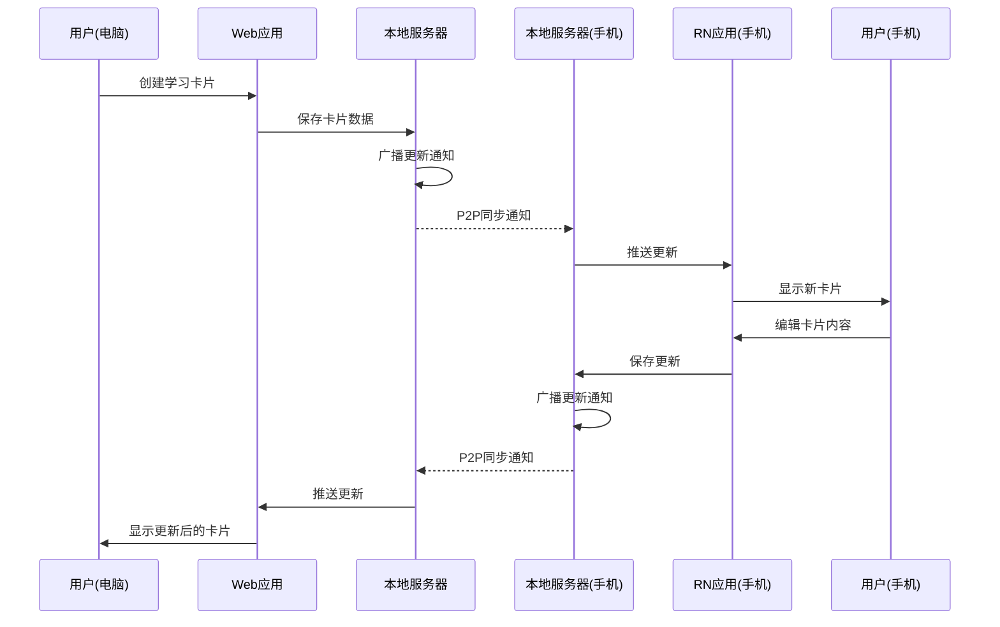
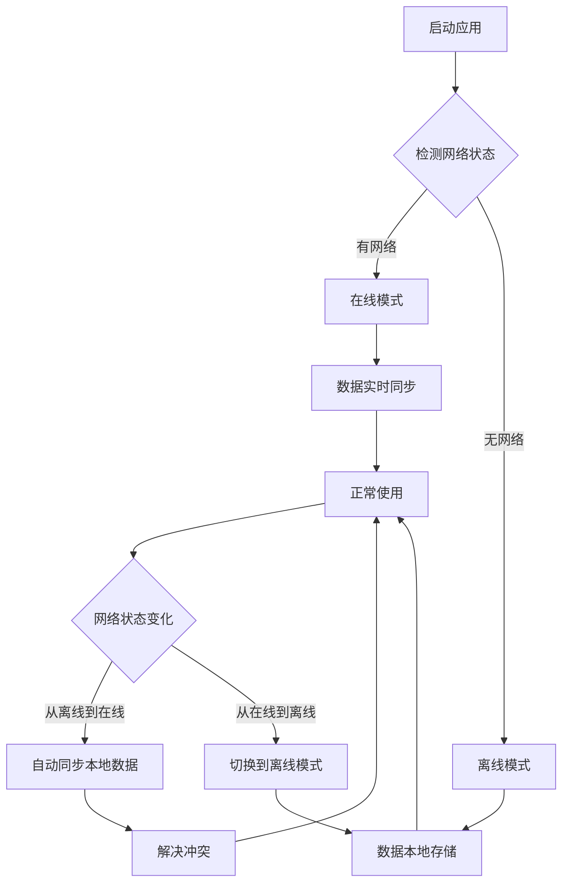
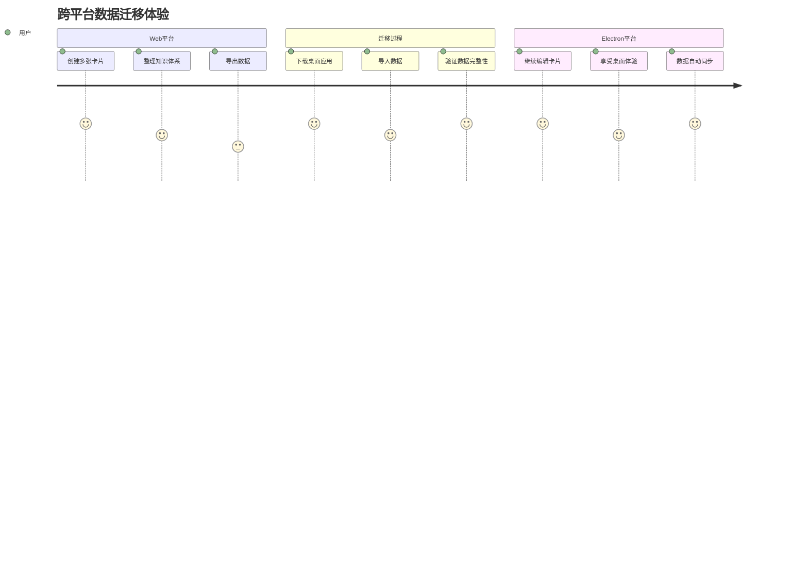

# 统一业务逻辑架构设计

## 1. 概述

本文档描述了CardMind项目的统一业务逻辑架构设计，旨在实现前后端业务逻辑统一、平台无关性、渐进式平台适配和零成本迁移的架构目标。通过分层架构设计，实现一套核心业务逻辑代码在Web、Electron和React Native三个平台的复用，最大化代码复用率，降低开发和维护成本。

## 2. 核心内容

### 2.1 架构设计原则

#### 2.1.1 前后端业务逻辑统一
- Web前后端共享相同的业务逻辑代码，确保一致性
- 前端React组件 + 后端Node.js服务共享相同业务逻辑

#### 2.1.2 平台无关性
- 核心业务逻辑与平台解耦，通过适配层实现跨平台
- 一套代码，多端运行，最大化代码复用率

#### 2.1.3 渐进式平台适配
- 从Web平台完整验证开始，逐步扩展到Electron/RN
- 迁移成本最低：Web前端可直接迁移到Electron/RN，仅需补充平台能力

#### 2.1.4 零成本迁移
- Web前端组件和业务逻辑可直接迁移到客户端平台
- 仅需适配平台特定能力，无需重写业务逻辑

### 2.2 架构分层

#### 2.2.1 分层架构图
```
┌─────────────────────────────────────────────────────────────┐
│                    表现层（Presentation Layer）               │
│  ┌─────────────┐  ┌──────────────┐  ┌──────────────────┐    │
│  │ React Web   │  │ Electron UI  │  │ React Native     │    │
│  │ 组件        │  │ 复用Web组件  │  │ 原生组件         │    │
│  └──────┬──────┘  └──────┬───────┘  └──────────┬─────────┘    │
│         │                │                      │            │
└─────────┼──────┼─────────┼──────────┼─────────────────┘
          │      │         │          │
          ▼      ▼         ▼          ▼
┌─────────────────────────────────────────────────────────────┐
│                 统一业务逻辑层（Unified Business Logic）       │
│  ┌─────────────┐  ┌──────────────┐  ┌──────────────────┐    │
│  │ CardService │  │ SyncService  │  │ AuthService      │    │
│  │ 卡片管理    │  │ 数据同步     │  │ 身份认证         │    │
│  ├─────────────┤  ├──────────────┤  ├──────────────────┤    │
│  │ NetworkSvc  │  │ EncryptService│ │ DeviceService    │    │
│  │ 网络管理    │  │ 加密服务     │  │ 设备管理         │    │
│  └──────┬──────┘  └──────┬───────┘  └──────────┬─────────┘    │
│         │                │                      │            │
└─────────┼──────┼─────────┼──────────┼─────────────────┘
          │      │         │          │
          ▼      ▼         ▼          ▼
┌─────────────────────────────────────────────────────────────┐
│                 平台适配层（Platform Adapter Layer）          │
│  ┌─────────────┐  ┌──────────────┐  ┌──────────────────┐    │
│  │ WebAdapter  │  │ ElectronAdapter│  │ ReactNativeAdapter│   │
│  │ Web平台适配 │  │ 桌面平台适配  │  │ 移动端平台适配   │    │
│  ├─────────────┤  ├──────────────┤  ├──────────────────┤    │
│  │ StorageAdapter│ NetworkAdapter │ SystemAdapter    │    │
│  │ 存储适配    │  │ 网络适配     │  │ 系统能力适配     │    │
│  └──────┬──────┘  └──────┬───────┘  └──────────┬─────────┘    │
│         │                │                      │            │
└─────────┼──────┼─────────┼──────────┼─────────────────┘
          │      │         │          │
          ▼      ▼         ▼          ▼
┌─────────────────────────────────────────────────────────────┐
│                    平台原生能力（Native Layer）                │
│  ┌─────────────┐  ┌──────────────┐  ┌──────────────────┐    │
│  │ IndexedDB   │  │ Node.js API  │  │ AsyncStorage     │    │
│  │ Web存储     │  │ 桌面API      │  │ RN存储           │    │
│  ├─────────────┤  ├──────────────┤  ├──────────────────┤    │
│  │ WebSocket   │  │ Native HTTP  │  │ Native Modules   │    │
│  │ Web网络     │  │ Server       │  │ 原生模块         │    │
│  └─────────────┘  └──────────────┘  └──────────────────┘    │
└─────────────────────────────────────────────────────────────┘
```

#### 2.2.2 核心接口设计

##### 2.2.2.1 业务服务接口
```typescript
// 平台无关的业务逻辑接口
interface ICardService {
  createCard(card: CreateCardDto): Promise<Card>;
  updateCard(id: string, updates: UpdateCardDto): Promise<Card>;
  deleteCard(id: string): Promise<void>;
  getCard(id: string): Promise<Card | null>;
  getAllCards(): Promise<Card[]>;
  searchCards(query: string): Promise<Card[]>;
}

interface ISyncService {
  initialize(): Promise<void>;
  joinNetwork(accessCode: string): Promise<void>;
  leaveNetwork(): Promise<void>;
  broadcastCardUpdate(card: Card): Promise<void>;
  requestSync(): Promise<void>;
  getConnectionStatus(): ConnectionStatus;
}

interface IAuthService {
  generateAccessCode(): Promise<string>;
  validateAccessCode(code: string): Promise<boolean>;
  getCurrentUser(): User | null;
}
```

##### 2.2.2.2 平台适配接口
```typescript
// 存储适配器接口
interface IStorageAdapter {
  getItem<T>(key: string): Promise<T | null>;
  setItem<T>(key: string, value: T): Promise<void>;
  removeItem(key: string): Promise<void>;
  clear(): Promise<void>;
  keys(): Promise<string[]>;
}

// 网络适配器接口
interface INetworkAdapter {
  createWebSocket(url: string): WebSocket;
  createHttpServer(port: number): HttpServer;
  discoverDevices(): Promise<Device[]>;
  getNetworkInfo(): NetworkInfo;
}

// 系统能力接口
interface ISystemAdapter {
  getPlatformInfo(): PlatformInfo;
  showNotification(title: string, body: string): Promise<void>;
  requestPermission(type: PermissionType): Promise<boolean>;
}
```

### 2.3 平台迁移策略

#### 2.3.1 Web平台（基准平台）
**架构模式**: 前后端完全分离
```
Web前端 (React + TypeScript)
    ↓ HTTP/WebSocket
Web后端 (Node.js + Express)
    ↓ LevelDB
数据持久化 (文件系统/SQLite)
```

**职责划分**:
- 前端：UI展示、用户交互、本地状态管理
- 后端：业务逻辑、数据持久化、网络服务、设备发现
- 通信：HTTP API + WebSocket实时通信

#### 2.3.2 Electron平台
**架构模式**: 前后端打包集成
```
Electron主进程 = Web后端 (Node.js + Express + 业务逻辑)
    ↓ IPC通信
Electron渲染进程 = Web前端 (React + UI组件)
    ↓ 本地调用
数据持久化 (SQLite/文件系统)
```

**迁移策略**:
1. 主进程直接复用Web后端代码（包含业务逻辑）
2. 渲染进程直接复用Web前端组件
3. 用IPC替代HTTP通信，保持接口一致性
4. 平台能力用Electron API实现

#### 2.3.3 React Native平台
**架构模式**: 原生模块 + JavaScript业务逻辑
```
RN原生模块 (Objective-C/Java + 原生能力)
    ↓ Native Bridge
RN JavaScript = Web前端 (React Native组件) + Web后端 (业务逻辑)
    ↓ AsyncStorage/原生存储
数据持久化 (SQLite/原生存储)
```

**迁移策略**:
1. 用原生模块实现后端能力（HTTP服务器、文件系统）
2. JavaScript层复用Web前后端业务逻辑
3. UI层用React Native组件替换Web组件
4. 保持业务逻辑接口完全一致

#### 2.3.4 技术实现示例
以下是一个简单的代码示例，展示如何实现跨平台的卡片服务：

```typescript
// 统一业务逻辑层 - 卡片服务实现
class CardService implements ICardService {
  constructor(
    private storageAdapter: IStorageAdapter,
    private networkAdapter: INetworkAdapter
  ) {}

  async createCard(card: CreateCardDto): Promise<Card> {
    const newCard: Card = {
      id: generateId(),
      ...card,
      createdAt: new Date(),
      updatedAt: new Date()
    };
    
    await this.storageAdapter.setItem(`card:${newCard.id}`, newCard);
    await this.networkAdapter.broadcastCardUpdate(newCard);
    
    return newCard;
  }

  async getCard(id: string): Promise<Card | null> {
    return await this.storageAdapter.getItem<Card>(`card:${id}`);
  }

  // 其他方法实现...
}

// Web平台适配器实现
class WebStorageAdapter implements IStorageAdapter {
  async getItem<T>(key: string): Promise<T | null> {
    const result = await localStorage.getItem(key);
    return result ? JSON.parse(result) : null;
  }

  async setItem<T>(key: string, value: T): Promise<void> {
    await localStorage.setItem(key, JSON.stringify(value));
  }

  // 其他方法实现...
}

// Electron平台适配器实现
class ElectronStorageAdapter implements IStorageAdapter {
  private db: Database;

  constructor(dbPath: string) {
    this.db = new Database(dbPath);
  }

  async getItem<T>(key: string): Promise<T | null> {
    const stmt = this.db.prepare('SELECT value FROM storage WHERE key = ?');
    const result = stmt.get(key);
    return result ? JSON.parse(result.value) : null;
  }

  async setItem<T>(key: string, value: T): Promise<void> {
    const stmt = this.db.prepare('INSERT OR REPLACE INTO storage (key, value) VALUES (?, ?)');
    stmt.run(key, JSON.stringify(value));
  }

  // 其他方法实现...
}

// 平台工厂 - 根据平台创建适配器
class PlatformAdapterFactory {
  static createStorageAdapter(): IStorageAdapter {
    if (typeof window !== 'undefined' && window.localStorage) {
      // Web平台
      return new WebStorageAdapter();
    } else if (typeof window !== 'undefined' && window.electronAPI) {
      // Electron平台
      return new ElectronStorageAdapter(window.electronAPI.dbPath);
    } else {
      // React Native平台
      return new ReactNativeStorageAdapter();
    }
  }

  static createNetworkAdapter(): INetworkAdapter {
    if (typeof window !== 'undefined' && window.fetch) {
      // Web平台
      return new WebNetworkAdapter();
    } else if (typeof window !== 'undefined' && window.electronAPI) {
      // Electron平台
      return new ElectronNetworkAdapter();
    } else {
      // React Native平台
      return new ReactNativeNetworkAdapter();
    }
  }
}

// 使用示例 - 业务逻辑代码完全平台无关
async function initializeApp() {
  const storageAdapter = PlatformAdapterFactory.createStorageAdapter();
  const networkAdapter = PlatformAdapterFactory.createNetworkAdapter();
  
  const cardService = new CardService(storageAdapter, networkAdapter);
  const syncService = new SyncService(networkAdapter);
  
  // 创建一张新卡片
  const newCard = await cardService.createCard({
    title: "我的第一张卡片",
    content: "这是卡片的内容",
    tags: ["学习", "笔记"]
  });
  
  console.log("创建卡片成功:", newCard);
  
  // 加入同步网络
  await syncService.initialize();
  await syncService.joinNetwork("ROOM-12345");
}
```

详细的技术实现代码示例请参考 [技术实现示例文档](implementation-examples.md)，其中包含：
- 统一业务逻辑层实现示例
- 跨平台迁移实现示例
- 网络发现实现示例
- 存储适配实现示例
- 错误处理与降级机制

### 2.4 实现路径

#### 2.4.1 第一阶段：Web平台验证
**目标**: 在Web平台验证业务逻辑的完整性和正确性

**关键任务**:
- 设计并实现所有业务服务接口
- 实现Web平台的适配器（IndexedDB、WebSocket、Web API）
- 建立完整的测试体系（单元测试、集成测试）
- 验证前后端分离架构的可行性

**交付标准**:
- 所有业务功能在Web平台正常运行
- 测试覆盖率 > 80%
- 性能指标满足要求（响应时间 < 100ms）

#### 2.4.2 第二阶段：Electron适配
**目标**: 将Web代码迁移到Electron平台，验证平台无关性

**关键任务**:
- 创建Electron主进程，集成Web后端代码
- 实现Electron适配器（Node.js API、IPC通信）
- 用IPC替代HTTP通信，保持接口兼容
- 验证所有业务功能在Electron平台正常运行

**交付标准**:
- 零修改复用Web业务逻辑代码
- 所有功能在Electron平台正常运行
- 性能不低于Web平台

#### 2.4.3 第三阶段：React Native适配
**目标**: 将业务逻辑迁移到React Native平台

**关键任务**:
- 开发RN原生模块（HTTP服务器、文件系统）
- 实现React Native适配器（AsyncStorage、原生API）
- 用React Native组件替换Web UI组件
- 保持业务逻辑层零修改

**交付标准**:
- 业务逻辑代码100%复用
- UI适配完整，用户体验良好
- 性能满足移动端要求

### 2.5 技术挑战与解决方案

#### 2.5.1 存储差异
**挑战**: 不同平台的存储API差异很大
**解决方案**: 
- 抽象统一的存储接口
- 每个平台实现对应的存储适配器
- 提供数据迁移工具

#### 2.5.2 网络通信
**挑战**: Web用HTTP，Electron/RN需要本地通信
**解决方案**:
- 抽象统一的网络接口
- Web平台用HTTP实现，Electron/RN用IPC/原生通道实现
- 保持业务逻辑层接口一致

#### 2.5.3 文件系统
**挑战**: Web平台的文件访问能力受限
**解决方案**:
- 设计平台无关的文件操作接口
- Web平台用IndexedDB模拟文件系统
- Electron/RN用原生文件系统API

#### 2.5.4 性能优化
**挑战**: 不同平台的性能特征不同
**解决方案**:
- 建立跨平台的性能基准测试
- 针对每个平台做特定的性能优化
- 保持业务逻辑不变，优化平台适配层

## 3. 注意事项

### 3.1 架构设计注意事项
- **接口设计**: 确保平台无关接口的稳定性和扩展性
- **状态管理**: 统一的状态管理模式，避免平台特定实现
- **错误处理**: 统一的错误处理机制，提供平台特定的错误恢复策略

### 3.2 实施风险注意事项
- **渐进式实施**: 严格按照Web→Electron→React Native的顺序实施
- **充分测试**: 每个平台适配完成后进行全面测试
- **性能监控**: 持续监控各平台性能指标，及时优化

### 3.3 团队协作注意事项
- **技能要求**: 团队需要掌握多平台开发技能
- **代码规范**: 统一的代码规范和最佳实践
- **文档维护**: 及时更新架构文档和实施指南

## 4. 关联文档

- [技术栈文档](tech-stack.md) - 了解项目整体技术选型
- [技术概念文档](tech-concepts.md) - 深入理解核心技术概念
- [实现计划文档](implementation-plan.md) - 查看详细实施计划
- [技术实现示例](implementation-examples.md) - 参考具体代码实现
- [跨平台架构设计](cross-platform-architecture.md) - 了解跨平台架构细节

## 5. 实际应用场景示例

### 5.1 多设备协作场景
假设用户在电脑上创建了一张学习卡片，希望在手机上也能查看和编辑：



### 5.2 离线工作场景
用户在没有网络连接的环境下使用CardMind：



### 5.3 跨平台数据迁移场景
用户从Web平台切换到Electron桌面应用：



## 6. 预期收益

### 6.1 开发效率
- **代码复用率**: 业务逻辑代码复用率 > 90%
- **开发时间**: 新功能开发时间减少 60%
- **维护成本**: bug修复和功能更新成本降低 70%

### 6.2 质量保证
- **一致性**: 所有平台功能行为完全一致
- **可靠性**: 统一的测试覆盖，质量更有保障
- **可维护性**: 代码集中管理，易于维护和升级

### 6.3 扩展性
- **新平台支持**: 新增平台只需实现适配层
- **新功能开发**: 一次开发，多端受益
- **技术升级**: 平台技术升级不影响业务逻辑

## 7. 风险评估

### 7.1 技术风险
- **适配复杂度**: 某些平台能力可能难以抽象
- **性能差异**: 不同平台性能表现可能差异较大
- **调试难度**: 跨平台问题调试复杂度增加

### 7.2 项目风险
- **开发周期**: 初期架构设计需要更多时间
- **学习成本**: 团队需要掌握多平台开发技能
- **技术债务**: 架构设计不当可能导致后期重构

### 7.3 缓解措施
- **渐进式实施**: 从Web开始，逐步扩展到其他平台
- **充分验证**: 每个阶段都要充分测试和验证
- **技术评审**: 关键设计决策需要团队评审
- **风险监控**: 持续监控技术风险和项目进度