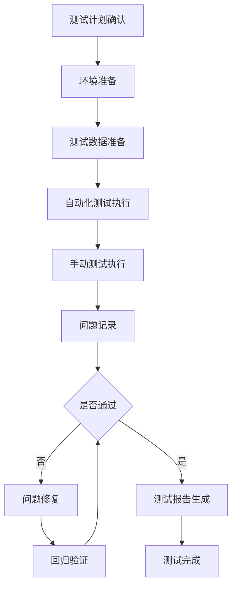
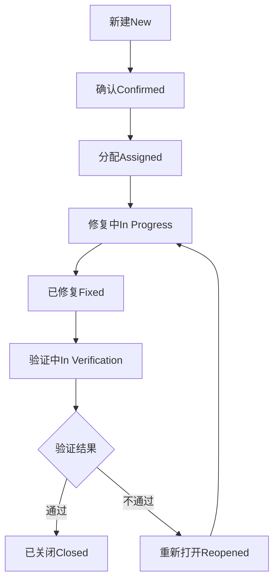

# 回归测试计划

本文档详细描述了CardMind应用的回归测试计划，包括测试策略、环境配置、执行计划、用例管理和缺陷管理流程。

## 目录

- [1. 回归测试策略](#1-回归测试策略)
- [2. 测试环境配置](#2-测试环境配置)
- [3. 执行计划](#3-执行计划)
- [4. 用例管理](#4-用例管理)
- [5. 缺陷管理流程](#5-缺陷管理流程)

## 1. 回归测试策略

### 1.1 测试范围界定

- **全面回归测试**：在重大版本发布前执行，覆盖所有功能模块
- **选择性回归测试**：针对特定功能变更或修复执行，聚焦于变更影响的功能区域
- **冒烟测试**：每次构建后快速验证核心功能可用性
- **自动化回归测试**：针对稳定功能模块实现自动化测试，提高测试效率

### 1.2 优先级划分

| 优先级 | 测试范围 | 触发条件 | 执行频率 |
|--------|----------|----------|----------|
| P0 | 核心用户流程和功能 | 每次代码提交 | 每日 |
| P1 | 重要业务功能 | 功能模块变更 | 每周 |
| P2 | 次要功能和边缘场景 | 版本发布前 | 每版本 |

### 1.3 风险评估

- **高风险区域**：同步功能、数据存储、用户认证
- **中风险区域**：UI交互、卡片编辑、标签管理
- **低风险区域**：辅助功能、非核心配置

### 1.4 测试方法

- **功能回归**：验证功能正常工作且未引入新问题
- **性能回归**：验证性能指标满足要求且未退化
- **兼容性回归**：验证在各目标平台和浏览器上的兼容性
- **安全回归**：验证安全机制有效且无新的安全漏洞

## 2. 测试环境配置

### 2.1 开发环境

- **操作系统**：Windows 10/11, macOS 12+, Ubuntu 20.04+
- **浏览器**：Chrome 最新版，Firefox 最新版，Safari 最新版
- **Node.js**：v16.x 或 v18.x
- **数据库**：IndexedDB (浏览器内置)
- **同步服务**：本地开发服务器模拟

### 2.2 测试环境

- **操作系统**：与开发环境相同，增加Windows 8, iOS 15+, Android 10+
- **浏览器**：增加Edge 最新版，旧版兼容性测试（Chrome 90+, Firefox 88+）
- **网络环境**：模拟不同网络条件（良好、一般、较差、不稳定）
- **同步服务**：测试环境专用同步服务器

### 2.3 生产环境模拟

- **负载模拟**：模拟多人同时使用场景
- **数据量**：模拟大量卡片数据（1000+卡片）
- **网络延迟**：模拟不同地区网络延迟
- **设备多样性**：覆盖主流移动设备和桌面分辨率

### 2.4 环境准备脚本

```bash
# 开发环境准备脚本
# setup-dev-env.sh

echo "设置CardMind开发环境..."

# 安装Node.js依赖
echo "安装Node.js依赖..."
npm install

# 配置开发环境变量
echo "配置环境变量..."
cp .env.example .env.development

# 启动开发服务器
echo "启动开发服务器..."
npm run dev
```

```bash
# 测试环境准备脚本
# setup-test-env.sh

echo "设置CardMind测试环境..."

# 安装Node.js依赖
echo "安装Node.js依赖..."
npm install

# 配置测试环境变量
echo "配置环境变量..."
cp .env.example .env.test

# 构建应用
echo "构建应用..."
npm run build

# 启动测试服务器
echo "启动测试服务器..."
npm run start:test
```

## 3. 执行计划

### 3.1 迭代回归测试

#### 3.1.1 每日构建验证

- **执行时间**：每个工作日上午9:00
- **测试内容**：
  - 构建是否成功
  - 应用能否正常启动
  - 核心功能冒烟测试（登录、创建卡片、基本同步）
- **执行方式**：自动化测试脚本
- **结果报告**：发送到团队Slack频道

#### 3.1.2 每周回归测试

- **执行时间**：每周五下午2:00
- **测试内容**：
  - 本周开发的所有新功能
  - 受变更影响的相关功能
  - 关键用户流程
- **执行方式**：自动化+手动测试
- **结果报告**：生成测试报告文档

### 3.2 发布前回归测试

#### 3.2.1 Beta版本测试

- **执行时间**：正式发布前2周
- **测试内容**：
  - 全面功能回归测试
  - 性能测试
  - 兼容性测试
  - 安全测试
- **参与人员**：测试团队+部分开发人员
- **测试周期**：5个工作日

#### 3.2.2 最终发布测试

- **执行时间**：正式发布前3天
- **测试内容**：
  - 关键路径功能验证
  - 已知问题修复验证
  - 生产环境配置验证
- **参与人员**：全测试团队
- **测试周期**：2个工作日

### 3.3 测试执行流程



## 4. 用例管理

### 4.1 用例结构

每个测试用例包含以下字段：

- **用例ID**：唯一标识符，格式为RM-XX-XXX
- **用例名称**：简明描述测试内容
- **测试目的**：描述测试的目标
- **前提条件**：执行测试前需要满足的条件
- **测试步骤**：详细的操作步骤
- **预期结果**：期望的测试结果
- **实际结果**：执行测试后的实际结果
- **优先级**：P0/P1/P2
- **所属模块**：功能模块分类
- **自动化状态**：自动化/手动/计划自动化

### 4.2 用例示例

| 用例ID | 用例名称 | 优先级 | 测试步骤 | 预期结果 |
|--------|----------|--------|----------|----------|
| RM-AUTH-001 | 用户登录验证 | P0 | 1. 打开应用<br>2. 输入有效用户名密码<br>3. 点击登录按钮 | 登录成功，进入主界面 |
| RM-AUTH-002 | 无效登录验证 | P1 | 1. 打开应用<br>2. 输入无效用户名密码<br>3. 点击登录按钮 | 显示错误提示，不允许登录 |
| RM-CARD-001 | 创建文本卡片 | P0 | 1. 进入主界面<br>2. 点击"新建卡片"<br>3. 输入标题和内容<br>4. 点击保存 | 卡片创建成功，显示在列表中 |
| RM-SYNC-001 | 自动同步验证 | P0 | 1. 在设备A创建卡片<br>2. 等待自动同步<br>3. 在设备B检查 | 设备B上显示同步的卡片 |

### 4.3 用例管理工具

- **测试用例管理**：Jira Test Management
- **用例版本控制**：与代码版本同步
- **用例评审**：每个迭代开始前进行用例评审
- **用例更新**：根据需求变更及时更新测试用例

### 4.4 测试数据管理

- **测试数据准备**：
  - 基础测试数据集：包含常见使用场景的测试数据
  - 边界测试数据集：包含特殊情况和边界值的测试数据
  - 性能测试数据集：包含大量数据的测试集
- **数据维护**：
  - 测试数据版本控制
  - 定期清理和重置测试数据
  - 敏感数据脱敏处理

## 5. 缺陷管理流程

### 5.1 缺陷定义和分类

**严重性分类**：

- **阻断（Critical）**：导致系统无法使用的缺陷
- **严重（Major）**：影响核心功能，但有临时解决方案的缺陷
- **一般（Minor）**：影响非核心功能的缺陷
- **轻微（Trivial）**：UI/UX问题，不影响功能使用

**优先级分类**：

- **立即修复（P0）**：发布前必须修复的缺陷
- **高优先级（P1）**：下个迭代必须修复的缺陷
- **中优先级（P2）**：在适当的时候修复的缺陷
- **低优先级（P3）**：可以考虑在未来版本修复的缺陷

### 5.2 缺陷生命周期



### 5.3 缺陷报告模板

```markdown
## 缺陷报告

### 基本信息
- **缺陷ID**：BUG-[编号]
- **报告人**：[姓名]
- **报告日期**：YYYY-MM-DD
- **所属版本**：[版本号]
- **严重性**：阻断/严重/一般/轻微
- **优先级**：P0/P1/P2/P3
- **状态**：新建/确认/分配/修复中等

### 问题描述
[详细描述问题现象]

### 复现步骤
1. [步骤1]
2. [步骤2]
3. [步骤3]

### 预期结果
[描述预期的正确行为]

### 实际结果
[描述实际发生的错误行为]

### 附件
- [截图/日志/录屏等]

### 环境信息
- **操作系统**：[操作系统版本]
- **浏览器**：[浏览器类型和版本]
- **网络环境**：[网络条件]
```

### 5.4 缺陷解决流程

1. **缺陷发现**：测试人员执行测试过程中发现缺陷
2. **缺陷记录**：在缺陷管理系统中创建详细的缺陷报告
3. **缺陷评审**：开发和测试团队评审缺陷的严重性和优先级
4. **缺陷分配**：项目经理分配缺陷给相关开发人员
5. **缺陷修复**：开发人员修复缺陷并提交代码
6. **代码审查**：其他开发人员审查修复代码
7. **缺陷验证**：测试人员验证缺陷是否已修复
8. **缺陷关闭/重开**：验证通过则关闭缺陷，否则重新打开

### 5.5 缺陷统计和分析

#### 5.5.1 缺陷趋势分析

跟踪每周/每月发现的缺陷数量、修复数量、重开数量等指标，识别产品质量趋势。

#### 5.5.2 缺陷密度分析

按功能模块分析缺陷密度，识别质量风险较高的模块。

#### 5.5.3 缺陷原因分类

- **代码质量问题**：代码逻辑错误、边界条件处理不当
- **需求理解偏差**：开发实现与需求不一致
- **设计缺陷**：架构设计或接口设计不合理
- **测试覆盖不足**：测试用例未覆盖特定场景
- **环境配置问题**：环境差异导致的问题

## 相关文档

- [API接口设计与单元测试](../api/api-interfaces-testing.md)
- [状态管理Store API](../api/store-apis-testing.md)
- [系统测试计划](./system-testing-plan.md)
- [用户界面测试](./ui-testing.md)
- [测试工具与技术](./testing-tools.md)

[返回技术文档索引](../api-testing-design-index.md)