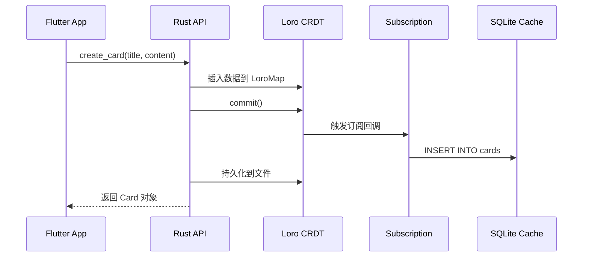
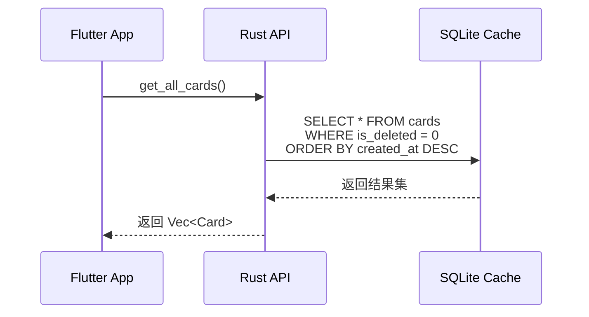
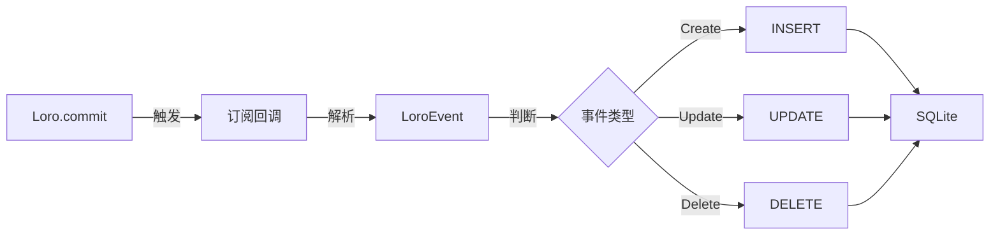

# CardMind API 设计文档

本文档阐述 CardMind 的 API 设计理念、架构决策和使用指南。

**详细的 API 参考文档由 Rust 源码自动生成**,请运行:
```bash
cd rust
cargo doc --open
```

或查看 [DATA_MODELS.md](DATA_MODELS.md) 了解数据模型概览。

---

## 概述

### 技术栈

- **桥接工具**: flutter_rust_bridge 2.0
- **数据格式**: 自动序列化/反序列化 (无需手动编写 JSON 转换)
- **错误处理**: 统一使用 `Result<T, CardMindError>`
- **API 风格**: 同步调用为主,异步用于耗时操作

### 设计原则

1. **简单优于复杂**: API 接口保持简洁,避免过度设计
2. **类型安全**: 利用 Rust 的类型系统保证正确性
3. **单一职责**: 每个 API 只做一件事
4. **错误透明**: 所有错误都有明确的类型和描述

---

## API 分类

### 1. 卡片管理 API

提供卡片的完整生命周期管理:

| 功能 | API 名称 | 说明 |
|------|---------|------|
| 创建卡片 | `create_card` | 生成 UUID v7,写入 Loro,自动同步到 SQLite |
| 获取所有卡片 | `get_all_cards` | 从 SQLite 快速查询,按时间降序 |
| 获取单个卡片 | `get_card` | 根据 ID 查询单个卡片 |
| 获取卡片数量 | `get_card_count` | 统计未删除卡片总数 |
| 更新卡片 | `update_card` | 修改标题和内容,自动更新时间戳 |
| 删除卡片 | `delete_card` | 软删除(设置标记,可恢复) |
| 恢复卡片 | `restore_card` | 恢复已删除的卡片 (可选) |

**核心设计**:
- **所有写操作通过 Loro**: 保证 CRDT 一致性
- **所有读操作通过 SQLite**: 利用索引实现快速查询
- **自动同步**: `loro.commit()` 触发订阅,SQLite 自动更新

### 2. 初始化和配置 API

| 功能 | API 名称 | 说明 |
|------|---------|------|
| 初始化数据存储 | `init_card_store` | 创建 Loro 目录和 SQLite 数据库,设置订阅 |

**调用时机**: `init_card_store` 必须在应用启动时调用,先于任何其他 API。

### 3. P2P 同步 API (Phase 2 规划)

以下 API 将在 Phase 2 实现,用于设备间的点对点同步:

| 功能 | API 名称 | 说明 |
|------|---------|------|
| 启动同步服务 | `start_sync_service` | 启动 libp2p 网络,开始节点发现 |
| 停止同步服务 | `stop_sync_service` | 停止同步,断开连接 |
| 获取同步状态 | `get_sync_status` | 查询当前同步状态和已连接节点 |
| 手动触发同步 | `manual_sync` | 立即与对等节点同步 |

---

## 核心设计理念

### 为什么采用 flutter_rust_bridge?

| 方案 | 优点 | 缺点 | 是否采用 |
|------|------|------|---------|
| FFI (原生绑定) | 性能最优 | 手动管理内存,易出错 | ✗ |
| JSON over FFI | 简单 | 序列化开销大,类型不安全 | ✗ |
| **flutter_rust_bridge** | 类型安全,自动生成代码 | 需要额外工具 | ✓ |

**优势**:
- 自动生成 Dart 和 Rust 桥接代码
- 类型安全,编译时检查
- 支持复杂数据结构 (嵌套对象、枚举等)
- 错误处理自动传递

### 为什么优先使用同步 API?

大部分 API 标记为 `#[flutter_rust_bridge::frb(sync)]` (同步调用):

**原因**:
1. **操作耗时短**: 大部分操作 <50ms,无需异步
2. **代码简洁**: 避免 Future 和 async/await 的复杂性
3. **调试友好**: 同步调用的堆栈更清晰

**何时使用异步**:
- 操作耗时 >100ms (如全量导出、批量操作)
- 涉及网络 I/O (如 P2P 同步)
- 可能阻塞 UI 的长时间操作

### 错误处理策略

所有 API 统一返回 `Result<T, CardMindError>`:

```rust
pub enum CardMindError {
    LoroError(loro::Error),      // Loro CRDT 操作失败
    SqliteError(rusqlite::Error), // SQLite 查询失败
    CardNotFound(String),         // 卡片不存在
    IoError(std::io::Error),      // 文件读写失败
    InvalidUuid(String),          // UUID 格式错误
    SyncError(String),            // P2P 同步错误 (Phase 2)
}
```

**Flutter 端处理示例**:
```dart
try {
  final card = await api.createCard(title: title, content: content);
  print('创建成功: ${card.id}');
} on CardMindError catch (e) {
  // 根据错误类型提供用户友好的提示
  showErrorDialog('操作失败: $e');
}
```

**设计考量**:
- 使用 `thiserror` crate 自动实现错误转换
- 错误信息包含足够的上下文 (如缺失的卡片 ID)
- 区分可恢复错误 (如网络超时) 和致命错误 (如数据损坏)

---

## 数据流设计

### 写操作流程 (Write Path)



**关键点**:
1. **单一写入点**: 只通过 Loro 修改数据
2. **自动同步**: commit 后自动触发 SQLite 更新
3. **原子性**: 订阅回调使用事务保证一致性

### 读操作流程 (Read Path)



**关键点**:
1. **只读 SQLite**: 应用层从不直接写入 SQLite
2. **索引优化**: created_at 和 updated_at 有索引
3. **过滤已删除**: 默认过滤 `is_deleted = true` 的记录

### 同步机制 (Sync Mechanism)

**Loro 到 SQLite 的订阅同步**:



**设计优势**:
- **实时同步**: 修改立即反映到查询层
- **单向数据流**: Loro → SQLite,不会反向污染
- **故障恢复**: SQLite 损坏时可从 Loro 重建

---

## API 使用最佳实践

### 1. 初始化流程

**正确的启动顺序**:
```dart
void main() async {
  WidgetsFlutterBinding.ensureInitialized();

  // 1. 获取数据目录
  final dataDir = await getApplicationDocumentsDirectory();

  // 2. 初始化 Rust 后端
  await api.initCardStore(dataDir: dataDir.path);

  // 3. 启动 Flutter 应用
  runApp(MyApp());
}
```

**错误示例** (会导致崩溃):
```dart
// ❌ 错误: 未初始化就调用 API
final cards = await api.getAllCards(); // 抛出 StoreNotInitialized 错误
```

### 2. 创建卡片

**推荐方式**:
```dart
try {
  final card = await api.createCard(
    title: titleController.text,
    content: contentController.text.isEmpty
      ? ' ' // 内容不能为空,至少传一个空格
      : contentController.text,
  );

  // 创建成功后自动同步到 SQLite,可立即查询
  final allCards = await api.getAllCards();

} on CardMindError catch (e) {
  showError('创建失败: $e');
}
```

**注意事项**:
- `content` 不能为空字符串 (会返回错误)
- `title` 可以为空
- 无需手动刷新列表,SQLite 已自动更新

### 3. 更新卡片

**推荐方式**:
```dart
await api.updateCard(
  id: card.id,
  title: newTitle,
  content: newContent,
);

// 无需重新获取,但如果需要最新的 updated_at:
final updatedCard = await api.getCard(id: card.id);
```

**注意**:
- `updated_at` 字段会自动更新
- 不存在的 ID 会抛出 `CardNotFound` 错误

### 4. 软删除和恢复

**删除卡片**:
```dart
await api.deleteCard(id: card.id);

// 此时 is_deleted = true,get_all_cards 不会返回它
final cards = await api.getAllCards(); // 不包含已删除的卡片
```

**恢复卡片**:
```dart
await api.restoreCard(id: card.id);

// 恢复后 is_deleted = false,重新出现在列表中
```

### 5. 性能优化

**批量查询**: 使用 `get_all_cards` 一次性获取,避免循环调用 `get_card`:
```dart
// ✓ 推荐
final cards = await api.getAllCards();

// ✗ 避免
for (final id in cardIds) {
  final card = await api.getCard(id: id); // 多次数据库查询
}
```

**分页查询** (未来可能添加):
```dart
// Phase 1 暂不支持,如需分页,在 Dart 层实现:
final allCards = await api.getAllCards();
final page1 = allCards.skip(0).take(20).toList();
```

---

## API 兼容性和演进

### 版本策略

- **API 一旦发布,避免破坏性变更**
- 如需变更,新增 API,标记旧 API 为 `@deprecated`
- 遵循语义化版本 (Semantic Versioning)

**示例**:
```rust
// 旧 API (保留兼容)
#[deprecated(note = "使用 create_card_v2 代替")]
pub fn create_card(title: String, content: String) -> Result<Card> { ... }

// 新 API
pub fn create_card_v2(params: CreateCardParams) -> Result<Card> { ... }
```

### Phase 2 扩展计划

**新增的 API**:
- P2P 同步相关 API
- 高级搜索 API (全文搜索、标签过滤)
- 批量操作 API (批量删除、导入导出)

**保持向后兼容**:
- Phase 1 的所有 API 保持不变
- 新功能通过新 API 提供

---

## 相关文档

- [DATA_MODELS.md](DATA_MODELS.md) - 数据模型快速参考
- [DATABASE.md](DATABASE.md) - 数据库架构和同步机制
- [ARCHITECTURE.md](ARCHITECTURE.md) - 系统整体架构
- [TESTING_GUIDE.md](TESTING_GUIDE.md) - API 测试指南

**自动生成的文档**:
```bash
# 查看完整 API 参考
cd rust && cargo doc --open

# 查看 Flutter 桥接代码
# 文件位置: lib/bridge/bridge_generated.dart
```

---

## API 修改流程

当需要修改 API 时,遵循以下流程:

1. **修改 Rust 函数签名** (在 `rust/src/api/` 目录)
2. **更新对应的单元测试**
3. **重新生成桥接代码**:
   ```bash
   flutter_rust_bridge_codegen generate
   ```
4. **更新 Flutter 端调用代码** (在 `lib/services/` 目录)
5. **运行测试确保兼容性**:
   ```bash
   cd rust && cargo test
   flutter test
   ```
6. **更新本文档**(如有设计理念变更)

**注意**: 详细的函数签名由 `cargo doc` 自动生成,不在本文档中维护。

---

## 更新日志

| 版本 | 变更 |
|------|------|
| 0.2.1 | 文件重命名为 API_DESIGN.md,更准确反映设计导向的定位 |
| 0.2.0 | 重构为设计文档,移除代码实现细节 |
| 0.1.0 | 初始版本,包含详细 API 定义 |

---

**提示**: 当您需要查看某个 API 的具体参数、返回值或使用示例时,请运行 `cargo doc --open` 查看自动生成的 API 文档。
