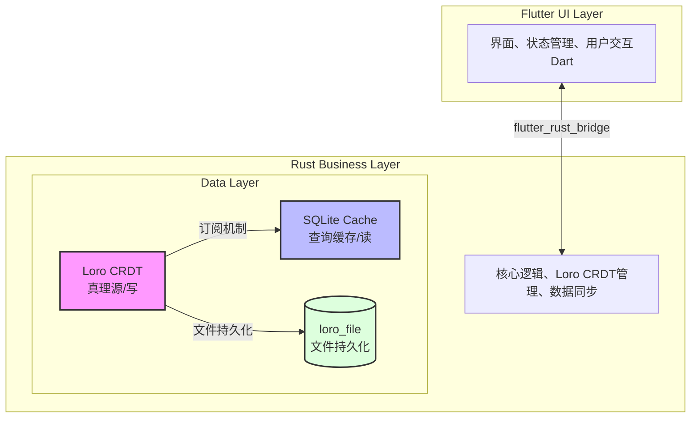
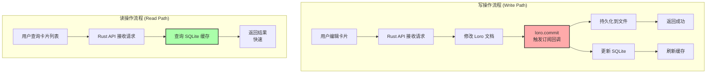
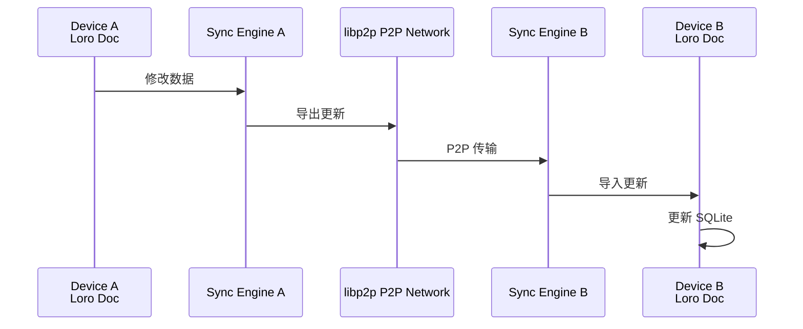

# CardMind 技术架构设计

## 1. 架构概览

CardMind 采用创新的双层数据架构，使用 Loro CRDT 作为真理源（Source of Truth），SQLite 作为查询缓存层。Flutter 负责 UI 展示，Rust 实现核心业务逻辑。



## 2. 技术栈选型

### 2.1 前端层 - Flutter

**选择理由**:
- 真正的跨平台支持（iOS、Android、Windows、macOS、Linux）
- 高性能渲染引擎，流畅的动画效果
- 丰富的UI组件库和社区支持
- 热重载，开发效率高

**核心依赖**:
```yaml
dependencies:
  flutter:
    sdk: flutter

  # 状态管理
  provider: ^6.0.0

  # Markdown渲染
  flutter_markdown: ^0.6.0

  # Rust桥接
  flutter_rust_bridge: ^2.0.0

  # 本地存储（配置等）
  shared_preferences: ^2.2.0

  # UUID v7生成
  uuid: ^4.0.0  # 需要v7支持的版本
```

### 2.2 业务逻辑层 - Rust

**选择理由**:
- 内存安全，无需GC，性能优异
- 强类型系统，编译期错误检测
- Loro CRDT是Rust实现，原生集成
- 可靠性高，适合处理关键业务逻辑

**核心依赖**:
```toml
[dependencies]
# 异步运行时
tokio = { version = "1.35", features = ["full"] }

# CRDT引擎
loro = "1.0"  # Loro CRDT库

# 数据库（仅作缓存）
rusqlite = { version = "0.31", features = ["bundled"] }

# 序列化
serde = { version = "1.0", features = ["derive"] }
serde_json = "1.0"

# UUID v7
uuid = { version = "1.7", features = ["v7", "serde"] }

# 时间处理
chrono = { version = "0.4", features = ["serde"] }

# P2P网络（第二阶段）
libp2p = { version = "0.53", optional = true }

# Flutter桥接
flutter_rust_bridge = "2.0"

# 日志
tracing = "0.1"
tracing-subscriber = "0.3"

# 错误处理
thiserror = "1.0"
anyhow = "1.0"
```

### 2.3 数据层架构

#### 2.3.1 Loro CRDT - 主数据源

**选择理由**:
- 文件持久化，无需额外序列化
- 强大的CRDT算法，自动冲突解决
- 订阅机制完美支持数据同步
- 原生支持P2P同步
- 性能优秀

**Loro的角色**:
- 唯一的写入目标
- 数据真理源
- 通过订阅通知数据变更

#### 2.3.2 SQLite - 查询缓存

**选择理由**:
- 快速的查询和索引
- 支持全文搜索（FTS5）
- 熟悉的SQL语法
- 轻量级，跨平台

**SQLite的角色**:
- 只读缓存
- 数据来自Loro订阅
- 加速列表查询和搜索

## 3. 数据架构设计

### 3.1 双层数据流



### 3.2 每卡片一LoroDoc架构

**重要设计决策**: 每个卡片维护独立的LoroDoc，而不是所有卡片共享一个LoroDoc。

**文件组织**:
```
/data/loro/<base64(uuid)>/
  ├── snapshot.loro   # 完整快照
  └── update.loro     # 增量更新（追加写入）
```

**CardStore结构**:
```rust
use loro::{LoroDoc, SubscribeOptions};
use std::collections::HashMap;
use std::path::PathBuf;

pub struct CardStore {
    data_dir: PathBuf,                           // 数据根目录
    loaded_cards: HashMap<String, LoroDoc>,      // 已加载的卡片文档（缓存）
    sqlite_conn: Connection,                     // SQLite连接
    update_size_threshold: usize,                // update.loro合并阈值（字节）
}

impl CardStore {
    pub fn new(data_dir: PathBuf, sqlite_path: &Path) -> Result<Self> {
        let sqlite_conn = Connection::open(sqlite_path)?;
        init_sqlite(&sqlite_conn)?;

        Ok(Self {
            data_dir,
            loaded_cards: HashMap::new(),
            sqlite_conn,
            update_size_threshold: 1024 * 1024, // 1MB
        })
    }

    // 获取卡片的Loro目录路径
    fn get_card_dir(&self, card_id: &str) -> PathBuf {
        let encoded_id = base64::encode(card_id);
        self.data_dir.join("loro").join(encoded_id)
    }

    // 加载或创建卡片的LoroDoc
    fn load_or_create_card_doc(&mut self, card_id: &str) -> Result<&mut LoroDoc> {
        if !self.loaded_cards.contains_key(card_id) {
            let card_dir = self.get_card_dir(card_id);
            let snapshot_path = card_dir.join("snapshot.loro");
            let update_path = card_dir.join("update.loro");

            let doc = LoroDoc::new();

            // 加载快照（如果存在）
            if snapshot_path.exists() {
                let snapshot_data = std::fs::read(&snapshot_path)?;
                doc.import(&snapshot_data)?;
            }

            // 应用增量更新（如果存在）
            if update_path.exists() {
                let update_data = std::fs::read(&update_path)?;
                if !update_data.is_empty() {
                    doc.import(&update_data)?;
                }
            }

            // 设置订阅
            self.setup_subscription_for_card(&doc, card_id)?;

            self.loaded_cards.insert(card_id.to_string(), doc);
        }

        Ok(self.loaded_cards.get_mut(card_id).unwrap())
    }

    // 为单个卡片设置订阅
    fn setup_subscription_for_card(&self, doc: &LoroDoc, card_id: &str) -> Result<()> {
        let conn_clone = self.sqlite_conn.clone();
        let card_id = card_id.to_string();

        doc.subscribe(
            &SubscribeOptions::default(),
            move |event| {
                if let Err(e) = sync_card_to_sqlite(&conn_clone, &card_id, event) {
                    tracing::error!("Failed to sync card {} to SQLite: {}", card_id, e);
                }
            }
        );

        Ok(())
    }

    // 保存卡片（追加到update.loro）
    fn save_card(&self, card_id: &str, doc: &LoroDoc) -> Result<()> {
        let card_dir = self.get_card_dir(card_id);
        std::fs::create_dir_all(&card_dir)?;

        let update_path = card_dir.join("update.loro");

        // 导出增量更新并追加
        let updates = doc.export_updates_since_last_save()?;
        let mut file = OpenOptions::new()
            .create(true)
            .append(true)
            .open(&update_path)?;
        file.write_all(&updates)?;

        // 检查是否需要合并
        let update_size = std::fs::metadata(&update_path)?.len();
        if update_size > self.update_size_threshold as u64 {
            self.merge_snapshot_and_updates(card_id, doc)?;
        }

        Ok(())
    }

    // 合并快照和更新
    fn merge_snapshot_and_updates(&self, card_id: &str, doc: &LoroDoc) -> Result<()> {
        let card_dir = self.get_card_dir(card_id);
        let snapshot_path = card_dir.join("snapshot.loro");
        let update_path = card_dir.join("update.loro");

        // 导出完整快照
        let snapshot_data = doc.export_snapshot();
        std::fs::write(&snapshot_path, snapshot_data)?;

        // 清空update.loro
        std::fs::write(&update_path, &[])?;

        tracing::info!("Merged snapshot for card: {}", card_id);
        Ok(())
    }
}

// 将单个卡片的Loro变更同步到SQLite
fn sync_card_to_sqlite(conn: &Connection, card_id: &str, event: &LoroEvent) -> Result<()> {
    // 从Loro文档提取卡片数据
    let card_data = event.doc.get_map("card")?;

    let title = card_data.get("title")?.as_str()?;
    let content = card_data.get("content")?.as_str()?;
    let created_at = card_data.get("created_at")?.as_i64()?;
    let updated_at = card_data.get("updated_at")?.as_i64()?;
    let is_deleted = card_data.get("is_deleted")?.as_bool()? as i32;

    // 更新SQLite
    conn.execute(
        "INSERT OR REPLACE INTO cards (id, title, content, created_at, updated_at, is_deleted)
         VALUES (?1, ?2, ?3, ?4, ?5, ?6)",
        params![card_id, title, content, created_at, updated_at, is_deleted],
    )?;

    Ok(())
}
```

### 3.3 卡片CRUD实现（支持软删除）

```rust
impl CardStore {
    // 创建卡片
    pub fn create_card(&mut self, title: &str, content: &str) -> Result<Card> {
        // 生成UUID v7
        let id = Uuid::now_v7().to_string();
        let now = Utc::now().timestamp_millis();

        // 加载或创建LoroDoc
        let doc = self.load_or_create_card_doc(&id)?;

        // 设置卡片数据
        let card_map = doc.get_map("card");
        card_map.insert("id", id.clone())?;
        card_map.insert("title", title)?;
        card_map.insert("content", content)?;
        card_map.insert("created_at", now)?;
        card_map.insert("updated_at", now)?;
        card_map.insert("is_deleted", false)?;

        // commit会触发订阅，自动同步到SQLite
        doc.commit();

        // 保存到文件（追加到update.loro）
        self.save_card(&id, doc)?;

        Ok(Card {
            id,
            title: title.to_string(),
            content: content.to_string(),
            created_at: now,
            updated_at: now,
            is_deleted: false,
        })
    }

    // 查询所有卡片（从SQLite读取，自动过滤已删除）
    pub fn get_all_cards(&self) -> Result<Vec<Card>> {
        let mut stmt = self.sqlite_conn.prepare(
            "SELECT id, title, content, created_at, updated_at, is_deleted
             FROM cards
             WHERE is_deleted = 0
             ORDER BY created_at DESC"
        )?;

        let cards = stmt.query_map([], |row| {
            Ok(Card {
                id: row.get(0)?,
                title: row.get(1)?,
                content: row.get(2)?,
                created_at: row.get(3)?,
                updated_at: row.get(4)?,
                is_deleted: row.get::<_, i32>(5)? != 0,
            })
        })?
        .collect::<Result<Vec<_>, _>>()?;

        Ok(cards)
    }

    // 更新卡片
    pub fn update_card(&mut self, id: &str, title: &str, content: &str) -> Result<()> {
        let doc = self.load_or_create_card_doc(id)?;
        let card_map = doc.get_map("card");

        // 修改Loro
        card_map.insert("title", title)?;
        card_map.insert("content", content)?;
        card_map.insert("updated_at", Utc::now().timestamp_millis())?;

        // commit触发订阅
        doc.commit();

        // 追加到update.loro
        self.save_card(id, doc)?;

        Ok(())
    }

    // 删除卡片（软删除）
    pub fn delete_card(&mut self, id: &str) -> Result<()> {
        let doc = self.load_or_create_card_doc(id)?;
        let card_map = doc.get_map("card");

        // 设置is_deleted为true（软删除）
        card_map.insert("is_deleted", true)?;
        card_map.insert("updated_at", Utc::now().timestamp_millis())?;

        // commit触发订阅，SQLite中的is_deleted字段会被更新
        doc.commit();

        // 追加到update.loro
        self.save_card(id, doc)?;

        Ok(())
    }

    // 永久删除卡片（物理删除）
    pub fn permanent_delete_card(&mut self, id: &str) -> Result<()> {
        // 从内存中移除
        self.loaded_cards.remove(id);

        // 删除Loro文件目录
        let card_dir = self.get_card_dir(id);
        if card_dir.exists() {
            std::fs::remove_dir_all(&card_dir)?;
        }

        // 从SQLite中删除
        self.sqlite_conn.execute(
            "DELETE FROM cards WHERE id = ?1",
            params![id],
        )?;

        Ok(())
    }

    // 恢复已删除的卡片
    pub fn restore_card(&mut self, id: &str) -> Result<()> {
        let doc = self.load_or_create_card_doc(id)?;
        let card_map = doc.get_map("card");

        // 设置is_deleted为false
        card_map.insert("is_deleted", false)?;
        card_map.insert("updated_at", Utc::now().timestamp_millis())?;

        doc.commit();
        self.save_card(id, doc)?;

        Ok(())
    }

    // 查询已删除的卡片（回收站功能）
    pub fn get_deleted_cards(&self) -> Result<Vec<Card>> {
        let mut stmt = self.sqlite_conn.prepare(
            "SELECT id, title, content, created_at, updated_at, is_deleted
             FROM cards
             WHERE is_deleted = 1
             ORDER BY updated_at DESC"
        )?;

        let cards = stmt.query_map([], |row| {
            Ok(Card {
                id: row.get(0)?,
                title: row.get(1)?,
                content: row.get(2)?,
                created_at: row.get(3)?,
                updated_at: row.get(4)?,
                is_deleted: true,
            })
        })?
        .collect::<Result<Vec<_>, _>>()?;

        Ok(cards)
    }
}
```

```
**注意**: 上述代码展示了完整的卡片CRUD实现，包含软删除机制。所有查询默认过滤 `is_deleted = 0` 以只显示未删除的卡片。

## 4. 分层架构设计

### 4.1 Flutter层架构

```
lib/
├── main.dart                      # 应用入口
├── app/
│   ├── app.dart                   # App配置
│   └── routes.dart                # 路由配置
├── models/                        # 数据模型
│   └── card.dart
├── services/                      # 服务层
│   └── card_service.dart          # 封装Rust API
├── providers/                     # 状态管理
│   ├── card_provider.dart
│   └── theme_provider.dart
├── screens/                       # 页面
│   ├── home/
│   │   ├── home_screen.dart
│   │   └── widgets/
│   │       ├── card_list.dart
│   │       └── card_item.dart
│   ├── card_editor/
│   │   ├── card_editor_screen.dart
│   │   └── widgets/
│   │       ├── markdown_editor.dart
│   │       └── markdown_preview.dart
│   └── settings/
│       └── settings_screen.dart
├── widgets/                       # 通用组件
│   ├── markdown_viewer.dart
│   └── loading_indicator.dart
└── bridge/                        # Rust桥接
    ├── bridge_generated.dart      # 自动生成
    └── api.dart                   # API封装
```

### 4.2 Rust层架构

```
rust/
├── src/
│   ├── lib.rs                     # 库入口
│   ├── api/                       # API层（暴露给Flutter）
│   │   ├── mod.rs
│   │   └── card.rs                # 卡片API
│   ├── store/                     # 数据存储层
│   │   ├── mod.rs
│   │   ├── card_store.rs          # Loro + SQLite管理
│   │   └── subscription.rs        # 订阅机制
│   ├── models/                    # 数据模型
│   │   ├── mod.rs
│   │   └── card.rs
│   ├── sync/                      # 同步逻辑 (Phase 2)
│   │   ├── mod.rs
│   │   ├── p2p.rs                 # libp2p集成
│   │   └── protocol.rs            # 同步协议
│   └── utils/                     # 工具函数
│       ├── mod.rs
│       └── uuid_v7.rs             # UUID v7生成
└── tests/                         # 测试
    ├── card_store_test.rs
    └── integration_test.rs
```

## 5. P2P同步设计（Phase 2）

### 5.1 libp2p集成架构



### 5.2 同步协议设计

```rust
use libp2p::*;
use loro::LoroDoc;

pub struct SyncEngine {
    loro_doc: LoroDoc,
    swarm: Swarm<SyncBehaviour>,
}

impl SyncEngine {
    pub async fn sync_with_peer(&mut self, peer_id: PeerId) -> Result<()> {
        // 1. 导出本地更新
        let updates = self.loro_doc.export_from(last_sync_version)?;

        // 2. 发送更新到对端
        self.swarm.behaviour_mut()
            .send_updates(peer_id, updates).await?;

        // 3. 接收对端更新
        let peer_updates = self.swarm.behaviour_mut()
            .receive_updates(peer_id).await?;

        // 4. 导入对端更新
        self.loro_doc.import(&peer_updates)?;

        // 5. commit触发订阅，自动更新SQLite
        self.loro_doc.commit();

        Ok(())
    }
}
```

### 5.3 设备发现

```rust
// mDNS本地网络发现
let mdns = mdns::tokio::Behaviour::new(
    mdns::Config::default(),
    swarm.local_peer_id().clone(),
)?;

// DHT全球网络发现
let kad = kad::Behaviour::new(
    swarm.local_peer_id().clone(),
    kad::store::MemoryStore::new(swarm.local_peer_id().clone()),
);
```

## 6. 测试策略（TDD）

### 6.1 TDD开发流程

```
┌─────────────────────────────────────────┐
│  1. Red - 编写失败的测试                 │
│     ↓                                   │
│  2. Green - 实现最小代码让测试通过       │
│     ↓                                   │
│  3. Refactor - 重构代码，保持测试通过    │
│     ↓                                   │
│  4. 重复上述步骤                         │
└─────────────────────────────────────────┘
```

### 6.2 测试分层

```rust
// tests/card_store_test.rs

#[cfg(test)]
mod tests {
    use super::*;

    // 单元测试：测试单个函数
    #[test]
    fn test_create_card() {
        // 先写测试（Red）
        let mut store = CardStore::new_in_memory().unwrap();
        let card = store.create_card("测试标题", "测试内容").unwrap();

        assert_eq!(card.title, "测试标题");
        assert_eq!(card.content, "测试内容");
        assert!(card.id.len() > 0);
    }

    #[test]
    fn test_loro_to_sqlite_sync() {
        // 测试Loro订阅机制同步到SQLite
        let mut store = CardStore::new_in_memory().unwrap();

        // 创建卡片（写入Loro）
        let card = store.create_card("标题", "内容").unwrap();

        // 从SQLite读取，验证同步成功
        let cards = store.get_all_cards().unwrap();
        assert_eq!(cards.len(), 1);
        assert_eq!(cards[0].id, card.id);
    }

    #[tokio::test]
    async fn test_p2p_sync() {
        // 集成测试：测试P2P同步
        let mut device_a = create_test_device().await;
        let mut device_b = create_test_device().await;

        // A设备创建卡片
        device_a.create_card("A的卡片", "内容").unwrap();

        // 同步到B设备
        sync_devices(&mut device_a, &mut device_b).await.unwrap();

        // 验证B设备收到卡片
        let cards = device_b.get_all_cards().unwrap();
        assert_eq!(cards.len(), 1);
        assert_eq!(cards[0].title, "A的卡片");
    }
}
```

### 6.3 测试覆盖率要求

- **单元测试**: 覆盖率 > 80%
- **集成测试**: 覆盖所有核心流程
- **性能测试**:
  - 1000张卡片加载时间 < 1秒
  - Loro操作 < 50ms
  - SQLite查询 < 10ms

### 6.4 CI/CD集成

```yaml
# .github/workflows/test.yml
name: Tests

on: [push, pull_request]

jobs:
  test:
    runs-on: ubuntu-latest
    steps:
      - uses: actions/checkout@v3
      - name: Install Rust
        uses: actions-rs/toolchain@v1
      - name: Run tests
        run: |
          cd rust
          cargo test --all-features
      - name: Check coverage
        run: |
          cargo install cargo-tarpaulin
          cargo tarpaulin --out Xml
      - name: Upload coverage
        uses: codecov/codecov-action@v3
```

## 7. 性能优化策略

### 7.1 Loro优化
- 定期compact Loro文档减小文件大小
- 批量操作使用单个commit
- 合理使用Loro的快照功能

### 7.2 SQLite优化
- 建立合适的索引
- 启用WAL模式
- 使用prepared statements
- 批量插入使用事务

### 7.3 内存优化
- 及时释放不用的Loro快照
- 控制SQLite连接池大小
- 大列表使用分页加载

## 8. 错误处理

```rust
use thiserror::Error;

#[derive(Error, Debug)]
pub enum CardMindError {
    #[error("Loro error: {0}")]
    LoroError(#[from] loro::Error),

    #[error("SQLite error: {0}")]
    SqliteError(#[from] rusqlite::Error),

    #[error("Card not found: {0}")]
    CardNotFound(String),

    #[error("Sync error: {0}")]
    SyncError(String),

    #[error("IO error: {0}")]
    IoError(#[from] std::io::Error),
}

pub type Result<T> = std::result::Result<T, CardMindError>;
```

## 9. 构建和部署

### 9.1 开发环境配置

```bash
# 安装Flutter
flutter doctor

# 安装Rust
rustup install stable

# 安装flutter_rust_bridge
cargo install flutter_rust_bridge_codegen

# 生成桥接代码
flutter_rust_bridge_codegen generate

# 运行应用
flutter run
```

### 9.2 代码生成脚本

```bash
# generate_bridge.sh
#!/bin/bash

flutter_rust_bridge_codegen \
  --rust-input rust/src/api/mod.rs \
  --dart-output lib/bridge/bridge_generated.dart \
  --dart-decl-output lib/bridge/bridge_definitions.dart
```

## 10. 数据文件位置

### 10.1 文件结构

```
应用数据目录/
├── loro_doc.loro          # Loro文档文件（主数据）
├── cache.db               # SQLite缓存数据库
└── backups/               # 备份目录（可选）
    ├── loro_doc_20240101.loro
    └── loro_doc_20240102.loro
```

### 10.2 各平台路径

- **iOS**: `Library/Application Support/cardmind/`
- **Android**: `data/data/com.cardmind.app/files/`
- **Windows**: `%APPDATA%/cardmind/`
- **macOS**: `~/Library/Application Support/cardmind/`
- **Linux**: `~/.local/share/cardmind/`

## 11. 安全考虑

- 本地数据加密（可选，Phase 3）
- P2P通信加密（TLS）
- 不记录敏感信息到日志
- 定期安全审计

## 12. 总结

CardMind的架构设计核心优势：

1. **Loro + SQLite双层架构**：
   - Loro保证数据可靠性和同步能力
   - SQLite提供高性能查询
   - 订阅机制自动保持同步

2. **UUID v7**：
   - 时间排序特性
   - 分布式生成无冲突
   - 适合CRDT场景

3. **TDD开发**：
   - 保证代码质量
   - 便于重构
   - 文档化测试用例

4. **P2P同步**：
   - 去中心化
   - 无需服务器
   - 完全自主可控

这个架构能够支撑从MVP到完整功能的平滑演进，同时保持高性能和可靠性。
