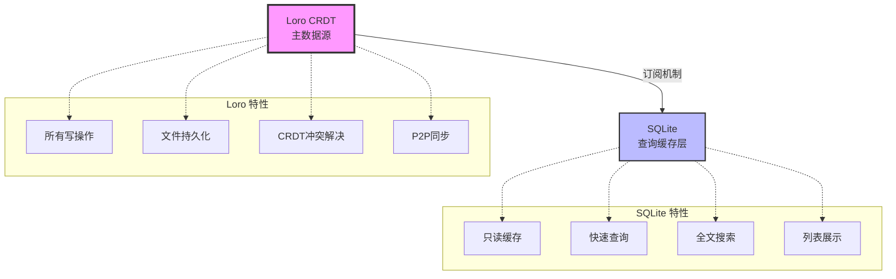
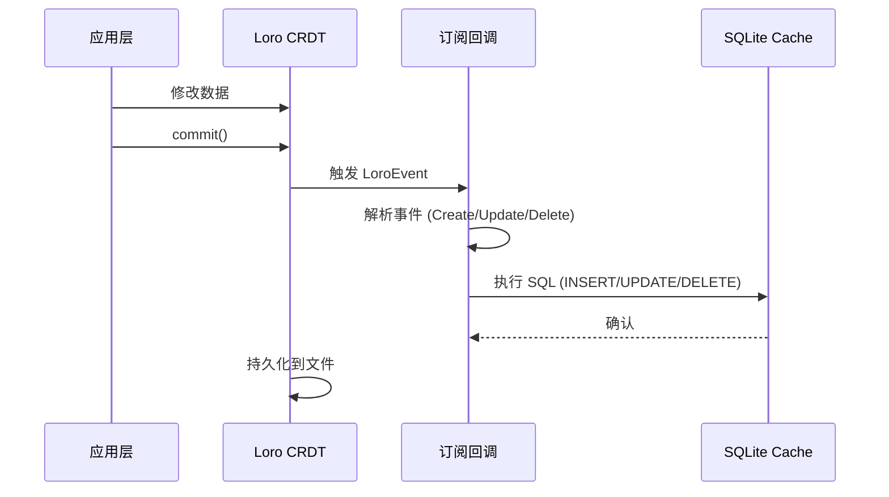
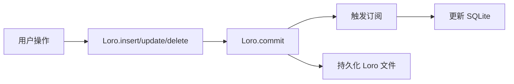

# CardMind 数据库架构设计

本文档阐述 CardMind 的数据架构设计理念、技术选型和关键决策。

**实现细节请查看源码**:
- Loro 存储实现: `rust/src/store/loro_store.rs`
- SQLite 缓存实现: `rust/src/store/sqlite_cache.rs`
- 订阅机制: `rust/src/store/subscription.rs`

或运行 `cargo doc --open` 查看自动生成的文档。

---

## 1. 架构总览

CardMind 采用**双层数据架构**,结合 CRDT 的分布式一致性和关系数据库的查询性能:



### 核心原则

- **Loro 是真理源 (Source of Truth)**: 所有数据修改只通过 Loro
- **SQLite 是缓存**: 数据通过 Loro 订阅机制自动同步
- **SQLite 只读**: 应用层不直接写入 SQLite
- **单向数据流**: Loro → SQLite,永不反向

---

## 2. 为什么采用双层架构?

### 2.1 技术选型对比

| 方案 | 优点 | 缺点 | 是否采用 |
|------|------|------|---------|
| **纯 Loro CRDT** | 简单,无同步逻辑<br/>分布式冲突解决 | 查询慢,无索引<br/>无全文搜索 | ✗ |
| **纯 SQLite** | 查询快,索引优化<br/>FTS5 全文搜索 | 无 CRDT,同步困难<br/>冲突解决复杂 | ✗ |
| **双层架构**<br/>(Loro + SQLite) | **兼具两者优势**<br/>查询快 + CRDT 同步 | 需维护同步机制 | **✓** |

### 2.2 Loro CRDT 的优势

**为什么选择 Loro?**

1. **自动冲突解决**: CRDT 算法保证最终一致性,无需手动处理冲突
2. **P2P 友好**: 天然支持去中心化同步
3. **文件持久化**: 简单可靠,无需复杂的数据库
4. **性能优秀**: Rust 实现,零开销抽象
5. **细粒度更新**: 只传输变更,减少网络流量

**Loro 不擅长什么?**

- ✗ 复杂查询 (无 SQL)
- ✗ 全文搜索
- ✗ 聚合统计
- ✗ 索引优化

### 2.3 SQLite 的优势

**为什么需要 SQLite?**

1. **快速查询**: 索引优化,毫秒级响应
2. **全文搜索**: FTS5 支持,搜索体验好
3. **排序分页**: SQL 原生支持
4. **熟悉度高**: 开发者熟悉 SQL 语法
5. **跨平台**: Flutter 所有平台都支持

**SQLite 为什么不适合作为主存储?**

- ✗ 分布式同步复杂 (需要自己实现冲突解决)
- ✗ 文件锁可能导致并发问题
- ✗ Schema 迁移需要谨慎处理

### 2.4 架构权衡总结

| 需求 | Loro | SQLite | 双层架构 |
|------|------|--------|---------|
| 分布式同步 | ✓ CRDT | ✗ 复杂 | ✓ 由 Loro 提供 |
| 快速查询 | ✗ 慢 | ✓ 快 | ✓ 由 SQLite 提供 |
| 冲突解决 | ✓ 自动 | ✗ 手动 | ✓ 由 Loro 提供 |
| 全文搜索 | ✗ 无 | ✓ FTS5 | ✓ 由 SQLite 提供 |
| 维护成本 | 低 | 低 | **中** (需同步) |

**结论**: 虽然需要维护同步机制,但双层架构充分利用了两者的优势。

---

## 3. Loro CRDT 数据设计

### 3.1 每卡片一 LoroDoc 架构

**设计决策**: 每个卡片维护独立的 LoroDoc,而不是所有卡片共享一个大 LoroDoc。

**单个卡片的 Loro 文档结构**:
```rust
{
  "schema_version": 1,
  "card": LoroMap {
    "id": "<uuid-v7>",
    "title": "卡片标题",
    "content": "Markdown内容",
    "created_at": 1234567890000,
    "updated_at": 1234567890000,
    "is_deleted": false
  }
}
```

### 3.2 为什么每卡片一 LoroDoc?

| 方案 | 优点 | 缺点 | 是否采用 |
|------|------|------|---------|
| **单个大 LoroDoc**<br/>(所有卡片) | 简单,一个文件 | 加载慢,版本历史混杂<br/>同步全部数据 | ✗ |
| **每卡片一 LoroDoc** | 隔离性好,按需加载<br/>P2P 按卡片同步 | 文件多,管理复杂 | **✓** |

**优势详解**:

1. **隔离性好**: 每个卡片的版本历史独立,互不影响
2. **性能优秀**: 小文档加载和操作速度快
3. **P2P 友好**: 可以按需同步单个卡片,减少流量
4. **灵活性高**: 便于实现卡片级别的权限控制 (未来扩展)
5. **文件管理简单**: 删除卡片只需删除对应目录

### 3.3 Loro 文件组织

**目录结构**:
```
应用数据目录/
└── data/
    └── loro/
        ├── <base64(uuid-1)>/
        │   ├── snapshot.loro    # 完整快照
        │   └── update.loro      # 增量更新(追加写入)
        ├── <base64(uuid-2)>/
        │   ├── snapshot.loro
        │   └── update.loro
        └── ...
```

**设计说明**:

- **snapshot.loro**: 完整的卡片状态快照
- **update.loro**: 增量更新,追加写入,避免重写整个文件
- **合并策略**: 当 `update.loro` 超过 1MB 时,合并到 `snapshot.loro` 并清空

**优势**:
- 追加写入性能好 (避免频繁重写大文件)
- 定期合并控制文件大小
- 故障恢复简单 (先加载快照,再应用增量)

详细实现见源码: `rust/src/store/loro_store.rs`

---

## 4. SQLite 缓存层设计

### 4.1 SQLite 表结构

#### cards 表 (MVP 阶段)

```sql
CREATE TABLE IF NOT EXISTS cards (
    id TEXT PRIMARY KEY NOT NULL,
    title TEXT,
    content TEXT NOT NULL,
    created_at INTEGER NOT NULL,
    updated_at INTEGER NOT NULL,
    is_deleted INTEGER DEFAULT 0 NOT NULL
);

CREATE INDEX IF NOT EXISTS idx_cards_not_deleted_created
    ON cards(is_deleted, created_at DESC);

CREATE INDEX IF NOT EXISTS idx_cards_not_deleted_updated
    ON cards(is_deleted, updated_at DESC);
```

**设计要点**:

1. **软删除机制**: `is_deleted = 0/1`,不真正删除数据
2. **复合索引**: `(is_deleted, created_at)` 优化未删除卡片的查询
3. **时间戳**: 使用 INTEGER 存储 Unix 毫秒时间戳

#### 全文搜索表 (Phase 3)

```sql
CREATE VIRTUAL TABLE IF NOT EXISTS cards_fts USING fts5(
    title,
    content,
    content='cards',
    content_rowid='rowid'
);
```

**设计要点**:
- FTS5 虚拟表,支持高性能全文搜索
- 通过触发器自动与 `cards` 表同步
- Phase 1 暂不实现,保留扩展性

### 4.2 软删除机制

**为什么使用软删除?**

| 方案 | 优点 | 缺点 | 是否采用 |
|------|------|------|---------|
| **硬删除**<br/>(DELETE FROM) | 节省空间 | 无法恢复,回收站困难 | ✗ |
| **软删除**<br/>(is_deleted=1) | 可恢复,支持回收站 | 占用空间,查询需过滤 | **✓** |

**实现方式**:
- 所有查询默认添加 `WHERE is_deleted = 0`
- 删除操作只更新标记: `UPDATE cards SET is_deleted = 1`
- 回收站查询: `WHERE is_deleted = 1`
- 恢复操作: `UPDATE cards SET is_deleted = 0`

### 4.3 索引策略

**当前索引**:
- `id` (主键) - 自动索引
- `(is_deleted, created_at DESC)` - 按创建时间排序未删除卡片
- `(is_deleted, updated_at DESC)` - 按更新时间排序未删除卡片

**为什么使用复合索引?**

```sql
-- 不优化的查询 (需要全表扫描 + 过滤)
SELECT * FROM cards
WHERE is_deleted = 0
ORDER BY created_at DESC;

-- 优化后 (使用复合索引,只扫描未删除的记录)
-- 索引: (is_deleted, created_at DESC)
```

**未来扩展** (Phase 3):
- FTS5 全文搜索索引
- 标签索引 (如果添加标签功能)

### 4.4 性能优化配置

**PRAGMA 设置**:
```sql
PRAGMA journal_mode = WAL;           -- 写前日志,提高并发性能
PRAGMA synchronous = NORMAL;         -- 平衡性能和安全
PRAGMA cache_size = -32000;          -- 32MB 缓存
PRAGMA temp_store = MEMORY;          -- 临时表在内存
PRAGMA mmap_size = 30000000000;      -- 使用内存映射
PRAGMA page_size = 4096;             -- 页大小 4KB
```

详细配置见源码: `rust/src/store/sqlite_cache.rs`

---

## 5. Loro 到 SQLite 同步机制

### 5.1 订阅驱动的单向同步

**核心设计**: Loro 的订阅机制 (Subscription) 自动触发 SQLite 更新。



**关键特性**:
1. **实时同步**: `commit()` 后立即触发
2. **单向数据流**: Loro → SQLite,永不反向
3. **原子性**: 订阅回调使用事务保证一致性
4. **故障恢复**: SQLite 损坏时可从 Loro 重建

### 5.2 事件处理流程

**LoroEvent 类型映射**:

| Loro 事件 | SQLite 操作 | 说明 |
|-----------|------------|------|
| `Create` | `INSERT` | 新建卡片 |
| `Update` | `UPDATE` | 修改字段 |
| `Delete` | `UPDATE is_deleted=1` | 软删除 |

**伪代码**:
```rust
fn handle_loro_event(event: LoroEvent) -> Result<()> {
    match event.diff {
        Diff::Create => sqlite.execute("INSERT INTO cards ..."),
        Diff::Update => sqlite.execute("UPDATE cards SET ... WHERE id = ?"),
        Diff::Delete => sqlite.execute("UPDATE cards SET is_deleted = 1 WHERE id = ?"),
    }
}
```

详细实现见源码: `rust/src/store/subscription.rs`

### 5.3 数据一致性保证

**同步失败处理**:
- 使用 SQLite 事务保证原子性
- 失败时回滚,不影响 Loro 数据
- 记录错误日志,便于调试

**SQLite 损坏恢复**:
1. 删除旧的 SQLite 数据库文件
2. 重新创建空数据库
3. 从 Loro 全量同步所有卡片
4. 重建索引

**一致性检查** (可选,用于调试):
```rust
pub fn verify_consistency() -> Result<bool> {
    // 比较 Loro 中的卡片数量和 SQLite 中的数量
    let loro_count = count_cards_in_loro();
    let sqlite_count = count_cards_in_sqlite();

    if loro_count != sqlite_count {
        warn!("数据不一致: Loro={}, SQLite={}", loro_count, sqlite_count);
        return Ok(false);
    }
    Ok(true)
}
```

---

## 6. 数据操作模式

### 6.1 写操作流程 (Write Path)

**原则**: 所有写操作必须通过 Loro。



**示例** (创建卡片):
1. 生成 UUID v7
2. 插入数据到 Loro LoroMap
3. 调用 `commit()` 触发订阅
4. 订阅回调自动 `INSERT` 到 SQLite
5. 持久化 Loro 到 `update.loro` (追加写入)

### 6.2 读操作流程 (Read Path)

**原则**: 所有读操作从 SQLite 查询。


**优势**:
- 快速: 索引优化,毫秒级响应
- 灵活: SQL 支持复杂查询、排序、分页
- 可扩展: 未来可添加全文搜索 (FTS5)

### 6.3 为什么不从 Loro 读取?

| 操作 | Loro | SQLite | 选择 |
|------|------|--------|------|
| 获取所有卡片 | 遍历 LoroMap,O(n) | 索引查询,O(log n) | **SQLite** |
| 按时间排序 | 手动排序,O(n log n) | ORDER BY,使用索引 | **SQLite** |
| 全文搜索 | 不支持 | FTS5,专门优化 | **SQLite** |
| 分页查询 | 不支持 | LIMIT/OFFSET | **SQLite** |

**结论**: Loro 专注于写操作和同步,SQLite 专注于查询。

---

## 7. 数据文件管理

### 7.1 文件结构

```
应用数据目录/
└── data/
    ├── loro/
    │   ├── <base64(uuid-1)>/
    │   │   ├── snapshot.loro
    │   │   └── update.loro
    │   ├── <base64(uuid-2)>/
    │   │   ├── snapshot.loro
    │   │   └── update.loro
    │   └── ...
    └── cache.db               # SQLite 缓存数据库
```

### 7.2 备份策略

**重要**: 只需备份 `loro/` 目录,SQLite 可以随时从 Loro 重建。

**备份方案**:
1. **定期备份**: 每天/每周备份 `loro/` 目录
2. **增量备份**: 只备份新增或修改的 Loro 文件
3. **云同步**: P2P 同步本身就是一种备份 (Phase 2)

**恢复方案**:
1. 恢复 `loro/` 目录
2. 删除 `cache.db`
3. 重新初始化应用,自动重建 SQLite

### 7.3 导入导出设计 (Phase 3)

**导出**:
- 打包 `loro/` 目录为 ZIP
- 添加元数据 (版本号、导出时间、卡片数量)

**导入**:
- 解压 ZIP 到 `loro/` 目录
- 重建 SQLite 缓存
- 验证数据完整性

---

## 8. 数据版本管理和迁移

### 8.1 Schema 版本控制

**版本号存储**:
- Loro: 每个卡片文档的 `schema_version` 字段
- SQLite: `PRAGMA user_version`

**当前版本**: v1

### 8.2 迁移策略

**Loro Schema 迁移** (按需迁移):
- 加载卡片时检查 `schema_version`
- 如果版本过旧,自动迁移到最新版本
- 使用默认值填充新字段 (如 `is_deleted` 默认为 `false`)

**SQLite Schema 迁移** (重建方案):
- 检测到版本不匹配时,删除旧数据库
- 重新创建表结构
- 从 Loro 全量同步

**为什么 SQLite 可以删除重建?**
- SQLite 是缓存,不是主存储
- 所有数据都能从 Loro 恢复
- 重建比复杂的 ALTER TABLE 迁移更可靠

### 8.3 向后兼容原则

1. **新版本能读取旧版本数据**
2. **使用默认值填充缺失字段**
3. **渐进式迁移** (逐个文档迁移,不是一次性全部迁移)
4. **失败回滚** (迁移失败时保留原始数据)

详细迁移逻辑见源码: `rust/src/store/migration.rs`

---

## 9. 性能基准和优化

### 9.1 性能目标

| 操作 | 目标时间 | 数据量 | 说明 |
|------|---------|--------|------|
| 创建卡片 | < 50ms | - | 包括 Loro commit 和 SQLite INSERT |
| 读取列表 | < 10ms | 1000 张卡片 | 利用索引优化 |
| 搜索 | < 100ms | 1000 张卡片 | FTS5 全文搜索 (Phase 3) |
| Loro → SQLite 同步 | < 5ms | 单条记录 | 订阅回调延迟 |
| 应用启动 | < 2s | - | 加载数据库,初始化订阅 |
| 列表加载 | < 1s | 1000 张卡片 | 查询 + 渲染 |

### 9.2 优化策略

**Loro 优化**:
- 每卡片一 LoroDoc,避免加载全部数据
- 追加写入 `update.loro`,减少磁盘 I/O
- 定期合并快照,控制文件大小

**SQLite 优化**:
- WAL 模式提高并发性能
- 复合索引 `(is_deleted, created_at)` 优化查询
- 32MB 缓存提高命中率
- 内存映射减少系统调用

**应用层优化**:
- 批量查询代替循环查询
- 分页加载 (Dart 层实现)
- 虚拟滚动 (Flutter ListView.builder)

---

## 10. 数据安全和隐私

### 10.1 数据加密 (未来考虑)

**方案**:
- 文件级加密: 加密整个 `loro/` 目录
- 字段级加密: 加密敏感字段 (如内容)

**权衡**:
- 优势: 保护本地数据
- 劣势: 性能开销,密钥管理复杂

**MVP 阶段**: 暂不实现,依赖操作系统的文件权限保护。

### 10.2 数据隔离

**文件权限**:
- `loro/` 目录权限: 仅应用可访问 (0700)
- `cache.db` 权限: 仅应用可访问

**跨用户隔离**:
- 每个操作系统用户有独立的数据目录
- 不同用户的卡片互不可见

---

## 11. 常见问题 (FAQ)

### Q1: SQLite 损坏了怎么办?

**A**: SQLite 是缓存,可以安全删除并重建:
1. 删除 `cache.db`
2. 重启应用,自动从 Loro 重建

### Q2: 为什么不直接用 Loro 查询?

**A**: Loro 优化了写操作和 CRDT 合并,不是查询。SQLite 的索引和 SQL 查询能力更强。

### Q3: 如何保证 Loro 和 SQLite 一致?

**A**: 通过订阅机制单向同步,Loro 是唯一的写入点,SQLite 永远是 Loro 的镜像。

### Q4: 卡片很多时,Loro 文件会不会太大?

**A**: 每卡片一 LoroDoc,单个文件很小。定期合并快照控制大小。

### Q5: 如何实现多设备同步?

**A**: Phase 2 使用 libp2p P2P 同步。Loro 的 CRDT 特性天然支持分布式冲突解决。

---

## 12. 相关文档

- [API_DESIGN.md](API_DESIGN.md) - API 设计理念和使用指南
- [DATA_MODELS.md](DATA_MODELS.md) - 数据模型快速参考
- [ARCHITECTURE.md](ARCHITECTURE.md) - 系统整体架构
- [ROADMAP.md](ROADMAP.md) - 开发路线图

**源码位置**:
- Loro 存储: `rust/src/store/loro_store.rs`
- SQLite 缓存: `rust/src/store/sqlite_cache.rs`
- 订阅机制: `rust/src/store/subscription.rs`
- 数据迁移: `rust/src/store/migration.rs`

**自动生成的文档**:
```bash
cd rust && cargo doc --open
```

---

## 更新日志

| 版本 | 变更 |
|------|------|
| 0.2.0 | 重构为架构设计文档,移除实现细节 |
| 0.1.0 | 初始版本,包含详细实现代码 |

---

**提示**: 本文档专注于架构设计和技术选型。具体的实现细节 (如函数签名、数据结构定义) 请查看源码或运行 `cargo doc --open`。
