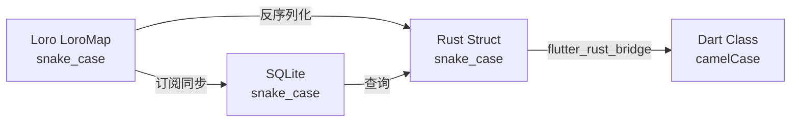

# 数据模型快速参考

> **重要提示**: 本文档仅供快速查阅。权威定义请查看源码或运行 `cargo doc --open`。

## 文档说明

本文档提供数据模型的**概览和索引**,不包含完整的实现细节。

### 查看详细文档

**Rust API 文档** (推荐):
```bash
# 生成并打开 Rust API 文档
cd rust
cargo doc --open
```

**源码位置**:
- Rust 模型定义: `rust/src/models/`
- Dart 模型定义: `lib/models/` 及 `lib/bridge/bridge_generated.dart` (自动生成)
- SQLite Schema: `rust/src/store/` 中的初始化代码

---

## Card 数据模型

**定义位置**:
- Rust: `rust/src/models/card.rs`
- Dart: `lib/models/card.dart` 及自动生成的桥接代码
- SQLite: `cards` 表

### 字段概览

| 字段 | Rust 类型 | Dart 类型 | SQLite 类型 | 说明 | 约束 |
|------|-----------|-----------|-------------|------|------|
| `id` | `String` | `String` | `TEXT` | UUID v7 唯一标识符 | 主键,时间有序 |
| `title` | `String` | `String` | `TEXT` | 卡片标题 | 可选,可为空字符串 |
| `content` | `String` | `String` | `TEXT` | Markdown 格式内容 | 必填,不能为空 |
| `created_at` | `i64` | `int` | `INTEGER` | 创建时间戳(毫秒) | 自动生成 |
| `updated_at` | `i64` | `int` | `INTEGER` | 更新时间戳(毫秒) | 自动更新 |
| `is_deleted` | `bool` | `bool` | `INTEGER` | 软删除标记 | 0=未删除, 1=已删除 |

### 命名约定

- **Rust/SQLite**: `snake_case` (如 `created_at`)
- **Dart**: `camelCase` (如 `createdAt`)
- **Loro**: 与 Rust 保持一致,使用 `snake_case`

### 关键设计说明

1. **UUID v7 的优势**:
   - 时间有序性:可按 ID 排序
   - 分布式友好:无需中心化 ID 生成
   - 避免冲突:适合 CRDT 场景

2. **软删除机制**:
   - `is_deleted = false`: 正常卡片
   - `is_deleted = true`: 已删除(可恢复)
   - 所有查询默认过滤已删除卡片

3. **时间戳格式**:
   - 使用 Unix 毫秒时间戳
   - Rust: `Utc::now().timestamp_millis()`
   - 跨平台兼容性好

---

## CardMindError 错误类型

**定义位置**: `rust/src/models/error.rs` (规划中)

### 错误类型概览

| 错误类型 | 说明 | 使用场景 |
|---------|------|---------|
| `LoroError` | Loro CRDT 操作失败 | commit 失败,文档损坏 |
| `SqliteError` | SQLite 数据库操作失败 | 查询失败,表不存在 |
| `CardNotFound` | 卡片不存在 | 查询或更新不存在的卡片 |
| `IoError` | 文件读写失败 | Loro 文件持久化失败 |
| `InvalidUuid` | UUID 格式错误 | ID 格式验证失败 |
| `SyncError` | P2P 同步错误 (Phase 2) | 网络错误,冲突解决失败 |

**详细定义**: 运行 `cargo doc` 查看 `CardMindError` 枚举的完整文档。

---

## SyncStatus 同步状态 (Phase 2)

**定义位置**: `rust/src/models/sync.rs` (规划中)

### 字段概览

| 字段 | 类型 | 说明 |
|------|------|------|
| `is_syncing` | `bool` | 是否正在同步 |
| `connected_peers` | `Vec<String>` | 已连接的对等节点列表 |
| `last_sync_time` | `Option<i64>` | 最后同步时间戳 |

---

## 数据一致性保证

### 三层数据映射

所有数据在 **Loro → Rust → Dart → SQLite** 之间保持一致:



### 类型转换规则

**Rust ↔ Dart**:
- `bool` ↔ `bool`
- `String` ↔ `String`
- `i64` ↔ `int`

**Rust ↔ SQLite**:
- `bool` ↔ `INTEGER` (0/1)
- `String` ↔ `TEXT`
- `i64` ↔ `INTEGER`

**重要**: flutter_rust_bridge 自动处理 Rust-Dart 转换,无需手动序列化。

---

## 使用示例

### 创建卡片

**Rust 侧** (详见 `cargo doc`):
```rust
let card = Card {
    id: Uuid::now_v7().to_string(),
    title: "我的想法".to_string(),
    content: "今天想到的一个点子".to_string(),
    created_at: Utc::now().timestamp_millis(),
    updated_at: Utc::now().timestamp_millis(),
    is_deleted: false,
};
```

**Flutter 侧** (通过 API 调用):
```dart
final card = await api.createCard(
  title: '我的想法',
  content: '今天想到的一个点子',
);
print('创建的卡片 ID: ${card.id}');
```

---

## Schema 版本管理

### 当前版本: v1

**版本号存储位置**: Loro 文档的 `schema_version` 字段

**未来迁移**: 当数据结构变更时,会在 Loro 加载时自动迁移。详见 [DATABASE.md](DATABASE.md) 的"数据版本管理和迁移"章节。

---

## 相关文档

- [DATABASE.md](DATABASE.md) - 数据库架构设计和同步机制
- [API_DESIGN.md](API_DESIGN.md) - API 设计理念和使用指南
- [ARCHITECTURE.md](ARCHITECTURE.md) - 系统整体架构

**自动生成的文档**:
- Rust API 文档: `cargo doc --open`
- Flutter 桥接代码: `lib/bridge/bridge_generated.dart`

---

## 更新日志

| 版本 | 变更 |
|------|------|
| v1 | 初始版本,基于文档规划 |

---

**提示**: 当您需要了解某个字段的确切用途、默认值或验证规则时,请查看源码或运行 `cargo doc --open`。本文档仅作为快速索引使用。
