# Mermaid 图表迁移指南

本文档列出所有文档中需要转换为 Mermaid 的图表位置。

## 为什么使用 Mermaid？

- ✅ **版本控制友好**: 纯文本，易于 diff
- ✅ **易于维护**: 修改图表只需修改文本
- ✅ **GitHub 原生支持**: 自动渲染，无需额外工具
- ✅ **统一风格**: 自动生成，风格一致

---

## 待转换图表清单

### 1. ARCHITECTURE.md

#### 1.1 架构概览图 (第7行)
**当前**: ASCII 框图
**改为**: Mermaid 架构图

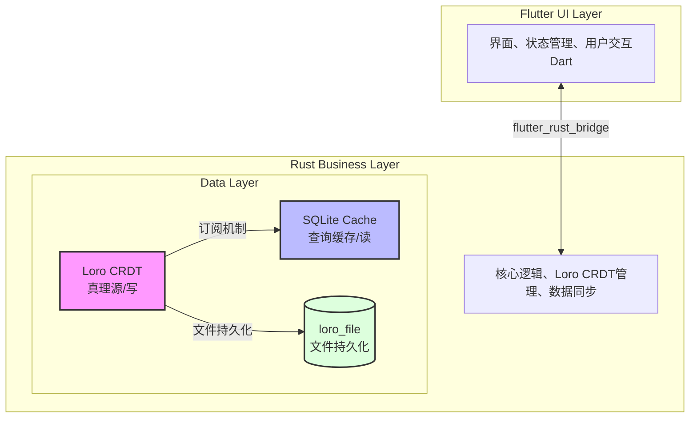

#### 1.2 数据流图 (第136-170行)
**当前**: ASCII 流程图
**改为**: Mermaid 流程图

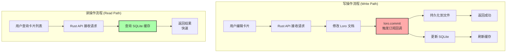

#### 1.3 P2P 同步架构图 (第562-580行)
**当前**: ASCII 双设备图
**改为**: Mermaid 序列图

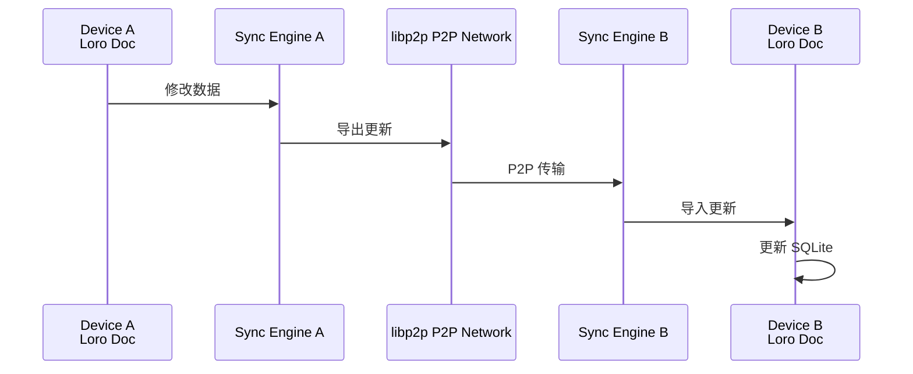

---

### 2. DATABASE.md

#### 2.1 数据架构总览 (第8-24行)
**当前**: ASCII 框图
**改为**: Mermaid 架构图

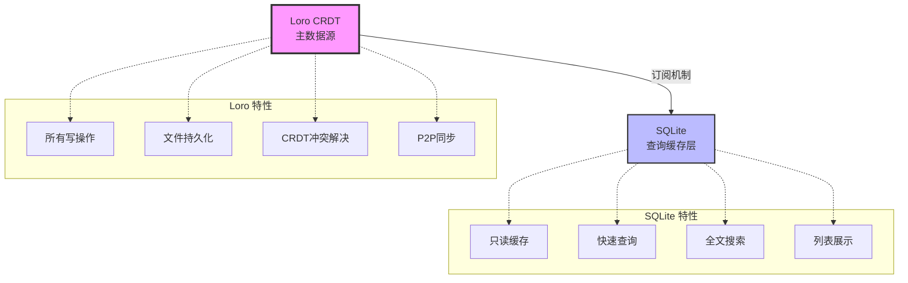

#### 2.2 数据流图 (第380-393行)
**当前**: ASCII 文本流程
**改为**: Mermaid 流程图

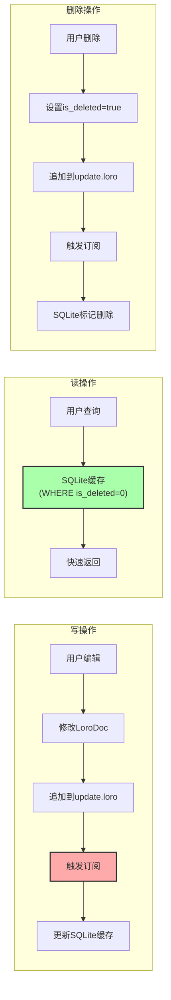

---

### 3. PRD.md

#### 3.1 数据流图 (第106-114行)
**当前**: ASCII 文本流程
**改为**: Mermaid 流程图

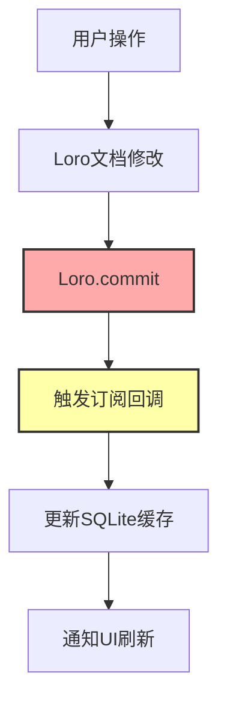

#### 3.2 P2P 同步流程 (第132-141行)
**当前**: ASCII 双设备文本
**改为**: Mermaid 序列图

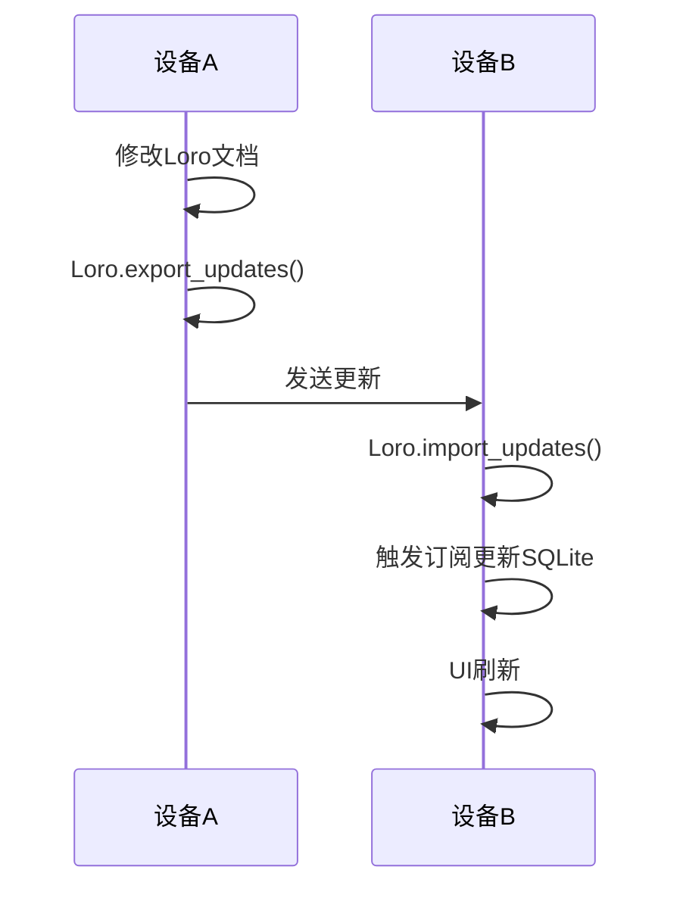

---

### 4. ROADMAP.md

#### 4.1 TDD 开发流程 (第516-543行)
**当前**: ASCII 文本流程
**改为**: Mermaid 流程图

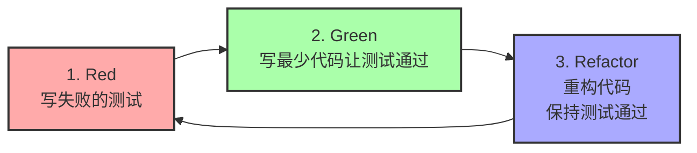

---

### 5. TESTING_GUIDE.md

#### 5.1 TDD 三步走 (第12-19行)
**当前**: ASCII 文本
**改为**: Mermaid 流程图

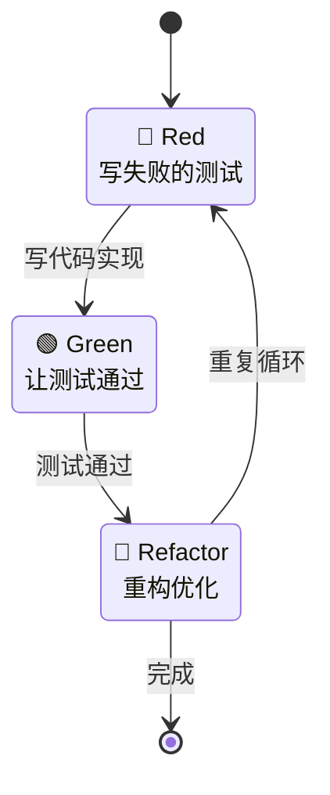

---

## 转换优先级

### 高优先级（立即转换）
1. ✅ ARCHITECTURE.md - 架构概览图
2. ✅ ARCHITECTURE.md - 数据流图
3. ✅ DATABASE.md - 数据架构总览

### 中优先级（Phase 1前转换）
4. ⏳ TESTING_GUIDE.md - TDD流程图
5. ⏳ ROADMAP.md - TDD开发流程
6. ⏳ PRD.md - 数据流图

### 低优先级（Phase 2前转换）
7. ⏳ ARCHITECTURE.md - P2P同步图
8. ⏳ PRD.md - P2P同步流程

---

## Mermaid 语法速查

### 流程图
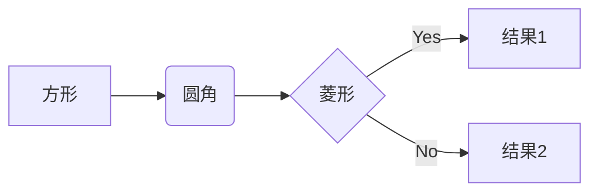

### 序列图
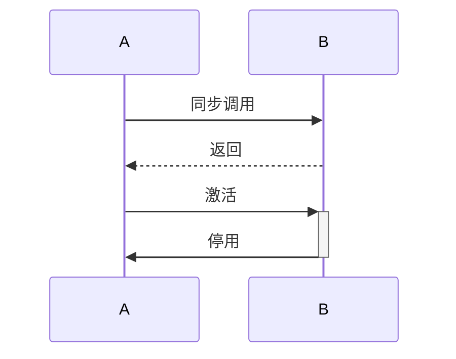

### 状态图
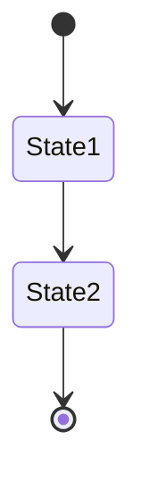

### 架构图
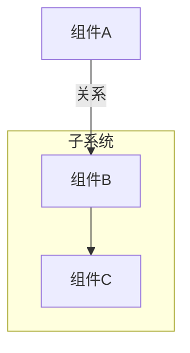

---

## 在线工具

- **Mermaid Live Editor**: https://mermaid.live/
- **GitHub渲染测试**: 直接在GitHub预览Markdown

---

## 注意事项

1. **GitHub 支持**: GitHub 自动渲染 Mermaid（无需插件）
2. **本地预览**: VS Code 需安装 Mermaid 预览插件
3. **语法检查**: 使用 Mermaid Live Editor 验证语法
4. **备份**: 转换前保留原ASCII图（注释掉）

---

**开始转换吧！** 🎨
