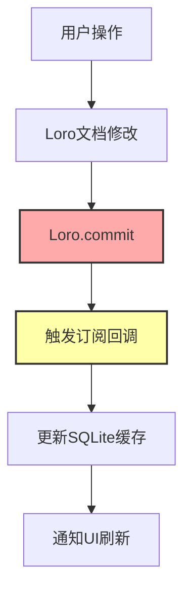
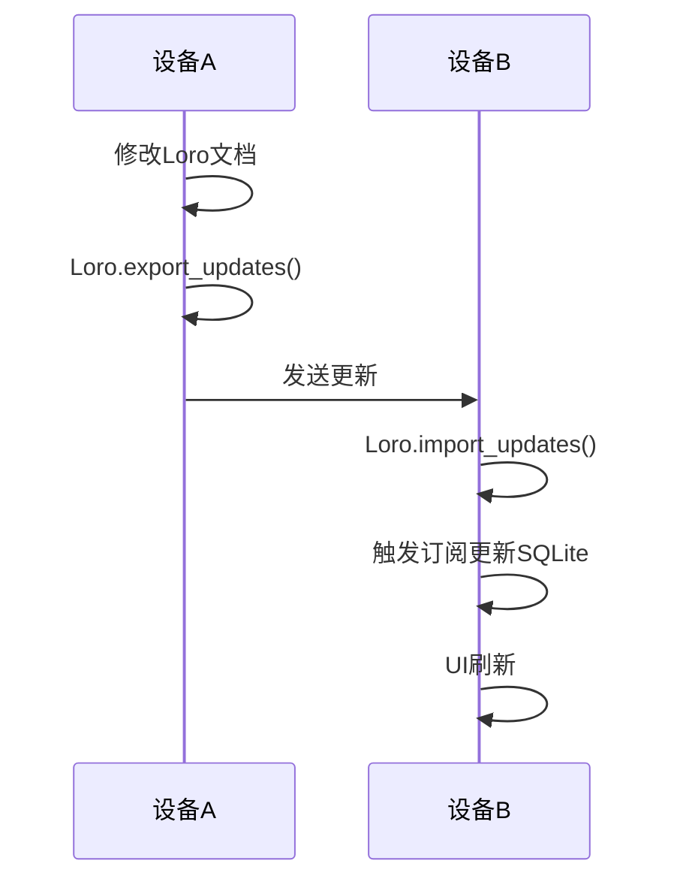

# CardMind 产品需求文档 (PRD)

## 1. 产品定位

### 1.1 产品类型
CardMind 是一款卡片式笔记应用，通过卡片的形式帮助用户组织和管理知识片段、想法和笔记。

### 1.2 目标用户
- **主要用户**: 需要灵活组织知识和笔记的个人用户

### 1.3 核心使用场景

#### 场景1：碎片化想法捕捉
- **情境**: 地铁上、咖啡店、睡前等碎片时间有想法或灵感
- **设备**: 手机（iOS/Android）
- **操作**: 快速打开app → 新建卡片 → 记录想法/感受 → 自动保存
- **期望**:
  - 30秒内完成记录
  - 支持Markdown基础语法（加粗、列表、代码等）
  - 离线可用，无需网络

#### 场景2：深度整理和扩展
- **情境**: 在家、办公室等有电脑的环境
- **设备**: 桌面端（Windows/macOS/Linux）
- **操作**: 查看之前记录的想法 → 扩展内容 → 添加代码块/长文本 → 整理知识
- **期望**:
  - 大屏幕编辑体验好
  - Markdown预览实时
  - 完整的Markdown语法支持
  - 快速查找和浏览历史卡片

#### 场景3：跨设备无缝衔接
- **情境**: 设备切换（手机 ↔ 电脑）
- **触发时机**:
  - 地铁上手机记录 → 回家打开电脑能立即看到
  - 家里电脑记录 → 外出手机能立即看到
- **同步方式**: 本地网络P2P自动同步（第二阶段）
- **期望**:
  - 同一WiFi/局域网下自动发现设备并同步
  - 离线编辑不受影响，联网后自动合并
  - 冲突自动解决，无需手动处理
  - 数据永不丢失

#### 场景4：知识沉淀和回顾
- **情境**: 定期回顾之前的想法和笔记
- **操作**: 浏览卡片列表 → 查看历史想法 → 连接相关知识
- **期望**:
  - 按时间排序查看
  - 快速搜索（第三阶段）
  - 标签分类（第三阶段，可选）

### 1.4 核心价值主张
- **灵活**: 卡片式组织，一卡片一主题，灵活自由
- **可靠**: 基于CRDT技术，数据永不丢失
- **离线**: 完全离线可用，无需依赖网络
- **同步**: P2P去中心化同步，无需服务器

## 2. 功能需求

### 2.1 MVP 功能（第一阶段）

#### 2.1.1 卡片管理

**创建卡片**
- 输入卡片标题（可选）
- 输入卡片内容（Markdown格式）
- 支持Markdown格式
  - 基本格式：加粗、斜体、删除线
  - 标题（H1-H6）
  - 列表（有序、无序）
  - 代码块和行内代码
  - 引用块
  - 链接
  - 表格
- 自动生成UUID v7作为卡片ID
- 自动记录创建时间和更新时间

**编辑卡片**
- 修改标题和内容
- 实时预览Markdown渲染效果
- 自动保存（通过Loro CRDT）
- 更新时间自动更新

**删除卡片**
- 单个删除
- 删除确认提示

**查看卡片**
- 卡片列表视图（按时间倒序）
- 卡片详情视图
- Markdown渲染显示

#### 2.1.2 数据架构

**Loro CRDT作为主数据源**
- 所有卡片数据存储在Loro文档中
- Loro文档直接持久化为文件
- Loro订阅机制监听数据变更

**SQLite作为缓存层**
- 通过Loro订阅机制同步数据到SQLite
- SQLite用于快速查询和列表展示
- SQLite仅作为只读缓存，不直接写入

**数据流**:


#### 2.1.3 数据持久化
- Loro文档文件存储（主数据）
- SQLite数据库（查询缓存）
- 数据完整性由Loro保证

### 2.2 第二阶段功能 - P2P同步

#### 2.2.1 同步机制
**基于libp2p的P2P同步**
- 设备发现（mDNS/DHT）
- 点对点连接建立
- CRDT数据同步
- 支持离线编辑
- 自动冲突解决（由Loro CRDT处理）

**同步流程**:


**同步设置**
- 同步开关
- 设备列表显示
- 同步状态显示
- 手动触发同步

#### 2.2.2 冲突解决
- 由Loro CRDT自动处理
- 无需用户干预
- 保证最终一致性

### 2.3 第三阶段功能（优化完善）

#### 2.3.1 搜索功能
- 全文搜索（标题和内容）
- 搜索结果高亮
- 搜索历史（可选）

#### 2.3.2 标签系统（可选）
- 为卡片添加标签
- 多标签支持
- 按标签筛选

#### 2.3.3 数据管理
- 导出Loro文档文件（压缩包）
- 导入Loro文档文件（解压并加载）
- 数据完全自包含，无需额外处理

## 3. 非功能需求

### 3.1 性能要求
- 应用启动时间 < 2秒
- 卡片切换流畅（< 100ms）
- 支持至少1000张卡片不卡顿
- Loro操作响应时间 < 50ms

### 3.2 可用性要求
- 界面简洁直观，学习成本低
- 支持深色模式
- 适配不同屏幕尺寸
- 支持横屏和竖屏

### 3.3 可靠性要求
- 数据不丢失（Loro CRDT保证）
- 自动保存防止数据丢失
- 异常情况下能够恢复数据
- 同步冲突自动解决

### 3.4 兼容性要求
- iOS 12+
- Android 6.0+
- Windows 10+
- macOS 10.14+
- Linux (主流发行版)

## 4. 用户界面设计原则

### 4.1 设计理念
- **极简主义**: 去除一切不必要的元素
- **专注内容**: 让卡片内容成为焦点
- **流畅体验**: 动画过渡自然流畅
- **一致性**: 遵循平台设计规范

### 4.2 主要界面

#### 4.2.1 主界面（卡片列表）
- 显示所有卡片
- 按创建/修改时间排序
- 显示卡片标题和内容预览
- 浮动按钮：创建新卡片
- 搜索框（第三阶段）

#### 4.2.2 卡片编辑界面
- 标题输入区（可选）
- 内容编辑区（Markdown）
- Markdown工具栏
- 实时预览切换
- 自动保存指示器

#### 4.2.3 卡片详情界面
- Markdown渲染展示
- 编辑按钮
- 删除按钮
- 创建/修改时间显示

#### 4.2.4 设置界面
- 主题切换（浅色/深色）
- 同步设置（第二阶段）
- 数据管理（导入/导出）
- 关于应用

## 5. 数据结构

### 5.1 Loro文档结构

**重要**: 每个卡片对应一个独立的LoroDoc，而不是所有卡片共享一个LoroDoc。

**单个卡片的Loro文档结构**:
```rust
// 每个卡片有自己的LoroDoc
{
  "id": "<uuid-v7>",
  "title": "卡片标题",
  "content": "卡片内容（Markdown）",
  "created_at": 1234567890000,
  "updated_at": 1234567890000,
  "is_deleted": false  // 软删除标记
}
```

**Loro文件存储结构**:
```
应用数据目录/
└── data/
    └── loro/
        ├── <base64(uuid-1)>/
        │   ├── snapshot.loro    # 快照数据
        │   └── update.loro      # 增量更新（追加写入）
        ├── <base64(uuid-2)>/
        │   ├── snapshot.loro
        │   └── update.loro
        └── ...
```

**更新策略**:
- 每次更新追加到 `update.loro`
- 当 `update.loro` 达到阈值（如1MB）时：
  1. 合并 `snapshot.loro` + `update.loro`
  2. 生成新的 `snapshot.loro`
  3. 清空 `update.loro`

### 5.2 SQLite缓存表（只读）
```sql
CREATE TABLE cards (
    id TEXT PRIMARY KEY,
    title TEXT,
    content TEXT,
    created_at INTEGER,
    updated_at INTEGER,
    is_deleted INTEGER DEFAULT 0  -- 软删除标记（0=未删除，1=已删除）
);

-- 索引（只查询未删除的卡片）
CREATE INDEX idx_cards_not_deleted ON cards(is_deleted, created_at DESC);
```

## 6. 技术约束

- 使用Flutter 3.x开发
- 使用Rust实现核心业务逻辑
- CRDT引擎使用Loro
- UUID使用v7版本（支持分布式无冲突，时间排序）
- SQLite仅作为查询缓存层
- 使用flutter_rust_bridge进行Dart-Rust通信
- P2P同步使用libp2p（第二阶段）
- 遵循TDD开发原则（先写测试，再写实现）

## 7. 数据架构设计

### 7.1 每卡片一LoroDoc架构

**设计理念**: 每个卡片维护独立的LoroDoc，而不是所有卡片共享一个大LoroDoc。

**优势**:
- ✅ **隔离性好**: 每个卡片的版本历史独立，互不影响
- ✅ **性能优秀**: 小文档加载和操作速度快
- ✅ **P2P友好**: 可以按需同步单个卡片
- ✅ **灵活性高**: 便于实现卡片级别的权限控制（未来）
- ✅ **文件管理简单**: 删除卡片只需删除对应目录

**文件组织**:
```
/data/loro/<base64(uuid)>/
  ├── snapshot.loro   # 完整快照
  └── update.loro     # 增量更新（追加写入）
```

### 7.2 增量更新和快照合并策略

**写入流程**:
1. 用户修改卡片
2. 更新追加到 `update.loro`
3. 如果 `update.loro` 大小超过阈值（如1MB）：
   - 加载 `snapshot.loro`
   - 应用 `update.loro` 中的所有更新
   - 生成新的 `snapshot.loro`
   - 清空 `update.loro`

**读取流程**:
1. 加载 `snapshot.loro`（如果存在）
2. 应用 `update.loro` 中的增量更新
3. 得到完整的最新状态

**优势**:
- 写入快速（追加操作）
- 避免频繁的完整快照生成
- 历史记录完整保留
- 文件大小可控

### 7.3 软删除机制

**为什么需要软删除**:
- CRDT同步场景下，硬删除可能导致冲突
- 支持"回收站"功能（未来扩展）
- 便于数据恢复和审计

**实现方式**:
- 添加 `is_deleted` 字段（boolean）
- 删除操作：设置 `is_deleted = true`
- 查询过滤：WHERE `is_deleted = 0`
- 真正删除：定期清理任务（可选）

**查询示例**:
```sql
-- 获取所有有效卡片
SELECT * FROM cards WHERE is_deleted = 0 ORDER BY created_at DESC;

-- 搜索有效卡片
SELECT * FROM cards
WHERE is_deleted = 0 AND (title LIKE '%keyword%' OR content LIKE '%keyword%');
```

### 7.4 SQLite作为查询缓存

**为什么需要SQLite**:
- 快速的列表查询和分页
- 支持全文搜索（FTS5）
- 复杂的筛选和排序
- 统计和聚合查询

**SQLite的角色**:
- 仅用于读取和查询
- 数据来源于Loro订阅更新
- 所有查询默认只查询 `is_deleted = 0`（未删除）的卡片

### 7.5 双层架构数据流

```
写操作:
用户编辑 → 修改LoroDoc → 追加到update.loro → 触发订阅 → 更新SQLite缓存

读操作:
用户查询 → SQLite (WHERE is_deleted=0) → 快速返回

删除操作:
用户删除 → 设置is_deleted=true → 追加到update.loro → 触发订阅 → SQLite标记删除
用户查询 → SQLite缓存 → 快速返回

同步:
Loro订阅 → 检测变更 → 更新SQLite
```

**优势**:
- 数据可靠性高（Loro CRDT保证）
- 查询性能好（SQLite优化）
- 同步简单（Loro原生支持）
- 导入导出方便（Loro文件格式）

## 8. 风险和挑战

### 8.1 技术风险
- Loro库的学习曲线和生态成熟度
- Loro与SQLite的数据同步性能
- libp2p在移动平台的兼容性
- P2P网络穿透问题（NAT）

### 8.2 应对措施
- MVP阶段先实现本地功能，验证Loro集成
- 充分测试Loro订阅机制的性能
- P2P同步作为第二阶段，有充足时间研究
- 提供手动同步作为备选方案

## 9. 成功指标

### 9.1 MVP阶段
- [ ] 能够创建、编辑、删除卡片
- [ ] Markdown渲染正确
- [ ] Loro CRDT集成成功
- [ ] 数据可靠保存和恢复
- [ ] SQLite缓存正确同步

### 9.2 第二阶段
- [ ] P2P同步功能稳定可用
- [ ] 支持离线编辑和自动同步
- [ ] 冲突自动解决无异常

### 9.3 第三阶段
- [ ] 搜索功能快速准确
- [ ] 用户体验流畅
- [ ] 性能指标达标

## 10. 开发原则

### 10.1 TDD（测试驱动开发）
- **Red**: 先写失败的测试
- **Green**: 写最少的代码让测试通过
- **Refactor**: 重构代码，保持测试通过

**测试策略**:
```rust
// 示例：先写测试
#[cfg(test)]
mod tests {
    #[test]
    fn test_create_card() {
        // 先写测试，此时功能还未实现
        let card = create_card("标题", "内容");
        assert_eq!(card.title, "标题");
    }
}

// 然后实现功能
fn create_card(title: &str, content: &str) -> Card {
    // 实现逻辑
}
```

### 10.2 代码质量
- 单元测试覆盖率 > 80%
- 集成测试覆盖核心流程
- 代码review机制
- 遵循Rust和Dart最佳实践

## 11. 发布计划

- **Phase 0**: 文档编写和架构设计 ✅
- **Phase 1**: MVP开发（预计2-3周）
  - Loro集成
  - SQLite缓存层
  - 基础CRUD功能
  - Markdown支持
- **Phase 2**: P2P同步（预计2-3周）
  - libp2p集成
  - 设备发现和连接
  - CRDT数据同步
- **Phase 3**: 优化完善（持续迭代）
  - 搜索功能
  - 性能优化
  - 用户体验改进

## 12. 竞品分析

### 12.1 对比其他笔记应用

| 特性 | CardMind | Notion | Obsidian | Anki |
|------|----------|--------|----------|------|
| 卡片式 | ✅ | 部分 | 插件 | ✅ |
| 离线优先 | ✅ | ❌ | ✅ | ✅ |
| P2P同步 | ✅ | ❌ | 付费 | ❌ |
| Markdown | ✅ | ✅ | ✅ | 部分 |
| 学习模式 | ❌ | ❌ | ❌ | ✅ |
| 复杂度 | 低 | 高 | 中 | 中 |

### 12.2 CardMind的差异化
- **真正的离线优先**: 基于CRDT，不依赖服务器
- **P2P同步**: 去中心化，数据完全自主
- **简洁专注**: 只做卡片笔记，不做复杂功能
- **技术先进**: Loro CRDT + libp2p

## 13. 附录

### 13.1 术语表
- **CRDT**: Conflict-free Replicated Data Type（无冲突复制数据类型）
- **Loro**: 一个基于Rust的CRDT库，支持文件持久化
- **libp2p**: 模块化的P2P网络协议栈
- **UUID v7**: 时间排序的UUID版本，支持分布式生成

### 13.2 参考资料
- [Loro文档](https://loro.dev/)
- [libp2p文档](https://libp2p.io/)
- [UUID v7规范](https://datatracker.ietf.org/doc/html/draft-peabody-dispatch-new-uuid-format)
- [CRDT技术介绍](https://crdt.tech/)
