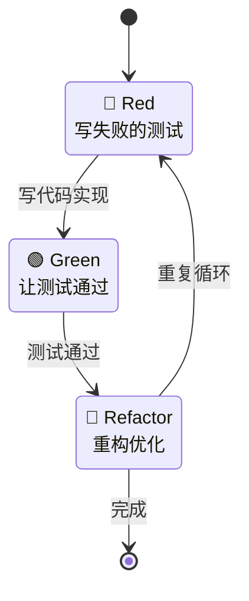

# CardMind 测试指南（TDD新手版）

本文档为首次接触TDD的开发者提供简单实用的测试指南。

## 什么是TDD？

TDD（Test-Driven Development，测试驱动开发）是一种"先写测试，再写代码"的开发方法。

### TDD三步走



### 为什么要用TDD？

- ✅ **减少bug**: 测试先行，功能更可靠
- ✅ **代码质量**: 可测试的代码往往设计更好
- ✅ **重构安全**: 有测试保护，重构不怕出错
- ✅ **活文档**: 测试用例就是最好的文档

---

## MVP阶段测试清单

### Rust侧必须测试的功能（优先级：高）

#### 卡片CRUD
- [ ] 创建卡片 → 能从Loro读到数据
- [ ] 创建卡片 → SQLite自动更新（订阅机制）
- [ ] 创建卡片 → UUID是v7格式（时间排序）
- [ ] 获取所有卡片 → 从SQLite正确读取
- [ ] 获取所有卡片 → 自动过滤已删除卡片
- [ ] 获取单个卡片 → 找到返回Some，不存在返回None
- [ ] 更新卡片 → Loro和SQLite都更新
- [ ] 更新卡片 → updated_at正确更新
- [ ] 删除卡片 → 软删除标记正确（is_deleted=true）
- [ ] 删除卡片 → 查询列表时不显示

#### Loro到SQLite同步
- [ ] Loro commit → 触发订阅回调
- [ ] 订阅回调 → SQLite正确更新
- [ ] 多个操作批量提交 → SQLite正确同步
- [ ] SQLite损坏 → 能从Loro重建

#### 数据持久化
- [ ] Loro文档 → 正确保存到文件
- [ ] 应用重启 → 能加载之前的数据
- [ ] update.loro超过阈值 → 自动合并快照

### Flutter侧需要测试的功能（优先级：中）

#### Service层
- [ ] CardService能调用Rust API
- [ ] API错误能正确捕获和处理
- [ ] 数据序列化/反序列化正确

#### Provider层
- [ ] CardProvider状态更新正确
- [ ] 创建卡片后列表自动刷新
- [ ] 删除卡片后列表自动更新

#### Widget测试（可选）
- [ ] 卡片列表显示正确
- [ ] 空状态提示显示正确
- [ ] 卡片点击导航正确

---

## TDD实战示例

### 示例1：创建卡片功能（完整流程）

#### Step 1: Red - 写失败的测试

```rust
// tests/card_store_test.rs

#[cfg(test)]
mod tests {
    use super::*;

    #[test]
    fn test_create_card_with_uuid_v7() {
        // 创建内存存储（用于测试）
        let mut store = CardStore::new_in_memory().unwrap();

        // 调用创建卡片（此时函数还不存在，测试会失败）
        let card = store.create_card("测试标题", "测试内容").unwrap();

        // 验证返回的卡片
        assert_eq!(card.title, "测试标题");
        assert_eq!(card.content, "测试内容");
        assert!(!card.id.is_empty());

        // 验证ID是UUID v7格式
        assert!(is_uuid_v7(&card.id), "ID应该是UUID v7格式");

        // 验证时间戳合理（与当前时间差距<1秒）
        let now = Utc::now().timestamp_millis();
        assert!((card.created_at - now).abs() < 1000);
        assert_eq!(card.created_at, card.updated_at);
    }
}
```

**运行测试**:
```bash
cd rust
cargo test test_create_card_with_uuid_v7
```

**预期结果**: 🔴 测试失败（因为函数还没实现）

---

#### Step 2: Green - 写最少的代码让测试通过

```rust
// src/store/card_store.rs

impl CardStore {
    pub fn create_card(&mut self, title: &str, content: &str) -> Result<Card> {
        // 生成UUID v7
        let id = Uuid::now_v7().to_string();
        let now = Utc::now().timestamp_millis();

        // 加载或创建Loro文档
        let doc = self.load_or_create_card_doc(&id)?;

        // 设置卡片数据
        let card_map = doc.get_map("card");
        card_map.insert("id", id.clone())?;
        card_map.insert("title", title)?;
        card_map.insert("content", content)?;
        card_map.insert("created_at", now)?;
        card_map.insert("updated_at", now)?;
        card_map.insert("is_deleted", false)?;

        // commit触发订阅，自动同步到SQLite
        doc.commit();

        // 保存到文件
        self.save_card(&id, doc)?;

        Ok(Card {
            id,
            title: title.to_string(),
            content: content.to_string(),
            created_at: now,
            updated_at: now,
            is_deleted: false,
        })
    }
}

// 辅助函数：验证UUID v7格式
fn is_uuid_v7(id: &str) -> bool {
    if let Ok(uuid) = Uuid::parse_str(id) {
        // UUID v7的版本字段应该是7
        uuid.get_version() == Some(Version::Random) // 实际实现需要更精确的判断
    } else {
        false
    }
}
```

**再次运行测试**:
```bash
cargo test test_create_card_with_uuid_v7
```

**预期结果**: ✅ 测试通过

---

#### Step 3: Refactor - 重构代码

```rust
// 提取ID生成逻辑
impl CardStore {
    fn generate_card_id() -> String {
        Uuid::now_v7().to_string()
    }

    fn current_timestamp() -> i64 {
        Utc::now().timestamp_millis()
    }

    pub fn create_card(&mut self, title: &str, content: &str) -> Result<Card> {
        let id = Self::generate_card_id();
        let now = Self::current_timestamp();

        // ... 其余逻辑保持不变
    }
}
```

**再次运行测试**:
```bash
cargo test
```

**预期结果**: ✅ 所有测试仍然通过

---

### 示例2：测试Loro到SQLite同步

```rust
#[test]
fn test_loro_to_sqlite_sync() {
    let mut store = CardStore::new_in_memory().unwrap();

    // 创建卡片（写入Loro）
    let card = store.create_card("标题", "内容").unwrap();

    // 从SQLite读取，验证同步成功
    let cards = store.get_all_cards().unwrap();
    assert_eq!(cards.len(), 1);
    assert_eq!(cards[0].id, card.id);
    assert_eq!(cards[0].title, "标题");
    assert_eq!(cards[0].content, "内容");
}

#[test]
fn test_deleted_cards_not_in_list() {
    let mut store = CardStore::new_in_memory().unwrap();

    // 创建两张卡片
    let card1 = store.create_card("卡片1", "内容1").unwrap();
    let card2 = store.create_card("卡片2", "内容2").unwrap();

    // 删除第一张
    store.delete_card(&card1.id).unwrap();

    // 查询列表，应该只有第二张
    let cards = store.get_all_cards().unwrap();
    assert_eq!(cards.len(), 1);
    assert_eq!(cards[0].id, card2.id);
}
```

---

## 测试命令速查

### Rust测试

```bash
# 运行所有测试
cd rust
cargo test

# 运行单个测试
cargo test test_create_card

# 运行特定模块的测试
cargo test card_store

# 显示println!输出
cargo test -- --nocapture

# 并行运行（默认）
cargo test

# 串行运行（调试时有用）
cargo test -- --test-threads=1

# 测试覆盖率（需要cargo-tarpaulin）
cargo tarpaulin --out Html
```

### Flutter测试

```bash
# 运行所有测试
flutter test

# 运行单个测试文件
flutter test test/card_service_test.dart

# 显示详细输出
flutter test --verbose

# Widget测试
flutter test test/widgets/card_list_test.dart
```

---

## 测试覆盖率目标

### MVP阶段

- **Rust核心逻辑**: >80%（严格要求）
- **Flutter Service层**: >70%
- **Flutter Provider层**: >60%
- **Flutter Widget**: >50%（widget测试较难，降低要求）

### 如何查看覆盖率

**Rust**:
```bash
# 安装tarpaulin
cargo install cargo-tarpaulin

# 生成覆盖率报告
cd rust
cargo tarpaulin --out Html

# 打开coverage/index.html查看
```

**Flutter**:
```bash
# 生成覆盖率报告
flutter test --coverage

# 生成HTML报告（需要lcov）
genhtml coverage/lcov.info -o coverage/html

# 打开coverage/html/index.html查看
```

---

## 什么时候可以跳过测试？

### 可以跳过测试的情况

1. **UI布局调整** - 纯视觉效果，手动测试更快
   ```dart
   // 这种不需要测试
   Container(
     padding: EdgeInsets.all(16),
     child: Text('Hello'),
   )
   ```

2. **一次性脚本** - 如数据迁移工具
   ```bash
   # 一次性脚本，不需要测试
   migrate_old_data.sh
   ```

3. **第三方库的封装** - 如果只是简单调用第三方库
   ```dart
   // 简单封装，可以不测
   Future<void> savePreference(String key, String value) async {
     await SharedPreferences.getInstance().then((prefs) {
       prefs.setString(key, value);
     });
   }
   ```

### 必须测试的情况

1. **核心业务逻辑** - 如卡片CRUD、Loro同步
2. **复杂算法** - 如UUID v7验证、数据迁移
3. **错误处理** - 各种异常情况
4. **数据一致性** - Loro和SQLite同步

---

## 测试技巧

### 1. 使用内存数据库（测试速度快）

```rust
impl CardStore {
    #[cfg(test)]
    pub fn new_in_memory() -> Result<Self> {
        // SQLite内存数据库
        let conn = Connection::open_in_memory()?;
        init_sqlite(&conn)?;

        Ok(Self {
            data_dir: PathBuf::from("/tmp/test"),
            loaded_cards: HashMap::new(),
            sqlite_conn: conn,
            update_size_threshold: 1024 * 1024,
        })
    }
}
```

### 2. 使用测试夹具（Fixture）

```rust
#[cfg(test)]
mod tests {
    // 创建测试夹具
    fn setup_store_with_cards() -> CardStore {
        let mut store = CardStore::new_in_memory().unwrap();
        store.create_card("卡片1", "内容1").unwrap();
        store.create_card("卡片2", "内容2").unwrap();
        store.create_card("卡片3", "内容3").unwrap();
        store
    }

    #[test]
    fn test_get_all_cards() {
        let store = setup_store_with_cards();
        let cards = store.get_all_cards().unwrap();
        assert_eq!(cards.len(), 3);
    }
}
```

### 3. 参数化测试

```rust
#[cfg(test)]
mod tests {
    #[test]
    fn test_create_card_with_various_inputs() {
        let test_cases = vec![
            ("标题1", "内容1"),
            ("", "只有内容"),  // 空标题
            ("标题with emoji 😊", "内容with\n换行"),
            ("长标题".repeat(100).as_str(), "长内容".repeat(1000).as_str()),
        ];

        let mut store = CardStore::new_in_memory().unwrap();

        for (title, content) in test_cases {
            let card = store.create_card(title, content).unwrap();
            assert_eq!(card.title, title);
            assert_eq!(card.content, content);
        }
    }
}
```

### 4. 测试错误情况

```rust
#[test]
fn test_get_nonexistent_card_returns_none() {
    let store = CardStore::new_in_memory().unwrap();
    let result = store.get_card("nonexistent-id").unwrap();
    assert!(result.is_none());
}

#[test]
fn test_update_nonexistent_card_returns_error() {
    let mut store = CardStore::new_in_memory().unwrap();
    let result = store.update_card("nonexistent-id", "标题", "内容");
    assert!(result.is_err());
    assert!(matches!(result.unwrap_err(), CardMindError::CardNotFound(_)));
}
```

---

## Flutter测试示例

### Service层测试

```dart
// test/services/card_service_test.dart

import 'package:flutter_test/flutter_test.dart';
import 'package:card_mind/services/card_service.dart';

void main() {
  group('CardService', () {
    late CardService cardService;

    setUp(() {
      cardService = CardService();
      // 初始化（使用测试路径）
      await cardService.init('/tmp/test');
    });

    test('创建卡片后能获取到', () async {
      final card = await cardService.createCard('标题', '内容');
      expect(card.title, '标题');
      expect(card.content, '内容');

      final cards = await cardService.getAllCards();
      expect(cards.length, 1);
      expect(cards[0].id, card.id);
    });

    test('删除卡片后列表不包含该卡片', () async {
      final card = await cardService.createCard('标题', '内容');
      await cardService.deleteCard(card.id);

      final cards = await cardService.getAllCards();
      expect(cards.length, 0);
    });
  });
}
```

### Provider层测试

```dart
// test/providers/card_provider_test.dart

import 'package:flutter_test/flutter_test.dart';
import 'package:card_mind/providers/card_provider.dart';

void main() {
  group('CardProvider', () {
    late CardProvider provider;

    setUp(() {
      provider = CardProvider();
    });

    test('初始状态为空', () {
      expect(provider.cards, isEmpty);
      expect(provider.isLoading, false);
    });

    test('加载卡片更新状态', () async {
      await provider.loadCards();
      expect(provider.isLoading, false);
      // 根据实际情况验证cards
    });
  });
}
```

---

## 常见问题

### Q1: 测试太慢怎么办？

**A**: 使用内存数据库，避免实际文件IO：
```rust
Connection::open_in_memory()  // 而不是 Connection::open("test.db")
```

### Q2: 如何测试异步代码？

**A**: 使用`#[tokio::test]`或Flutter的`async`测试：
```rust
#[tokio::test]
async fn test_async_function() {
    let result = some_async_function().await;
    assert!(result.is_ok());
}
```

### Q3: 测试之间互相影响怎么办？

**A**: 确保每个测试独立，使用`setUp`和`tearDown`：
```rust
#[test]
fn test_1() {
    let store = CardStore::new_in_memory().unwrap(); // 独立的store
    // ...
}

#[test]
fn test_2() {
    let store = CardStore::new_in_memory().unwrap(); // 另一个独立的store
    // ...
}
```

### Q4: 如何测试UI？

**A**: Flutter提供Widget测试框架：
```dart
testWidgets('卡片列表显示正确', (WidgetTester tester) async {
  await tester.pumpWidget(MyApp());

  expect(find.text('卡片标题'), findsOneWidget);
  expect(find.byType(CardList), findsOneWidget);
});
```

---

## 测试清单（Phase 1开始前）

在开始写业务代码前，确保：

- [ ] 理解TDD的Red-Green-Refactor循环
- [ ] 能运行`cargo test`和`flutter test`
- [ ] 知道如何查看测试覆盖率
- [ ] 阅读了本文档的TDD实战示例
- [ ] 设置了CI自动运行测试（可选）

---

## 下一步

1. **现在**: 阅读本文档，理解TDD基本流程
2. **Phase 1开始**: 跟着示例写第一个测试
3. **MVP完成**: 检查测试覆盖率是否达标（>80%）
4. **持续迭代**: 每个新功能都先写测试

**记住**: 测试不是负担，而是保护你代码的盔甲！🛡️

---

## 参考资源

- [Rust测试文档](https://doc.rust-lang.org/book/ch11-00-testing.html)
- [Flutter测试文档](https://docs.flutter.dev/testing)
- [TDD By Example（书籍推荐）](https://www.amazon.com/Test-Driven-Development-Kent-Beck/dp/0321146530)
