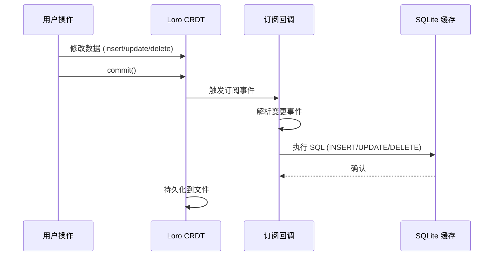
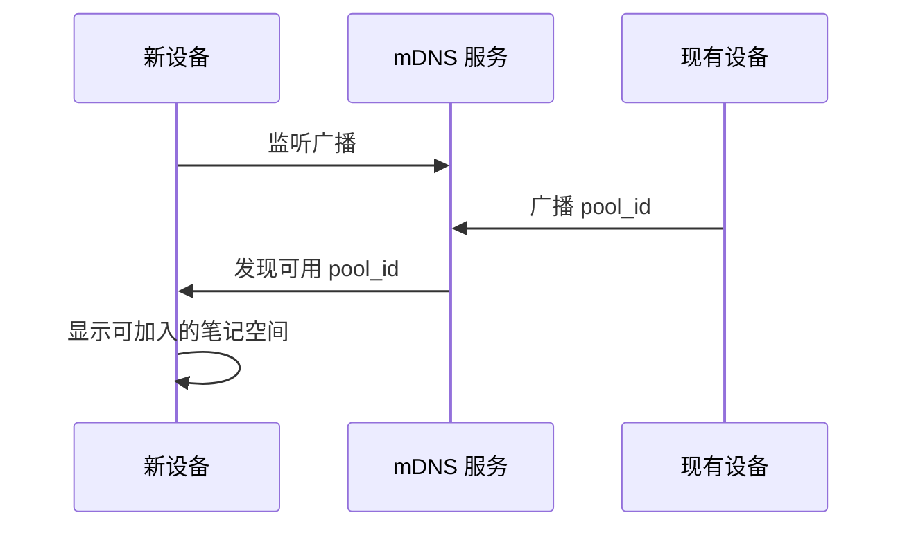

# 同步机制设计 (Sync Mechanism)

> **设计哲学**: 本文档定义同步机制的设计理念和流程。
> 详细实现规格请查看 [同步层规格](../specs/rust/sync_spec.md)。

---

## 1. 订阅驱动更新机制

### 1.1 设计原理

源数据层 (Loro CRDT) 变更时，通过**观察者模式**通知缓存层 (SQLite) 更新，保证数据一致性。



### 1.2 流程说明

1. **写入源数据层**: 用户操作触发数据修改 (创建、更新、删除卡片)
2. **提交变更**: 调用 `commit()` 接口，标记变更完成
3. **触发订阅回调**: 源数据层通知所有订阅者
4. **更新缓存层**: 订阅者接收变更事件，更新 SQLite 缓存
5. **通知 UI 刷新**: 缓存层触发 UI 重新查询 (Flutter 层实现)

### 1.3 订阅保证

**原子性**: 订阅回调在同一事务内执行

**一致性**: 缓存更新失败不影响源数据层
- SQLite 可以随时重建，Loro 数据永不丢失

**顺序性**: 订阅顺序与提交顺序一致
- Loro 保证事件按提交顺序触发
- SQLite 更新严格按事件顺序执行

### 1.4 订阅事件类型

| Loro 事件 | SQLite 操作 | 说明 |
|-----------|------------|------|
| `Create` | `INSERT INTO cards ...` | 新建卡片 |
| `Update` | `UPDATE cards SET ...` | 修改字段 |
| `Delete` | `UPDATE cards SET is_deleted = 1 ...` | 软删除 |

**注意**: 删除操作使用软删除 (设置标记)，而非物理删除。

### 1.5 故障恢复

**SQLite 损坏场景**:
1. 检测到 SQLite 数据损坏
2. 删除旧的 `cache.db` 文件
3. 重新创建空数据库
4. 从 Loro 全量同步所有卡片
5. 重建索引

**数据一致性保证**: Loro 是真理源，SQLite 可随时重建。

---

## 2. 初始化与设备发现 (单池模型)

### 2.1 初始化决策

**目标**: 区分第一台设备（创建笔记空间）与后续设备（加入已存在空间）。

```
┌─────────────────────────────────────────────┐
│           DeviceConfig.load_or_create()     │
└─────────────────────┬───────────────────────┘
                      │
              ┌───────┴───────┐
              │               │
              ▼               ▼
    ┌─────────────────┐ ┌─────────────────┐
    │ pool_id.is_some │ │ pool_id.is_none │
    └────────┬────────┘ └────────┬────────┘
             │                   │
             ▼                   ▼
    ┌─────────────────┐ ┌─────────────────┐
    │ EnterMain       │ │ Start mDNS      │
    │ (直接进入)      │ │ (发现现有池)    │
    └─────────────────┘ └────────┬────────┘
                                │
                       ┌────────┴────────┐
                       │                 │
                       ▼                 ▼
              ┌─────────────────┐ ┌─────────────────┐
              │ 发现同伴        │ │ 未发现同伴      │
              │ ShowChoice      │ │ ShowCreateWizard│
              └─────────────────┘ └─────────────────┘
```

### 2.2 发现协议

使用**本地网络广播**协议 (mDNS)，设备在同一局域网内自动发现唯一的笔记空间。



### 2.3 广播内容 (非敏感信息)

mDNS 广播仅包含基本信息，不泄露敏感数据：
- `device_id`: 设备标识
- `device_name`: 默认昵称
- `pool_id`: 数据池 ID

---

## 3. P2P 同步协议

### 3.1 同步架构

```
┌─────────────────────────────────────────────────────────┐
│                    P2P 同步层                           │
├─────────────────────────────────────────────────────────┤
│  ┌─────────────┐  ┌─────────────┐  ┌─────────────────┐  │
│  │ mDNS 发现   │  │ libp2p 连接 │  │  Loro 同步      │  │
│  └─────────────┘  └─────────────┘  └─────────────────┘  │
├─────────────────────────────────────────────────────────┤
│  功能: 设备发现 → 建立连接 → 交换状态 → 数据同步        │
└─────────────────────────────────────────────────────────┘
```

### 3.2 单池同步模型

每个设备只同步到同一个数据池：
- `pool_id` 来自 DeviceConfig
- 同步范围 = `Pool.card_ids` 中的卡片
- 简化同步逻辑，提高效率

---

## 4. 冲突解决

### 4.1 CRDT 自动解决

- **无需用户干预**: CRDT 算法自动合并冲突
- **Last-Write-Wins**: 时间戳最新的修改胜出
- **语义保留**: 自动合并字段级别的修改

### 4.2 日志记录

- 记录冲突发生的时间、设备、卡片 ID
- 供调试和审计使用
- 不影响用户体验

---

## 5. 性能优化

### 5.1 订阅优化

**批量更新**: 多个修改在同一 `commit()` 中批量提交，减少订阅回调次数

**延迟更新**: UI 编辑时不立即 commit，用户停止编辑后再 commit

### 5.2 同步优化

**增量传输**: 仅传输变更部分，不传输完整文档

**压缩传输**: 使用 gzip 或 zstd 压缩数据

**并行同步**: 同时与多个对等设备同步

### 5.3 存储优化

**Loro 文件合并**: 当更新文件超过 1MB 时合并到快照

**SQLite 缓存清理**: 定期执行 `VACUUM` 释放空间

---

## 6. 详细规格 (链接)

### 6.1 同步层规格
- [同步层简化规格](../specs/rust/sync_spec.md) - P2P 同步详细规范
- [API层规格](../specs/rust/api_spec.md) - 同步相关 API 定义

### 6.2 架构参考
- [系统设计](./system_design.md) - 双层架构原则
- [数据契约](./data_contract.md) - 同步数据类型

### 6.3 代码实现
- 运行 `cargo doc --open` 查看 Rust 同步模块文档
- 源码位置: `rust/src/p2p/`

---

## 7. 相关文档

### 架构文档
- [系统设计](./system_design.md) - 双层架构原则
- [数据契约](./data_contract.md) - 数据类型约束
- [层分离策略](./layer_separation.md) - 分层详细说明

### Spec文档
- [同步层规格](../specs/rust/sync_spec.md) - 同步机制完整定义
- [API层规格](../specs/rust/api_spec.md) - 同步 API 规范

### 代码
- 运行 `cargo doc --open` 查看 Rust 同步模块文档
- 源码位置: `rust/src/p2p/`

---

## 8. 更新日志

| 版本 | 变更 |
|------|------|
| 1.4.0 | 重构：移除实现细节，链接到规格文档 |
| 1.3.0 | 适配单池模型：新增初始化决策流程 |
| 1.2.0 | 增强隐私保护：mDNS 广播优化 |
| 1.1.0 | 更新设备昵称机制 |
| 1.0.0 | 初始版本 |

---

**设计哲学**: 本文档定义同步机制的设计理念和流程，使用流程图展示原理。同步的核心是"订阅驱动、单向数据流、CRDT 自动冲突解决"。详细实现请查看规格文档。
