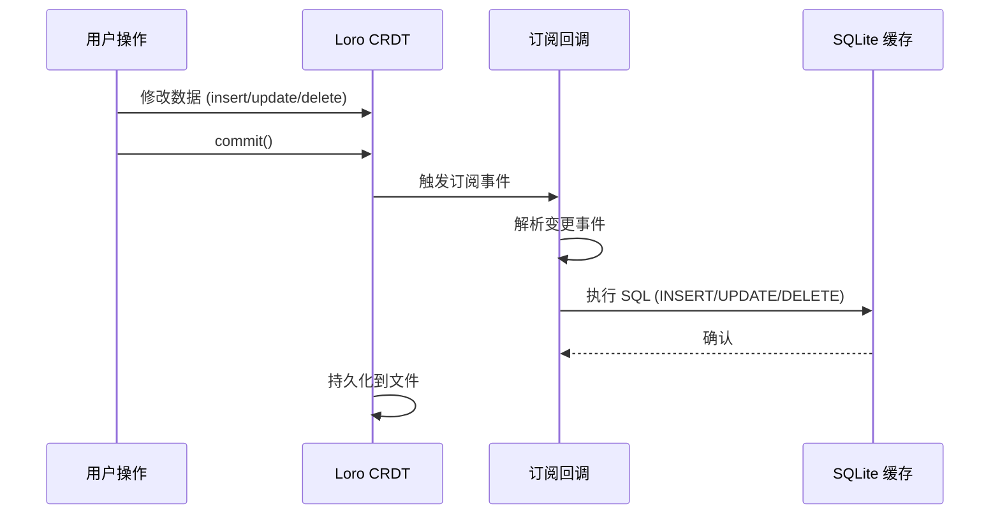
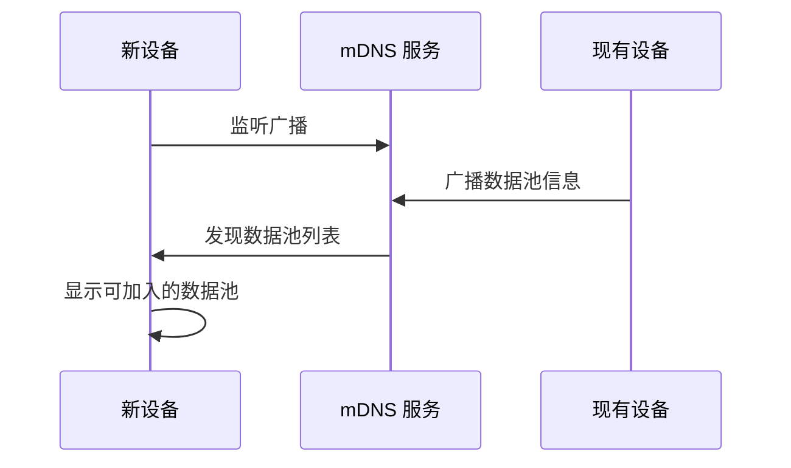
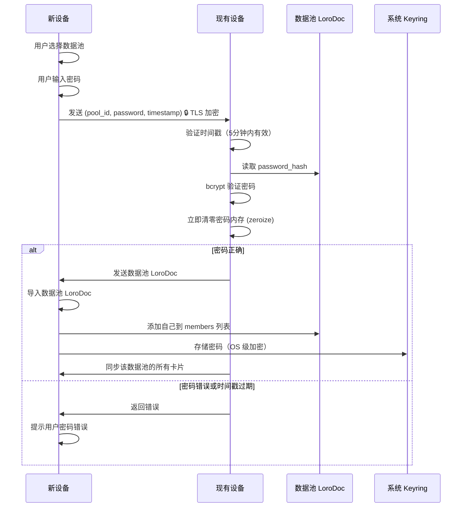
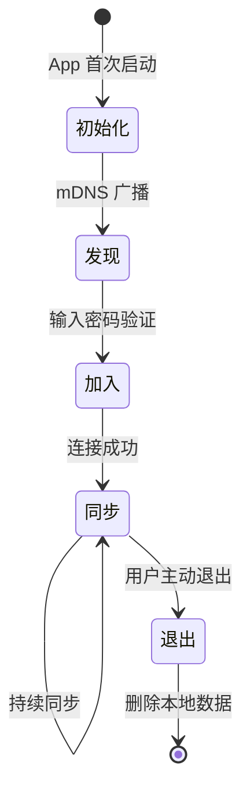

# 同步机制设计 (Sync Mechanism)

本文档定义 CardMind 的同步机制设计,包括订阅驱动更新、P2P 设备发现和数据池同步策略。

**实现细节请查看源码**: 运行 `cargo doc --open` 查看自动生成的 Rust 同步模块文档。

---

## 1. 订阅驱动更新机制

### 1.1 设计原理

源数据层 (Loro CRDT) 变更时,通过**观察者模式**通知缓存层 (SQLite) 更新,保证数据一致性。



### 1.2 流程说明

1. **写入源数据层**: 用户操作触发数据修改 (创建、更新、删除卡片)
2. **提交变更**: 调用 `commit()` 接口,标记变更完成
3. **触发订阅回调**: 源数据层通知所有订阅者
4. **更新缓存层**: 订阅者接收变更事件,更新 SQLite 缓存
5. **通知 UI 刷新**: 缓存层触发 UI 重新查询 (Flutter 层实现)

### 1.3 订阅保证

**原子性**: 订阅回调在同一事务内执行

```rust
// 伪代码
fn subscription_callback(event: LoroEvent) -> Result<()> {
    let tx = sqlite.transaction()?; // 开始事务

    match event {
        LoroEvent::Create => tx.execute("INSERT INTO cards ...")?,
        LoroEvent::Update => tx.execute("UPDATE cards ...")?,
        LoroEvent::Delete => tx.execute("UPDATE cards SET is_deleted = 1 ...")?,
    }

    tx.commit()?; // 提交事务
    Ok(())
}
```

**一致性**: 缓存更新失败不影响源数据层

```rust
// 伪代码
if let Err(e) = sync_to_sqlite(event) {
    // 记录错误,但不回滚 Loro 的 commit
    error!("Failed to sync to SQLite: {}", e);
    // SQLite 可以稍后重建,Loro 数据永不丢失
}
```

**顺序性**: 订阅顺序与提交顺序一致

- Loro 保证事件按提交顺序触发
- SQLite 更新严格按事件顺序执行

### 1.4 订阅事件类型

| Loro 事件 | SQLite 操作 | 说明 |
|-----------|------------|------|
| `Create` | `INSERT INTO cards ...` | 新建卡片 |
| `Update` | `UPDATE cards SET ...` | 修改字段 |
| `Delete` | `UPDATE cards SET is_deleted = 1 ...` | 软删除 |

**注意**: 删除操作使用软删除 (设置标记),而非物理删除 (DELETE FROM)。

### 1.5 故障恢复

**SQLite 损坏场景**:
1. 检测到 SQLite 数据损坏 (如校验和错误)
2. 删除旧的 `cache.db` 文件
3. 重新创建空数据库
4. 从 Loro 全量同步所有卡片 (遍历 Loro 文档)
5. 重建索引

**数据一致性保证**: Loro 是真理源,SQLite 可随时重建。

---

## 2. P2P 设备发现 (Phase 2)

### 2.1 发现协议

使用**本地网络广播**协议 (mDNS),设备在同一局域网内自动发现。



### 2.2 广播内容 (非敏感信息)

**mDNS 广播包含**:
```json
{
  "device_id": "device-001",
  "device_name": "MacBook-018c8",  // 使用默认昵称 (设备型号-UUID前5位)
  "pools": [
    {
      "pool_id": "pool-abc"  // 仅暴露数据池 ID
    }
  ]
}
```

**说明**:
- `device_name` 使用即时生成的默认昵称，不使用数据池中的设备昵称
- 默认昵称格式: `{设备型号}-{UUID前5位}`（如 `iPhone-018c8`, `MacBook-7a3e1`）
- 防止泄露用户在特定数据池中的身份信息

**隐私保护策略**:
- ✅ **仅暴露 `pool_id`** (UUID): 未授权设备无法推断数据池用途
- ❌ **不暴露 `pool_name`**: 防止泄露敏感业务信息 (如 "公司机密项目")
- ✅ **密码验证后获取**: 新设备需输入正确密码后才能获取数据池名称和详细信息

**不包含的敏感信息**:
- ❌ 数据池名称 (`pool_name`)
- ❌ 密码或密码哈希
- ❌ 成员列表
- ❌ 卡片数量或内容
- ❌ 任何业务数据

**用户体验说明**:
- 新设备发现数据池时，UI 显示 `pool_id` 的前 8 位 (如 `pool-abc`)
- 用户输入密码验证成功后，设备接收完整的数据池 LoroDoc，包含 `pool_name` 等详细信息
- 验证后 UI 显示友好的数据池名称 (如 "工作笔记")

### 2.3 连接建立



### 2.3.1 安全加固措施

**传输层安全**:
- **强制 TLS 加密**: libp2p 配置强制使用 TLS，拒绝明文连接
- **加密算法**: AES-256-GCM（libp2p 默认）
- **证书验证**: 使用 libp2p 自签名证书（本地网络信任模型）

**内存安全**:
- **敏感数据清零**: 使用 `zeroize` crate 清除密码内存
- **验证后立即清理**: bcrypt 验证完成后立即清零密码
- **避免日志泄露**: 密码不出现在任何日志中

**请求时效性**（防简单重放攻击）:
- **时间戳验证**: 加入请求包含 Unix 毫秒时间戳
- **有效期**: 请求在 5 分钟内有效
- **时钟偏差**: 容忍 ±30 秒偏差（可配置）

**密码强度要求**:
- **最少长度**: 8 位字符
- **建议复杂度**: 包含字母、数字（可选，不强制）
- **创建时验证**: 数据池创建时检查密码强度

**实现伪代码**:
```rust
// 1. 强制 TLS 配置
let transport = libp2p::tcp::Transport::default()
    .upgrade(libp2p::core::upgrade::Version::V1)
    .authenticate(libp2p::noise::Config::new(&keypair)?)
    .multiplex(libp2p::yamux::Config::default());

// 2. 密码内存清理
use zeroize::Zeroizing;

fn verify_password(password: Zeroizing<String>, hash: &str) -> Result<bool> {
    let result = bcrypt::verify(&password, hash)?;
    // password 离开作用域时自动清零内存
    Ok(result)
}

// 3. 时间戳验证
struct JoinRequest {
    pool_id: String,
    password: Zeroizing<String>,
    timestamp: u64,  // Unix 毫秒时间戳
}

fn validate_request(req: &JoinRequest) -> Result<()> {
    let now = current_timestamp_ms();
    let diff = now.abs_diff(req.timestamp);

    if diff > 300_000 {  // 5 分钟
        return Err("请求已过期");
    }
    Ok(())
}

// 4. 密码强度验证
fn validate_password_strength(password: &str) -> Result<()> {
    if password.len() < 8 {
        return Err("密码至少 8 位");
    }
    Ok(())
}
```

### 2.4 安全保证总结

**多层防护体系**:

1. **传输层**: libp2p TLS 加密（AES-256-GCM）
2. **验证层**: bcrypt 慢哈希（防暴力破解）
3. **内存层**: zeroize 清零敏感数据
4. **存储层**: 系统 Keyring OS 级加密
5. **时效层**: 时间戳验证（防简单重放）

**安全等级**: 适用于家庭/个人局域网场景，提供足够的安全保护。

**未来升级路径**: 如需更高安全性（如广域网），可升级到 SPAKE2 协议（v2.1.0+）。

### 2.5 自动重连机制

**App 启动时**:
1. 读取本地配置文件 (`config.json`)，获取 `joined_pools` ID 列表
2. 对每个 pool_id，加载对应的 Pool CRDT 文件，读取数据池详细信息
3. 从系统 Keyring 读取每个数据池的密码
4. 自动连接到已发现的数据池成员设备（通过 mDNS）
5. 如果密码验证失败 (例如密码已更改),提示用户重新输入

**保证**: 用户无需每次手动输入密码,自动恢复同步。

**实现伪代码**:
```rust
fn auto_reconnect_on_startup(config: &Config) -> Result<()> {
    for pool_id in &config.joined_pools {
        // 1. 加载数据池 CRDT，获取详细信息
        let pool = load_pool_crdt(pool_id)?;
        let pool_name = pool.name;

        // 2. 从 Keyring 读取密码
        let password = keyring::get_password(&format!("cardmind.pool.{}.password", pool_id))?;

        // 3. 连接到数据池成员设备
        connect_to_pool(pool_id, &password)?;
    }
    Ok(())
}
```

---

## 3. 数据池同步策略 (Phase 2)

### 3.1 同步范围

**过滤规则**: 仅同步满足以下条件的卡片:

```
card.pool_ids ∩ device.joined_pools ≠ ∅
```

**含义**: 卡片的绑定池与设备的加入池有交集。

**伪代码**:
```rust
fn should_sync_card(card: &Card, device: &Device) -> bool {
    let device_pools: HashSet<_> = device.joined_pools.iter().collect();
    let card_pools: HashSet<_> = card.pool_ids.iter().collect();

    !device_pools.is_disjoint(&card_pools)
}
```

**示例**:
- 卡片绑定: `pool_ids = ["pool-A", "pool-B"]`
- 设备加入: `joined_pools = ["pool-A", "pool-C"]`
- 结果: 同步 (因为 `pool-A` 在交集中)

### 3.2 冲突解决

**CRDT 自动合并**: 使用 Loro CRDT 的自动冲突解决算法

**示例场景**:
- 设备 A 离线修改卡片标题: "标题 A"
- 设备 B 离线修改卡片标题: "标题 B"
- 联网后 CRDT 合并: "标题 A标题 B" 或按时间戳选择最新

**保证**:
- 无需用户干预
- 保证最终一致性
- 数据永不丢失

### 3.3 离线支持

**离线编辑**:
- 离线时正常编辑卡片
- 修改保存在本地 Loro 文档

**联网后同步**:
1. 检测到网络连接
2. 导出本地更新 (`loro.export_updates()`)
3. 发送更新到对等设备
4. 接收对等设备的更新
5. 导入更新 (`loro.import_updates()`)
6. CRDT 自动合并冲突

**多设备离线编辑**:
- 设备 A 和设备 B 同时离线编辑
- 各自修改不同卡片或同一卡片的不同字段
- 联网后自动合并,无需手动处理

### 3.4 增量同步

**设计**: 仅同步变更部分,不传输完整文档

**流程**:
```rust
// 伪代码
fn sync_with_peer(peer: PeerId) -> Result<()> {
    // 1. 获取本地最后同步版本
    let last_sync_version = get_last_sync_version(peer)?;

    // 2. 导出增量更新
    let updates = loro_doc.export_from(last_sync_version)?;

    // 3. 发送到对等设备
    send_to_peer(peer, updates)?;

    // 4. 接收对等设备的更新
    let peer_updates = receive_from_peer(peer)?;

    // 5. 导入更新
    loro_doc.import(&peer_updates)?;

    // 6. commit 触发订阅,自动更新 SQLite
    loro_doc.commit();

    // 7. 更新同步版本
    set_last_sync_version(peer, loro_doc.current_version())?;

    Ok(())
}
```

**优势**:
- 减少网络流量
- 提高同步速度
- 支持断点续传 (记录同步版本)

---

## 4. 数据池网络架构 (Phase 2)

### 4.1 数据池生命周期



### 4.2 数据池角色

**平等权限模型**:
- 所有成员权限相同
- 所有成员都可以修改数据池信息 (昵称、成员列表)
- 不支持"踢出成员"功能,仅支持"主动退出"

**未来扩展**:
- 引入角色系统 (管理员/普通成员)
- 管理员可踢出成员
- 细粒度权限控制

### 4.3 密码管理

**密码修改流程**:
1. 任意成员修改数据池密码 (修改 `password_hash` 字段)
2. 修改通过 CRDT 同步到所有在线设备
3. 离线设备重连时,使用旧密码验证失败
4. 提示用户重新输入新密码
5. 验证通过后更新系统 Keyring

**安全保证**:
- 密码修改立即生效
- 旧密码无法访问数据池
- 新密码存储在系统 Keyring (加密)

---

## 5. 健康检查和状态监控 (Phase 2)

### 5.1 在线状态检测

**心跳机制**:
- App 定期发送心跳包 (每 30 秒)
- 如果 60 秒内未收到心跳,标记设备离线
- UI 显示设备在线/离线状态

**libp2p 集成**:
- 使用 libp2p 的 Ping 协议
- 自动检测网络连接状态
- 断线自动重连

### 5.2 同步状态监控

**同步状态**:
- `Idle`: 空闲,无同步任务
- `Syncing`: 正在同步
- `Completed`: 同步完成
- `Failed`: 同步失败 (显示错误原因)

**UI 反馈**:
- 同步中: 显示旋转图标
- 同步完成: 显示勾选图标 (2 秒后消失)
- 同步失败: 显示警告图标,点击重试

### 5.3 冲突检测

**自动冲突解决**: CRDT 算法自动处理,无需用户干预

**日志记录**:
- 记录冲突发生的时间、设备、卡片 ID
- 供调试和审计使用
- 不影响用户体验

---

## 6. 性能优化策略

### 6.1 订阅优化

**批量更新**:
- 多个修改在同一 `commit()` 中批量提交
- 减少订阅回调次数
- 提高 SQLite 更新效率

**延迟更新**:
- UI 编辑时不立即 commit
- 用户停止编辑后 (如 500ms 无输入) 再 commit
- 避免频繁触发订阅

### 6.2 同步优化

**增量传输**:
- 仅传输变更部分,不传输完整文档
- 记录同步版本,支持断点续传

**压缩传输**:
- 使用 gzip 或 zstd 压缩数据
- 减少网络流量

**并行同步**:
- 同时与多个对等设备同步
- 提高同步速度

### 6.3 存储优化

**Loro 文件合并**:
- 当 `update.loro` 超过 1MB 时,合并到 `snapshot.loro`
- 控制文件大小,提高加载速度

**SQLite 缓存清理**:
- 定期清理软删除的卡片 (可选)
- 执行 `VACUUM` 释放空间

---

## 7. 相关文档

**架构层文档**:
- [SYSTEM_DESIGN.md](SYSTEM_DESIGN.md) - 系统设计原则
- [DATA_CONTRACT.md](DATA_CONTRACT.md) - 数据契约定义
- [LAYER_SEPARATION.md](LAYER_SEPARATION.md) - 分层策略
- [TECH_CONSTRAINTS.md](TECH_CONSTRAINTS.md) - 技术选型理由

**实现细节**:
- 运行 `cargo doc --open` 查看 Rust 同步模块文档
- 源码位置:
  - 订阅机制: `rust/src/store/subscription.rs`
  - P2P 同步: `rust/src/sync/` (Phase 2)

---

## 更新日志

| 版本 | 变更 |
|------|------|
| 1.2.0 | 增强隐私保护：mDNS 广播仅暴露 `pool_id`，不暴露 `pool_name`；密码验证后才能获取数据池详细信息 |
| 1.1.0 | 更新设备昵称机制：mDNS 广播使用默认昵称；自动重连时从 CRDT 读取数据池详细信息 |
| 1.0.0 | 初始版本,从 PRD.md 和 DATABASE.md 提取同步机制设计 |

---

**设计哲学**: 本文档定义同步机制的设计理念和流程,使用流程图和伪代码展示原理,不包含具体实现。同步的核心是"订阅驱动、单向数据流、CRDT 自动冲突解决"。
