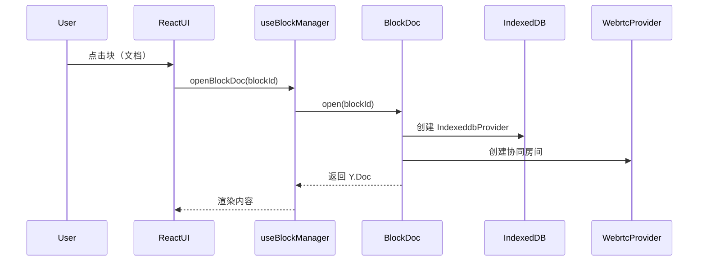
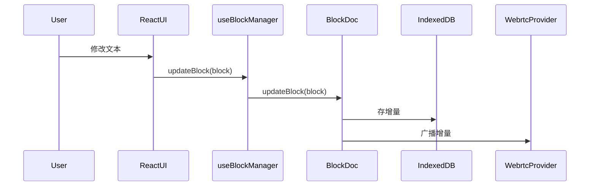
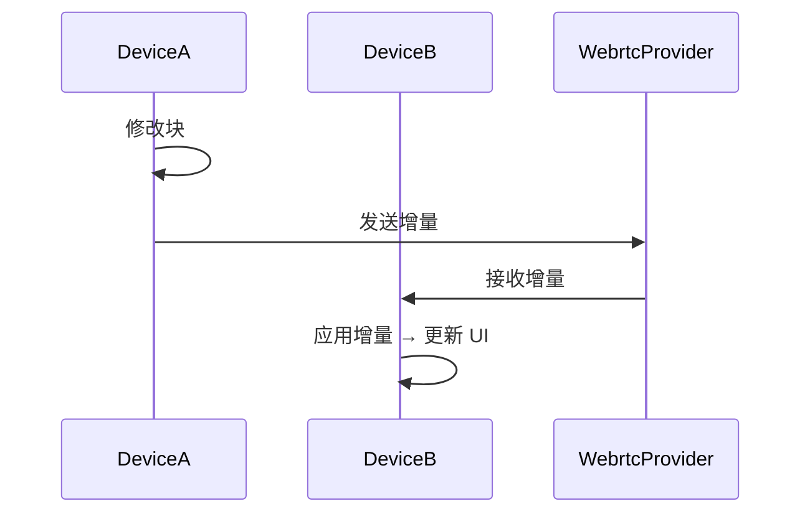

# 分布式笔记应用开发文档  
（React + React Native 统一版 · 万物皆块 · 一个块 = 一个 Y.Doc · pnpm）

---

## 目录
1. 设计总览  
2. 统一数据结构  
3. 技术栈与依赖（pnpm）  
4. 统一 IndexedDB 层  
5. 每块一个 Y.Doc 协同层  
6. LRU 缓存 & 历史快照  
7. 状态管理（Zustand）  
8. 加密工具  
9. React / RN 共享组件  
10. 一键启动（pnpm）  
11. 关键工作流程  
12. 部署检查清单  

---

## 1. 设计总览
- **理念**：**万物皆块** → **一个块 = 一篇笔记 = 一个 Y.Doc**  
- **结构**：  
  - 业务数据库（IndexedDB / Dexie）存储 `UnifiedBlock`（含 `parentId/childrenIds`）  
  - 每块独立 Y.Doc：`doc_<blockId>`  
  - 打开块时创建 Provider，关闭时销毁  
- **依赖**：pnpm 统一包管理  
- **代码复用**：≥ 95 % Web / RN  

---

## 2. 统一数据结构

```typescript
// types/block.ts
export enum BlockType { DOC = 'doc', TEXT = 'text', MEDIA = 'media', CODE = 'code' }

export interface UnifiedBlock {
  id: string;
  type: BlockType;
  parentId: string | null;
  childrenIds: string[];
  properties: Record<string, any>;
  createdAt: Date;
  modifiedAt: Date;
  isDeleted: boolean;
}
```

---

## 3. 技术栈与依赖（pnpm）

```bash
# 全局包管理器
npm i -g pnpm

# 根目录一次性安装
pnpm install

# 核心依赖
pnpm add zustand yjs y-indexeddb y-webrtc lru-cache libsodium-wrappers
pnpm add -D typescript @types/react @types/react-native vite
```

---

## 4. 统一 IndexedDB 层

```typescript
// db/index.ts
import Dexie from 'dexie';
const isRN = typeof navigator !== 'undefined' && navigator.product === 'ReactNative';
if (isRN) require('indexeddbshim')(global, { checkOrigin: false, win: global });

class NotesDatabase extends Dexie {
  blocks = this.table<UnifiedBlock, string>('blocks');
  snapshots = this.table<{ id: string; ts: number; update: Uint8Array }, string>('snapshots');
  constructor() {
    super('NotesApp');
    this.version(3).stores({
      blocks: 'id, parentId, modifiedAt, isDeleted',
      snapshots: '++id, ts'
    });
  }
}
export const db = new NotesDatabase();
```

```typescript
// db/operations.ts
export const Database = {
  create: (b: UnifiedBlock) => db.blocks.add(b),
  update: (b: UnifiedBlock) => db.blocks.put({ ...b, modifiedAt: new Date() }),
  batchUpdate: (bs: UnifiedBlock[]) => db.blocks.bulkPut(bs.map(b => ({ ...b, modifiedAt: new Date() }))),
  get: (id: string) => db.blocks.get(id),
  getChildren: (parentId: string) =>
    db.blocks.where('[parentId+isDeleted]').equals([parentId, false]).toArray(),
  saveSnapshot: (update: Uint8Array) => db.snapshots.add({ id: crypto.randomUUID(), ts: Date.now(), update }),
  listSnapshots: () => db.snapshots.orderBy('ts').reverse().toArray(),
  getSnapshot: (id: string) => db.snapshots.get(id)
};
```

---

## 5. 每块一个 Y.Doc 协同层

```typescript
// stores/blockDoc.ts
import * as Y from 'yjs';
import { IndexeddbProvider } from 'y-indexeddb';
import { WebrtcProvider } from 'y-webrtc';

export class BlockDoc {
  private static openDocs = new Map<string, { doc: Y.Doc; providers: any[] }>();

  static open(blockId: string) {
    if (this.openDocs.has(blockId)) return this.openDocs.get(blockId)!;

    const doc = new Y.Doc();
    const offline = new IndexeddbProvider(`doc_${blockId}`, doc);
    const online = new WebrtcProvider(`doc_${blockId}`, doc, {
      signalingUrls: ['wss://signaling.yjs.dev']
    });

    this.openDocs.set(blockId, { doc, providers: [offline, online] });
    return this.openDocs.get(blockId)!;
  }

  static close(blockId: string) {
    const entry = this.openDocs.get(blockId);
    if (!entry) return;
    entry.providers.forEach(p => p.destroy());
    this.openDocs.delete(blockId);
  }

  static updateBlock(blockId: string, block: UnifiedBlock) {
    const doc = this.open(blockId).doc;
    const map = doc.getMap('data');
    doc.transact(() => {
      Object.entries(block).forEach(([k, v]) =>
        map.set(k, typeof v === 'object' ? JSON.parse(JSON.stringify(v)) : v)
      );
    });
  }

  static getBlock(blockId: string): UnifiedBlock | null {
    const doc = this.open(blockId).doc;
    const map = doc.getMap('data');
    return map.size ? (Object.fromEntries(map.entries()) as UnifiedBlock) : null;
  }
}
```

---

## 6. LRU 缓存 & 历史快照

- **LRU**：`lru-cache` 在 **BlockDoc.openDocs** 中已内建  
- **快照**：每 30 次更新或 5 分钟触发 `Y.encodeStateAsUpdate`

---

## 7. 状态管理（Zustand）

```typescript
// stores/blockManager.ts
import { create } from 'zustand';
import { BlockDoc } from './blockDoc';
import { UnifiedBlock, BlockType } from '../types/block';

interface State {
  openBlockId: string | null;
  openBlock: UnifiedBlock | null;
  openBlockDoc: (id: string) => void;
  closeBlockDoc: () => void;
  updateBlock: (block: UnifiedBlock) => void;
}

export const useBlockManager = create<State>((set, get) => ({
  openBlockId: null,
  openBlock: null,

  openBlockDoc(id) {
    BlockDoc.open(id);
    const block = BlockDoc.getBlock(id)!;
    set({ openBlockId: id, openBlock: block });
  },

  closeBlockDoc() {
    if (get().openBlockId) BlockDoc.close(get().openBlockId!);
    set({ openBlockId: null, openBlock: null });
  },

  updateBlock(block) {
    BlockDoc.updateBlock(block.id, block);
    set({ openBlock: block });
  }
}));
```

---

## 8. 加密工具

```typescript
// utils/crypto.ts
import sodium from 'libsodium-wrappers';
await sodium.ready;

export const Crypto = {
  encrypt: (text: string, key: Uint8Array) => {
    const nonce = sodium.randombytes_buf(sodium.crypto_secretbox_NONCEBYTES);
    const cipher = sodium.crypto_secretbox_easy(text, nonce, key);
    return { nonce, cipher };
  },
  decrypt: (nonce: Uint8Array, cipher: Uint8Array, key: Uint8Array) =>
    sodium.crypto_secretbox_open_easy(cipher, nonce, key, 'text'),
  deriveKey: (passphrase: string) => sodium.crypto_generichash(32, passphrase)
};
```

---

## 9. React / RN 共享组件

```tsx
// components/BlockPage.tsx
import React, { useEffect } from 'react';
import { useBlockManager } from '../stores/blockManager';
import { BlockRenderer } from './BlockRenderer';

interface Props { blockId: string }

export const BlockPage: React.FC<Props> = ({ blockId }) => {
  const { openBlockDoc, closeBlockDoc, openBlock } = useBlockManager();

  useEffect(() => {
    openBlockDoc(blockId);
    return closeBlockDoc;
  }, [blockId]);

  return <>{openBlock?.id && <BlockRenderer blockId={openBlock.id} />}</>;
};
```

---

## 10. 一键启动（pnpm）

```bash
# 安装 pnpm
npm i -g pnpm

# 克隆 & 安装
git clone <repo> && cd <repo>
pnpm install

# 运行
pnpm web        # Vite dev server
pnpm android    # RN Android
pnpm ios        # RN iOS
```

---

## 11. 关键工作流程（万物皆块，每块一个 Y.Doc）

### 11.1 打开块（打开一篇笔记）



### 11.2 编辑块内容



### 11.3 多设备同步



---

## 12. 部署检查清单

| 检查项 | Web | RN |
|---|---|---|
| **pnpm 依赖** | ✅ | ✅ |
| **每块一个 Y.Doc** | ✅ | ✅ |
| **按需打开/销毁** | ✅ | ✅ |
| **IndexedDB 独立表** | ✅ | ✅ |
| **历史快照** | ✅ | ✅ |
| **加密** | ✅ | ✅ |

---

### ✅ 一句总结  
**万物皆块 → 每块一篇独立 Y.Doc，按需加载、按需协同，移动端最优解。**